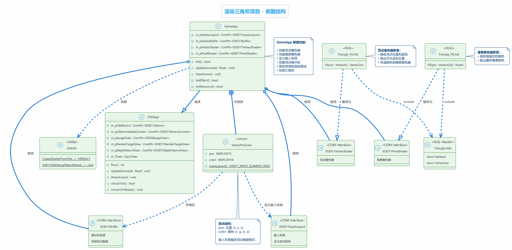
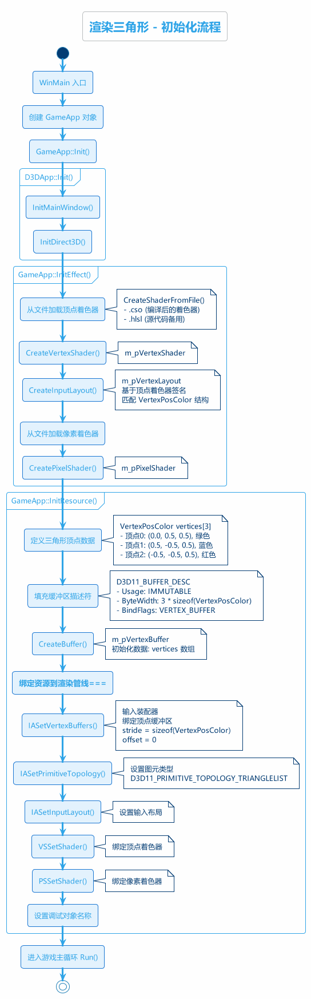
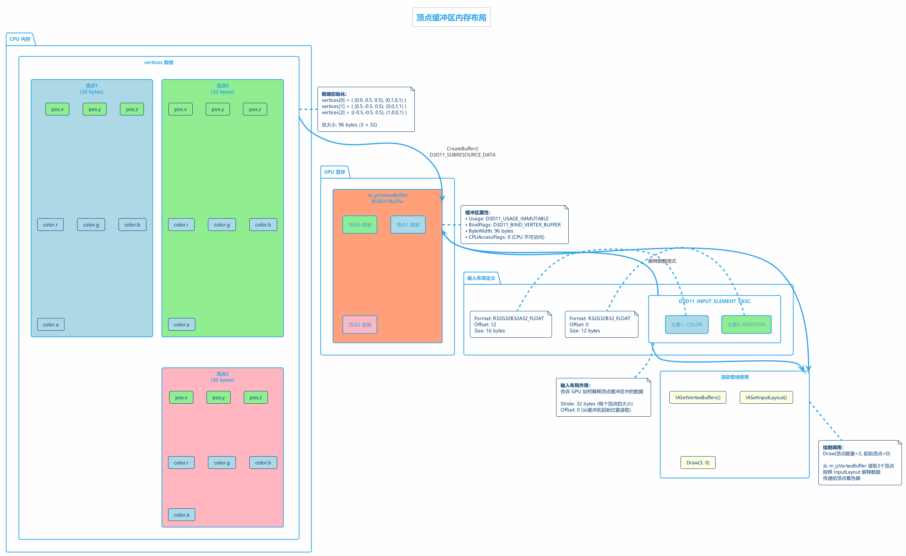
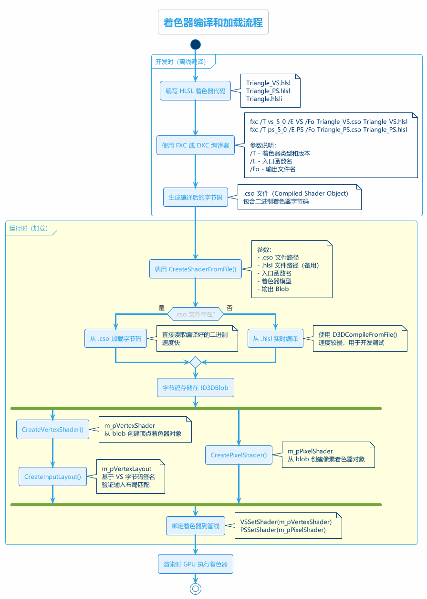
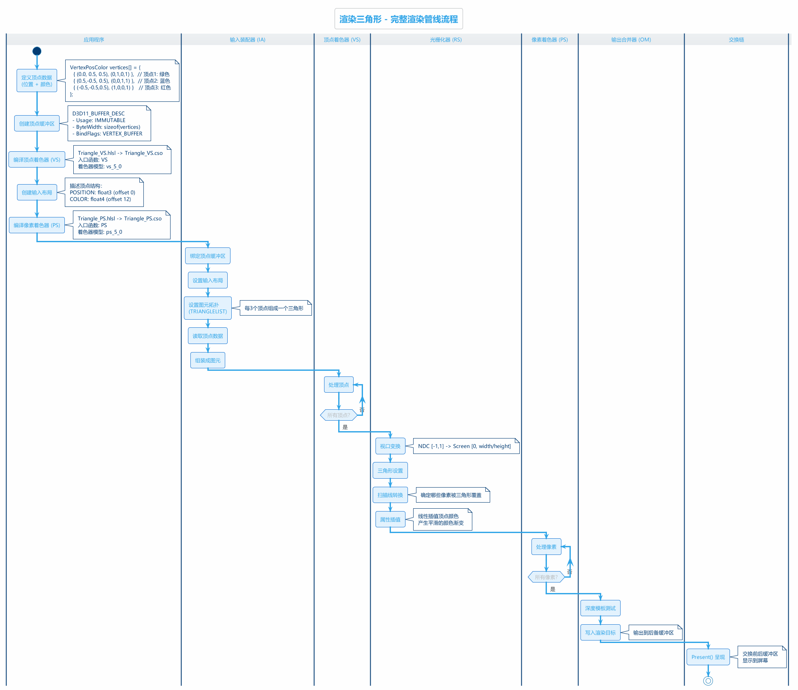
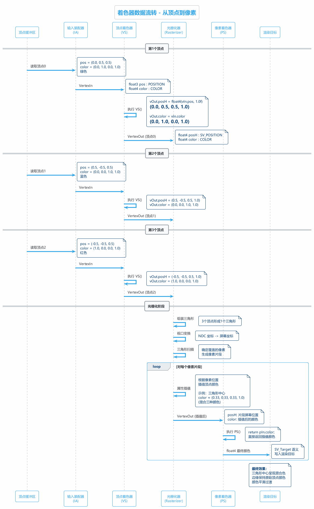

# 渲染三角形 - 学习总结

> **项目名称：** 02 Rendering a Triangle  
> **学习日期：** 2025年11月25日  
> **教程来源：** DirectX11 With Windows SDK  
> **作者：** MKXJun

---

## 📋 目录

- [1. 项目概述](#1-项目概述)
- [2. 项目架构](#2-项目架构)
- [3. 核心概念](#3-核心概念)
- [4. 初始化流程](#4-初始化流程)
- [5. 顶点缓冲区详解](#5-顶点缓冲区详解)
- [6. 着色器详解](#6-着色器详解)
- [7. 渲染管线流程](#7-渲染管线流程)
- [8. 关键技术点](#8-关键技术点)
- [9. 学习心得](#9-学习心得)

---

## 1. 项目概述

### 1.1 项目目标

本章是 DirectX11 系列教程的第二章，在第一章的基础上实现了真正的图形渲染：

- ✅ 定义顶点结构（位置 + 颜色）
- ✅ 创建顶点缓冲区
- ✅ 编写和加载 HLSL 着色器
- ✅ 创建输入布局
- ✅ 绑定资源到渲染管线
- ✅ 绘制彩色三角形

### 1.2 项目结构

```
02 Rendering a Triangle/
├── Main.cpp              # 程序入口点
├── GameApp.h/cpp         # 游戏应用类
├── d3dApp.h/cpp          # D3D 应用框架基类
├── d3dUtil.h/cpp         # D3D 工具函数
├── DXTrace.h/cpp         # 错误追踪工具
├── CpuTimer.h/cpp        # 高精度计时器
└── HLSL/                 # 着色器文件夹
    ├── Triangle.hlsli    # 着色器头文件
    ├── Triangle_VS.hlsl  # 顶点着色器
    ├── Triangle_PS.hlsl  # 像素着色器
    ├── Triangle_VS.cso   # 编译后的顶点着色器
    └── Triangle_PS.cso   # 编译后的像素着色器
```

### 1.3 与第一章的区别

| 特性 | 第一章 | 第二章 |
|------|--------|--------|
| **渲染内容** | 清屏（纯蓝色） | 绘制三角形 |
| **顶点缓冲区** | ❌ 无 | ✅ 创建并使用 |
| **着色器** | ❌ 无 | ✅ VS + PS |
| **输入布局** | ❌ 无 | ✅ 定义顶点结构 |
| **Draw 调用** | ❌ 无 | ✅ Draw(3, 0) |

---

## 2. 项目架构

### 2.1 类图结构



### 2.2 核心类和结构

#### GameApp 类

```cpp
class GameApp : public D3DApp
{
public:
    // 顶点结构体（嵌套在 GameApp 中）
    struct VertexPosColor
    {
        DirectX::XMFLOAT3 pos;      // 位置 (x, y, z)
        DirectX::XMFLOAT4 color;    // 颜色 (r, g, b, a)
        static const D3D11_INPUT_ELEMENT_DESC inputLayout[2];
    };

private:
    ComPtr<ID3D11InputLayout>   m_pVertexLayout;   // 输入布局
    ComPtr<ID3D11Buffer>        m_pVertexBuffer;   // 顶点缓冲区
    ComPtr<ID3D11VertexShader>  m_pVertexShader;   // 顶点着色器
    ComPtr<ID3D11PixelShader>   m_pPixelShader;    // 像素着色器
    
    bool InitEffect();    // 初始化着色器
    bool InitResource();  // 初始化资源
};
```

#### 输入布局定义

```cpp
const D3D11_INPUT_ELEMENT_DESC GameApp::VertexPosColor::inputLayout[2] = {
    { "POSITION", 0, DXGI_FORMAT_R32G32B32_FLOAT, 0, 0, 
      D3D11_INPUT_PER_VERTEX_DATA, 0 },
    { "COLOR", 0, DXGI_FORMAT_R32G32B32A32_FLOAT, 0, 12, 
      D3D11_INPUT_PER_VERTEX_DATA, 0 }
};
```

---

## 3. 核心概念

### 3.1 顶点缓冲区 (Vertex Buffer)

**定义：** 存储顶点数据的 GPU 缓冲区。

**作用：**
- 将顶点数据从 CPU 传输到 GPU
- 提供高速访问（显存）
- 支持不同的使用模式（IMMUTABLE, DEFAULT, DYNAMIC, STAGING）

**本章使用：**
```cpp
VertexPosColor vertices[] = {
    { XMFLOAT3(0.0f,  0.5f, 0.5f), XMFLOAT4(0.0f, 1.0f, 0.0f, 1.0f) }, // 绿色
    { XMFLOAT3(0.5f, -0.5f, 0.5f), XMFLOAT4(0.0f, 0.0f, 1.0f, 1.0f) }, // 蓝色
    { XMFLOAT3(-0.5f,-0.5f, 0.5f), XMFLOAT4(1.0f, 0.0f, 0.0f, 1.0f) }  // 红色
};
```

### 3.2 输入布局 (Input Layout)

**定义：** 描述顶点数据的结构和格式。

**作用：**
- 告诉 GPU 如何解释顶点缓冲区中的字节
- 将顶点数据映射到着色器输入
- 在创建时验证与顶点着色器签名的匹配

**关键字段：**
- `SemanticName`: 语义名称（如 POSITION, COLOR）
- `Format`: 数据格式（如 R32G32B32_FLOAT）
- `InputSlot`: 输入槽索引
- `AlignedByteOffset`: 字节偏移量

### 3.3 顶点着色器 (Vertex Shader)

**定义：** 对每个顶点执行的可编程着色器阶段。

**职责：**
- 顶点变换（模型空间 -> 世界空间 -> 视图空间 -> 裁剪空间）
- 计算顶点属性（法线、纹理坐标等）
- 传递数据到后续阶段

**本章实现：**
```hlsl
VertexOut VS(VertexIn vIn)
{
    VertexOut vOut;
    vOut.posH = float4(vIn.pos, 1.0f);  // 直接使用输入位置
    vOut.color = vIn.color;              // 传递颜色
    return vOut;
}
```

### 3.4 像素着色器 (Pixel Shader)

**定义：** 对每个像素片段执行的可编程着色器阶段。

**职责：**
- 计算最终像素颜色
- 纹理采样
- 光照计算
- 特效处理

**本章实现：**
```hlsl
float4 PS(VertexOut pIn) : SV_Target
{
    return pIn.color;  // 直接返回插值后的颜色
}
```

### 3.5 渲染管线阶段

```
输入装配器 (IA)
    ↓
顶点着色器 (VS) ← 本章使用
    ↓
几何着色器 (GS)
    ↓
光栅化器 (RS)
    ↓
像素着色器 (PS) ← 本章使用
    ↓
输出合并器 (OM)
```

---

## 4. 初始化流程

### 4.1 完整初始化流程图



### 4.2 InitEffect() - 初始化着色器

```cpp
bool GameApp::InitEffect()
{
    ComPtr<ID3DBlob> blob;

    // 1. 创建顶点着色器
    HR(CreateShaderFromFile(
        L"HLSL\\Triangle_VS.cso",      // 编译后的着色器
        L"HLSL\\Triangle_VS.hlsl",     // 源代码（备用）
        "VS",                          // 入口函数
        "vs_5_0",                      // 着色器模型
        blob.ReleaseAndGetAddressOf()
    ));
    
    HR(m_pd3dDevice->CreateVertexShader(
        blob->GetBufferPointer(),
        blob->GetBufferSize(),
        nullptr,
        m_pVertexShader.GetAddressOf()
    ));

    // 2. 创建输入布局（必须基于 VS 字节码）
    HR(m_pd3dDevice->CreateInputLayout(
        VertexPosColor::inputLayout,
        ARRAYSIZE(VertexPosColor::inputLayout),
        blob->GetBufferPointer(),    // VS 字节码
        blob->GetBufferSize(),
        m_pVertexLayout.GetAddressOf()
    ));

    // 3. 创建像素着色器
    HR(CreateShaderFromFile(
        L"HLSL\\Triangle_PS.cso",
        L"HLSL\\Triangle_PS.hlsl",
        "PS",
        "ps_5_0",
        blob.ReleaseAndGetAddressOf()
    ));
    
    HR(m_pd3dDevice->CreatePixelShader(
        blob->GetBufferPointer(),
        blob->GetBufferSize(),
        nullptr,
        m_pPixelShader.GetAddressOf()
    ));

    return true;
}
```

**关键点：**
- 输入布局必须基于顶点着色器的字节码创建
- 使用 `CreateShaderFromFile` 工具函数简化加载
- 优先加载 .cso 文件（预编译），失败时从 .hlsl 实时编译

### 4.3 InitResource() - 初始化资源

```cpp
bool GameApp::InitResource()
{
    // 1. 定义三角形顶点数据
    VertexPosColor vertices[] = {
        { XMFLOAT3(0.0f,  0.5f, 0.5f), XMFLOAT4(0.0f, 1.0f, 0.0f, 1.0f) },
        { XMFLOAT3(0.5f, -0.5f, 0.5f), XMFLOAT4(0.0f, 0.0f, 1.0f, 1.0f) },
        { XMFLOAT3(-0.5f,-0.5f, 0.5f), XMFLOAT4(1.0f, 0.0f, 0.0f, 1.0f) }
    };

    // 2. 设置顶点缓冲区描述符
    D3D11_BUFFER_DESC vbd;
    ZeroMemory(&vbd, sizeof(vbd));
    vbd.Usage = D3D11_USAGE_IMMUTABLE;      // 不可变（创建后不修改）
    vbd.ByteWidth = sizeof(vertices);        // 96 bytes
    vbd.BindFlags = D3D11_BIND_VERTEX_BUFFER;
    vbd.CPUAccessFlags = 0;

    // 3. 设置初始化数据
    D3D11_SUBRESOURCE_DATA InitData;
    ZeroMemory(&InitData, sizeof(InitData));
    InitData.pSysMem = vertices;

    // 4. 创建顶点缓冲区
    HR(m_pd3dDevice->CreateBuffer(&vbd, &InitData, 
                                   m_pVertexBuffer.GetAddressOf()));

    // 5. 绑定资源到渲染管线
    UINT stride = sizeof(VertexPosColor);  // 32 bytes
    UINT offset = 0;

    m_pd3dImmediateContext->IASetVertexBuffers(
        0, 1, m_pVertexBuffer.GetAddressOf(), &stride, &offset);
    m_pd3dImmediateContext->IASetPrimitiveTopology(
        D3D11_PRIMITIVE_TOPOLOGY_TRIANGLELIST);
    m_pd3dImmediateContext->IASetInputLayout(m_pVertexLayout.Get());
    m_pd3dImmediateContext->VSSetShader(m_pVertexShader.Get(), nullptr, 0);
    m_pd3dImmediateContext->PSSetShader(m_pPixelShader.Get(), nullptr, 0);

    return true;
}
```

---


## 5. 顶点缓冲区详解

### 5.1 顶点缓冲区内存布局



### 5.2 顶点结构定义

```cpp
struct VertexPosColor
{
    DirectX::XMFLOAT3 pos;    // 12 bytes (3  4)
    DirectX::XMFLOAT4 color;  // 16 bytes (4  4)
};
// 总大小: 32 bytes
```

**内存布局：**
```
偏移量    字段        大小    说明
0         pos.x       4       X 坐标
4         pos.y       4       Y 坐标
8         pos.z       4       Z 坐标
12        color.r     4       红色通道
16        color.g     4       绿色通道
20        color.b     4       蓝色通道
24        color.a     4       Alpha 通道
```

### 5.3 缓冲区使用模式

| Usage | 说明 | CPU 读 | CPU 写 | GPU 读 | GPU 写 | 适用场景 |
|-------|------|---------|---------|---------|---------|----------|
| **IMMUTABLE** | 不可变 | ❌ | ❌ | ✅ | ❌ | **静态几何体（本章使用）** |
| **DEFAULT** | 默认 | ❌ | ❌ | ✅ | ✅ | GPU 计算结果 |
| **DYNAMIC** | 动态 | ❌ | ✅ | ✅ | ❌ | 每帧更新的数据 |
| **STAGING** | 暂存 | ✅ | ✅ | ✅ | ✅ | CPU-GPU 数据传输 |

**本章选择 IMMUTABLE 的原因：**
- 三角形顶点数据固定不变
- 提供最佳性能
- GPU 可以优化存储位置

### 5.4 输入布局详解

```cpp
const D3D11_INPUT_ELEMENT_DESC inputLayout[2] = {
    // 元素0: 位置
    { 
        "POSITION",                    // SemanticName: 语义名
        0,                             // SemanticIndex: 语义索引
        DXGI_FORMAT_R32G32B32_FLOAT,  // Format: 3个 float
        0,                             // InputSlot: 输入槽
        0,                             // AlignedByteOffset: 偏移量
        D3D11_INPUT_PER_VERTEX_DATA,  // InputSlotClass: 每顶点数据
        0                              // InstanceDataStepRate: 实例步进率
    },
    // 元素1: 颜色
    {
        "COLOR",
        0,
        DXGI_FORMAT_R32G32B32A32_FLOAT,  // 4个 float
        0,
        12,  // 偏移12字节（跳过 pos）
        D3D11_INPUT_PER_VERTEX_DATA,
        0
    }
};
```

**语义名称的作用：**
- 将顶点数据映射到着色器输入
- POSITION -> `float3 pos : POSITION`
- COLOR -> `float4 color : COLOR`

### 5.5 绑定顶点缓冲区

```cpp
UINT stride = sizeof(VertexPosColor);  // 32 bytes (跨越字节数)
UINT offset = 0;                       // 起始偏移量

m_pd3dImmediateContext->IASetVertexBuffers(
    0,                                 // StartSlot: 起始槽
    1,                                 // NumBuffers: 缓冲区数量
    m_pVertexBuffer.GetAddressOf(),    // 缓冲区数组
    &stride,                           // 跨越字节数组
    &offset                            // 偏移量数组
);
```

**参数说明：**
- **Stride（跨越）：** 从一个顶点到下一个顶点的字节数
- **Offset（偏移）：** 从缓冲区起始位置的字节偏移

---

## 6. 着色器详解

### 6.1 着色器编译流程



### 6.2 HLSL 文件结构

#### Triangle.hlsli（头文件）

```hlsl
// 顶点着色器输入结构
struct VertexIn
{
    float3 pos : POSITION;    // 位置（语义：POSITION）
    float4 color : COLOR;     // 颜色（语义：COLOR）
};

// 顶点着色器输出 / 像素着色器输入
struct VertexOut
{
    float4 posH : SV_POSITION;  // 齐次裁剪空间位置（系统语义）
    float4 color : COLOR;       // 颜色
};
```

**系统语义 vs 自定义语义：**
- `SV_POSITION`: 系统值语义，表示裁剪空间位置
- `COLOR`: 自定义语义，可以任意命名

#### Triangle_VS.hlsl（顶点着色器）

```hlsl
#include "Triangle.hlsli"

VertexOut VS(VertexIn vIn)
{
    VertexOut vOut;
    
    // 将 float3 转换为 float4（齐次坐标）
    vOut.posH = float4(vIn.pos, 1.0f);
    
    // 直接传递颜色到像素着色器
    vOut.color = vIn.color;
    
    return vOut;
}
```

**职责：**
1. 将顶点位置从 float3 扩展为 float4（w = 1.0）
2. 传递颜色属性（光栅化器会自动插值）

#### Triangle_PS.hlsl（像素着色器）

```hlsl
#include "Triangle.hlsli"

float4 PS(VertexOut pIn) : SV_Target
{
    return pIn.color;  // 直接返回插值后的颜色
}
```

**职责：**
1. 接收光栅化器插值后的颜色
2. 输出最终像素颜色（SV_Target 表示渲染目标）

### 6.3 着色器编译

**离线编译（推荐）：**
```cmd
fxc /T vs_5_0 /E VS /Fo Triangle_VS.cso Triangle_VS.hlsl
fxc /T ps_5_0 /E PS /Fo Triangle_PS.cso Triangle_PS.hlsl
```

**参数说明：**
- `/T` - 着色器类型和版本（vs_5_0 = Vertex Shader Model 5.0）
- `/E` - 入口函数名称
- `/Fo` - 输出文件名（.cso = Compiled Shader Object）

**运行时加载：**
```cpp
CreateShaderFromFile(
    L"HLSL\\Triangle_VS.cso",    // 编译后的文件（优先）
    L"HLSL\\Triangle_VS.hlsl",   // 源代码（备用）
    "VS",                        // 入口函数
    "vs_5_0",                    // 着色器模型
    blob.GetAddressOf()
);
```

### 6.4 着色器版本对比

| 版本 | Direct3D | 特性 |
|------|----------|------|
| **vs_5_0** | D3D11 | 本章使用，支持所有 D3D11 特性 |
| **vs_4_0** | D3D10 | 几何着色器，流输出 |
| **vs_3_0** | D3D9 | 动态分支，顶点纹理 |
| **vs_2_0** | D3D9 | 基础顶点着色器 |

---

## 7. 渲染管线流程

### 7.1 完整渲染管线



### 7.2 着色器数据流



### 7.3 DrawScene() 函数

```cpp
void GameApp::DrawScene()
{
    assert(m_pd3dImmediateContext);
    assert(m_pSwapChain);

    // 1. 清空渲染目标为黑色
    static float black[4] = { 0.0f, 0.0f, 0.0f, 1.0f };
    m_pd3dImmediateContext->ClearRenderTargetView(
        m_pRenderTargetView.Get(), black);

    // 2. 清空深度模板缓冲区
    m_pd3dImmediateContext->ClearDepthStencilView(
        m_pDepthStencilView.Get(),
        D3D11_CLEAR_DEPTH | D3D11_CLEAR_STENCIL,
        1.0f, 0);

    // 3. 绘制三角形
    m_pd3dImmediateContext->Draw(3, 0);
    // 参数1: 顶点数量 = 3
    // 参数2: 起始顶点索引 = 0

    // 4. 呈现渲染结果
    HR(m_pSwapChain->Present(0, 0));
}
```

### 7.4 Draw() 详解

```cpp
void Draw(
    UINT VertexCount,      // 要绘制的顶点数量
    UINT StartVertexLocation  // 起始顶点索引
);
```

**执行流程：**
1. 从顶点缓冲区读取 3 个顶点（索引 0, 1, 2）
2. 对每个顶点调用顶点着色器
3. 组装成三角形图元
4. 光栅化生成像素片段
5. 对每个片段调用像素着色器
6. 输出到渲染目标

### 7.5 颜色插值

**顶点颜色：**
- 顶点0: (0.0, 1.0, 0.0, 1.0) - 绿色
- 顶点1: (0.0, 0.0, 1.0, 1.0) - 蓝色
- 顶点2: (1.0, 0.0, 0.0, 1.0) - 红色

**插值结果：**
- 三角形中心  (0.33, 0.33, 0.33, 1.0) - 混合色
- 边缘保持原始顶点颜色
- 内部平滑过渡

**插值算法：** 重心坐标插值（Barycentric Interpolation）

---


## 8. 关键技术点

### 8.1 NDC 坐标系统

**归一化设备坐标 (Normalized Device Coordinates)：**

```
        Y
         |
    (-1,1)|  (1,1)
     X
  (-1,-1)|  (1,-1)
         |
```

**坐标范围：**
- X 轴: [-1, 1]（左到右）
- Y 轴: [-1, 1]（下到上）
- Z 轴: [0, 1]（近到远）

**本章三角形顶点（NDC 空间）：**
- 顶点0: (0.0, 0.5, 0.5) - 顶部中央
- 顶点1: (0.5, -0.5, 0.5) - 右下
- 顶点2: (-0.5, -0.5, 0.5) - 左下

### 8.2 图元拓扑类型

```cpp
m_pd3dImmediateContext->IASetPrimitiveTopology(
    D3D11_PRIMITIVE_TOPOLOGY_TRIANGLELIST
);
```

| 拓扑类型 | 说明 | 顶点使用 |
|----------|------|----------|
| **TRIANGLELIST** | 三角形列表（本章使用） | 每3个顶点一个三角形 |
| **TRIANGLESTRIP** | 三角形条带 | 共享顶点，节省内存 |
| **LINELIST** | 线段列表 | 每2个顶点一条线 |
| **LINESTRIP** | 线段条带 | 连续线段 |
| **POINTLIST** | 点列表 | 每个顶点一个点 |

### 8.3 着色器反射

**输入布局验证：**

创建输入布局时，D3D11 会自动验证：
1. 语义名称是否匹配
2. 数据格式是否兼容
3. 输入槽是否正确

```cpp
// 必须基于顶点着色器字节码创建
m_pd3dDevice->CreateInputLayout(
    inputLayout,
    numElements,
    vsBlob->GetBufferPointer(),  // VS 字节码
    vsBlob->GetBufferSize(),
    &m_pInputLayout
);
```

**如果不匹配会发生什么？**
- Debug 模式：报错并提示不匹配的语义
- Release 模式：未定义行为（可能崩溃）

### 8.4 光栅化插值

**线性插值公式：**

对于三角形内的点 P，其属性值为：

```
value(P) = w0 * value(V0) + w1 * value(V1) + w2 * value(V2)
```

其中：
- w0, w1, w2 是重心坐标（权重）
- w0 + w1 + w2 = 1
- value 可以是颜色、纹理坐标、法线等

**本章颜色插值示例：**

三角形中心点的颜色：
```
color_center = 1/3 * (0,1,0,1) + 1/3 * (0,0,1,1) + 1/3 * (1,0,0,1)
             = (0.33, 0.33, 0.33, 1.0)
             = 灰色
```

### 8.5 着色器语义详解

**系统值语义（SV_*）：**

| 语义 | 类型 | 说明 |
|------|------|------|
| **SV_POSITION** | float4 | 裁剪空间位置（VS 输出） |
| **SV_Target** | float4 | 渲染目标输出（PS 输出） |
| **SV_VertexID** | uint | 顶点 ID |
| **SV_InstanceID** | uint | 实例 ID |
| **SV_PrimitiveID** | uint | 图元 ID |

**自定义语义：**
- 可以使用任意名称（COLOR, TEXCOORD, NORMAL 等）
- 用于在着色器阶段之间传递数据
- 不影响功能，仅用于语义匹配

### 8.6 CreateShaderFromFile 实现

```cpp
HRESULT CreateShaderFromFile(
    const WCHAR* csoFileNameInOut,
    const WCHAR* hlslFileName, 
    LPCSTR entryPoint,
    LPCSTR shaderModel,
    ID3DBlob** ppBlobOut)
{
    HRESULT hr = S_OK;

    // 1. 优先从 .cso 加载
    if (csoFileNameInOut && D3DReadFileToBlob(csoFileNameInOut, ppBlobOut) == S_OK)
    {
        return S_OK;
    }
    
    // 2. 从 .hlsl 实时编译
    DWORD dwShaderFlags = D3DCOMPILE_ENABLE_STRICTNESS;
#if defined(DEBUG) || defined(_DEBUG)
    dwShaderFlags |= D3DCOMPILE_DEBUG;
    dwShaderFlags |= D3DCOMPILE_SKIP_OPTIMIZATION;
#endif

    ID3DBlob* errorBlob = nullptr;
    hr = D3DCompileFromFile(hlslFileName, nullptr, 
        D3D_COMPILE_STANDARD_FILE_INCLUDE, entryPoint, shaderModel,
        dwShaderFlags, 0, ppBlobOut, &errorBlob);
        
    if (FAILED(hr))
    {
        if (errorBlob != nullptr)
        {
            OutputDebugStringA((char*)errorBlob->GetBufferPointer());
        }
        SAFE_RELEASE(errorBlob);
        return hr;
    }
    
    // 3. 可选：保存编译结果到 .cso
    if (csoFileNameInOut)
    {
        D3DWriteBlobToFile(*ppBlobOut, csoFileNameInOut, FALSE);
    }

    return S_OK;
}
```

---

## 9. 学习心得

### 9.1 核心要点总结

#### ✅ 必须掌握的概念

1. **顶点缓冲区的创建和使用**
   - 定义顶点结构
   - 创建 IMMUTABLE 缓冲区
   - 绑定到输入装配器

2. **输入布局的定义**
   - 匹配顶点结构
   - 对应着色器输入
   - 基于 VS 字节码创建

3. **着色器的编写和加载**
   - HLSL 语法基础
   - 离线编译流程
   - 运行时加载方法

4. **渲染管线的配置**
   - 绑定顶点缓冲区
   - 设置图元拓扑
   - 绑定着色器

5. **Draw 调用**
   - 非索引绘制
   - 顶点数量和起始索引

### 9.2 常见问题与解决方案

#### 问题1：黑屏或不显示三角形

**症状：** 程序运行但看不到三角形

**可能原因：**
- 顶点坐标超出 NDC 范围 [-1, 1]
- 着色器未正确绑定
- 输入布局不匹配
- 背面剔除导致不可见

**解决方案：**
```cpp
// 1. 检查顶点坐标
// 确保在 [-1, 1] 范围内

// 2. 检查着色器绑定
m_pd3dImmediateContext->VSSetShader(m_pVertexShader.Get(), nullptr, 0);
m_pd3dImmediateContext->PSSetShader(m_pPixelShader.Get(), nullptr, 0);

// 3. 检查输入布局
// 确保语义名称和格式匹配

// 4. 临时禁用背面剔除测试
// 后续章节会讲解
```

#### 问题2：着色器编译失败

**症状：** CreateShaderFromFile 返回错误

**可能原因：**
- .cso 文件不存在
- .hlsl 文件路径错误
- 着色器语法错误
- 入口函数名不匹配

**解决方案：**
```cpp
// 1. 确保 .cso 和 .hlsl 文件都存在
// 2. 使用相对路径或绝对路径
// 3. 检查 errorBlob 输出的错误信息
if (errorBlob)
{
    OutputDebugStringA((char*)errorBlob->GetBufferPointer());
}

// 4. 验证入口函数名和着色器模型
CreateShaderFromFile(L"...", L"...", "VS", "vs_5_0", ...);
                                     //  必须匹配 HLSL 中的函数名
```

#### 问题3：输入布局创建失败

**症状：** CreateInputLayout 返回 E_INVALIDARG

**可能原因：**
- 语义名称拼写错误
- 偏移量计算错误
- 格式不匹配
- 未基于 VS 字节码创建

**解决方案：**
```cpp
// 正确的输入布局定义
const D3D11_INPUT_ELEMENT_DESC inputLayout[] = {
    { "POSITION", 0, DXGI_FORMAT_R32G32B32_FLOAT, 0, 0, ... },
    //   必须与 HLSL 中的语义名完全匹配
    { "COLOR", 0, DXGI_FORMAT_R32G32B32A32_FLOAT, 0, 12, ... }
    //                                                    正确的偏移量
};

// 必须基于 VS 字节码
m_pd3dDevice->CreateInputLayout(inputLayout, 2,
    vsBlob->GetBufferPointer(),  // 来自顶点着色器
    vsBlob->GetBufferSize(),
    &m_pInputLayout);
```

### 9.3 性能优化建议

#### 着色器优化

1. **离线编译**
   - 使用 fxc 预编译着色器
   - 避免运行时编译开销
   - 减少启动时间

2. **优化着色器代码**
   - 避免不必要的计算
   - 使用内置函数（dot, cross, normalize 等）
   - 减少分支语句

#### 资源管理

1. **使用正确的 Usage**
   - IMMUTABLE：静态数据（本章）
   - DYNAMIC：每帧更新的数据
   - 避免频繁创建/销毁

2. **批量绘制**
   - 尽量减少 Draw 调用次数
   - 合并相同材质的几何体
   - 使用实例化（后续章节）

### 9.4 调试技巧

#### Visual Studio 图形调试器

1. **启动图形调试**
   - 调试  图形  开始诊断
   - 捕获帧
   - 分析渲染调用

2. **查看顶点数据**
   - 选择 Draw 调用
   - 查看输入装配器
   - 检查顶点缓冲区内容

3. **调试着色器**
   - 在像素上右键
   - 调试此像素
   - 单步执行着色器代码

#### RenderDoc

- 更强大的图形调试工具
- 支持 DirectX, OpenGL, Vulkan
- 详细的性能分析

### 9.5 后续学习方向

完成本章后，已经掌握了：
- ✅ 顶点缓冲区
- ✅ 着色器基础
- ✅ 输入布局
- ✅ 基本绘制

**第3章预告：** 渲染立方体
- 索引缓冲区（减少顶点重复）
- 常量缓冲区（传递变换矩阵）
- 深度测试
- 3D 变换

---

## 附录：完整代码清单

### A.1 GameApp.h

```cpp
struct VertexPosColor
{
    DirectX::XMFLOAT3 pos;
    DirectX::XMFLOAT4 color;
    static const D3D11_INPUT_ELEMENT_DESC inputLayout[2];
};

class GameApp : public D3DApp
{
private:
    ComPtr<ID3D11InputLayout>   m_pVertexLayout;
    ComPtr<ID3D11Buffer>        m_pVertexBuffer;
    ComPtr<ID3D11VertexShader>  m_pVertexShader;
    ComPtr<ID3D11PixelShader>   m_pPixelShader;
    
    bool InitEffect();
    bool InitResource();
};
```

### A.2 顶点数据定义

```cpp
VertexPosColor vertices[] = {
    { XMFLOAT3(0.0f,  0.5f, 0.5f), XMFLOAT4(0.0f, 1.0f, 0.0f, 1.0f) },
    { XMFLOAT3(0.5f, -0.5f, 0.5f), XMFLOAT4(0.0f, 0.0f, 1.0f, 1.0f) },
    { XMFLOAT3(-0.5f,-0.5f, 0.5f), XMFLOAT4(1.0f, 0.0f, 0.0f, 1.0f) }
};
```

### A.3 HLSL 着色器

```hlsl
// Triangle_VS.hlsl
VertexOut VS(VertexIn vIn)
{
    VertexOut vOut;
    vOut.posH = float4(vIn.pos, 1.0f);
    vOut.color = vIn.color;
    return vOut;
}

// Triangle_PS.hlsl
float4 PS(VertexOut pIn) : SV_Target
{
    return pIn.color;
}
```

---

## 结语

通过本章学习，我们成功实现了第一个真正的图形渲染：

✅ 创建顶点缓冲区  
✅ 编写 HLSL 着色器  
✅ 定义输入布局  
✅ 配置渲染管线  
✅ 绘制彩色三角形

这是图形编程的重要里程碑。理解了顶点处理和着色器的基本原理后，后续的复杂效果都是在此基础上的扩展。

**下一章预告：** 渲染立方体 - 学习索引缓冲区和常量缓冲区的使用。

---

**文档生成日期：** 2025年11月25日  
**PlantUML 图表：** 5 张（类图、流程图、时序图、内存布局图）  
**代码示例：** 完整且可运行  
**适用人群：** DirectX11 初学者

---

© 2025 学习总结 | 基于 MKXJun 的 DirectX11 With Windows SDK 教程

