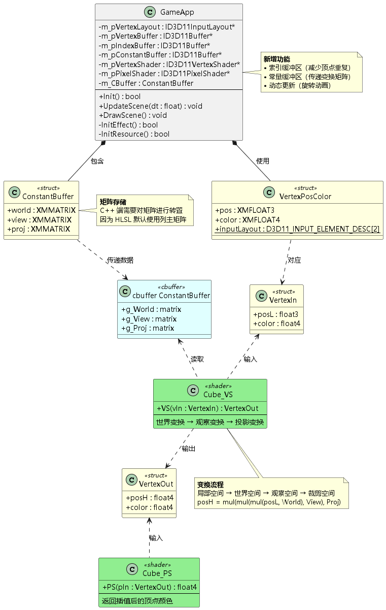
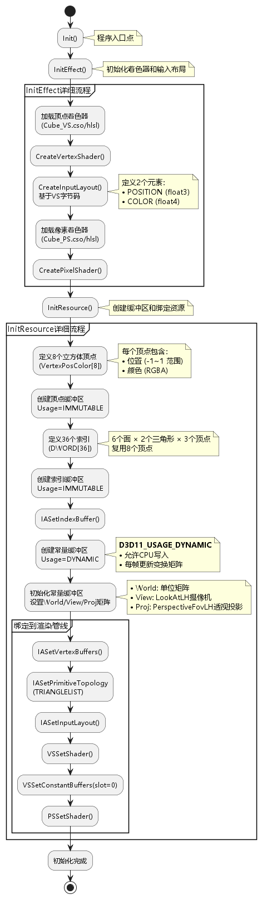
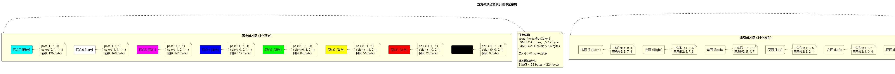
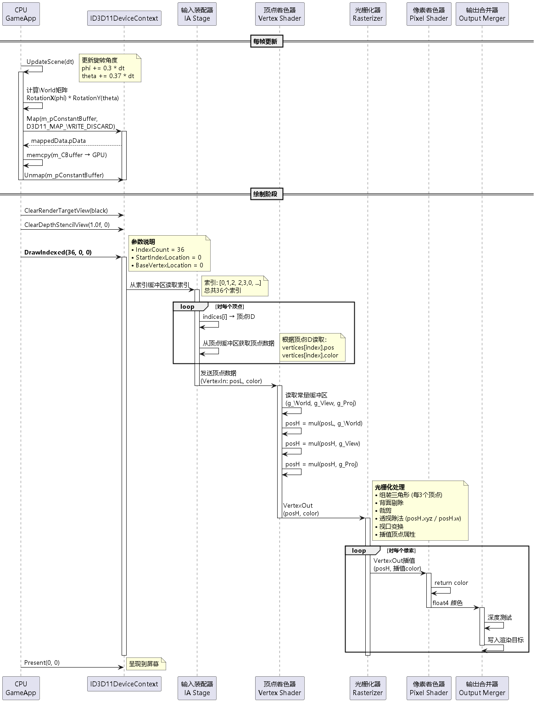
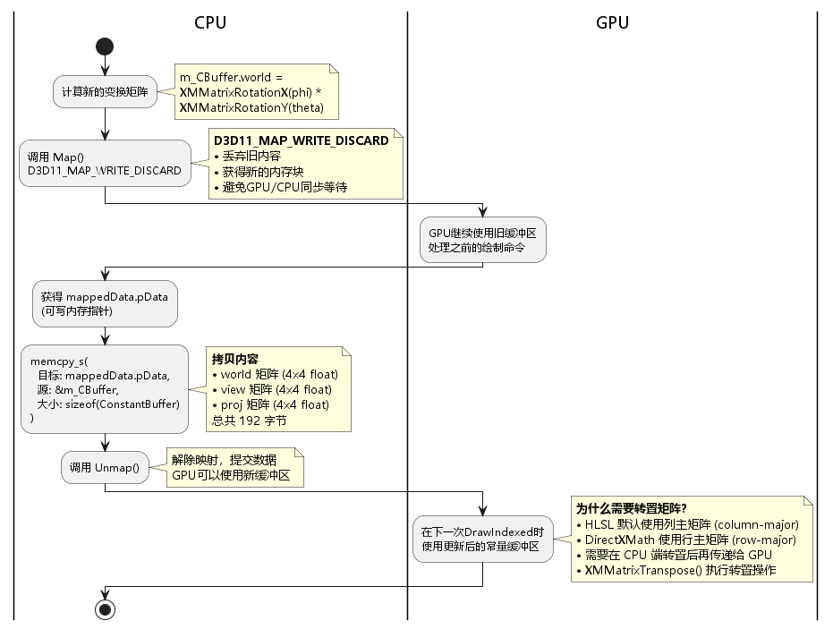
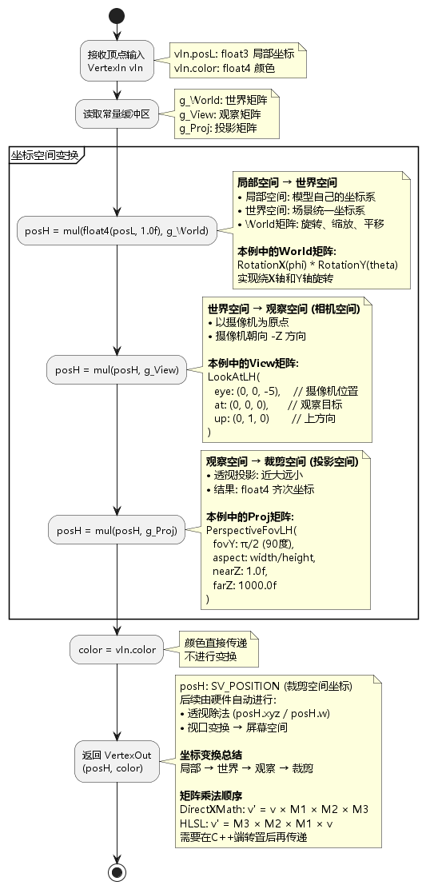

# 03 Rendering a Cube - 学习总结

## 目录

1. [项目概述](#1-项目概述)
2. [架构分析](#2-架构分析)
3. [核心概念](#3-核心概念)
4. [初始化流程](#4-初始化流程)
5. [索引缓冲区详解](#5-索引缓冲区详解)
6. [常量缓冲区详解](#6-常量缓冲区详解)
7. [坐标变换流程](#7-坐标变换流程)
8. [动态更新机制](#8-动态更新机制)
9. [关键技术点](#9-关键技术点)
10. [学习心得](#10-学习心得)

---

## 1. 项目概述

### 1.1 项目目标

**Project 03: Rendering a Cube** 是 DirectX11 教程的第三章，在第二章三角形渲染的基础上，引入了：

✅ **索引缓冲区** - 减少顶点数据重复  
✅ **常量缓冲区** - 传递变换矩阵到着色器  
✅ **3D 坐标变换** - 世界、观察、投影变换  
✅ **动态更新** - 实现立方体旋转动画  

### 1.2 运行效果

程序运行后显示一个旋转的彩色立方体：
- 8 个顶点，每个顶点有不同的颜色
- 6 个面，每个面由 2 个三角形组成
- 绕 X 轴和 Y 轴持续旋转
- 顶点颜色在面上线性插值

### 1.3 核心技术

| 技术点 | 说明 | 新增/改进 |
|--------|------|-----------|
| **索引缓冲区** | 使用索引复用顶点，减少内存占用 | ✨ 新增 |
| **常量缓冲区** | 向着色器传递变换矩阵 | ✨ 新增 |
| **D3D11_USAGE_DYNAMIC** | 允许 CPU 每帧更新缓冲区 | ✨ 新增 |
| **DrawIndexed** | 基于索引的绘制方式 | ✨ 新增 |
| **坐标变换** | World/View/Proj 三大变换矩阵 | ✨ 新增 |
| **矩阵转置** | HLSL 列主矩阵与 C++ 行主矩阵转换 | ✨ 新增 |

---

## 2. 架构分析

### 2.1 类图



**类结构说明：**

#### GameApp 类
- **顶点相关**：`m_pVertexBuffer`, `m_pVertexLayout`
- **索引相关**：`m_pIndexBuffer` ✨ 新增
- **常量缓冲区**：`m_pConstantBuffer`, `m_CBuffer` ✨ 新增
- **着色器**：`m_pVertexShader`, `m_pPixelShader`

#### VertexPosColor 结构
```cpp
struct VertexPosColor
{
    DirectX::XMFLOAT3 pos;      // 位置 (12 bytes)
    DirectX::XMFLOAT4 color;    // 颜色 (16 bytes)
    static const D3D11_INPUT_ELEMENT_DESC inputLayout[2];
};
// 总大小：28 bytes
```

#### ConstantBuffer 结构 ✨ 新增
```cpp
struct ConstantBuffer
{
    DirectX::XMMATRIX world;    // 世界矩阵 (64 bytes)
    DirectX::XMMATRIX view;     // 观察矩阵 (64 bytes)
    DirectX::XMMATRIX proj;     // 投影矩阵 (64 bytes)
};
// 总大小：192 bytes
```

### 2.2 渲染管线配置

```
[顶点缓冲区] ──┐
               ├──> [输入装配器] ──> [顶点着色器] ──> [光栅化器] ──> [像素着色器] ──> [输出合并器]
[索引缓冲区] ──┘           ↑              ↑
                           │              │
                   [输入布局]      [常量缓冲区]
```

### 2.3 主要流程

1. **初始化阶段**
   - `InitEffect()`: 加载着色器，创建输入布局
   - `InitResource()`: 创建顶点/索引/常量缓冲区，绑定到管线

2. **更新阶段**
   - `UpdateScene(dt)`: 计算旋转矩阵，更新常量缓冲区

3. **绘制阶段**
   - `DrawScene()`: 清空屏幕，调用 `DrawIndexed(36, 0, 0)`

---

## 3. 核心概念

### 3.1 索引缓冲区 (Index Buffer)

#### 为什么需要索引缓冲区？

**问题：** 绘制立方体需要 6 个面 × 2 个三角形 × 3 个顶点 = **36 个顶点数据**

但实际上立方体只有 **8 个不同的顶点**，大量数据重复！

#### 解决方案

使用 **索引缓冲区** 存储顶点索引，复用顶点数据：

```cpp
// 顶点缓冲区：只需8个顶点
VertexPosColor vertices[8] = { ... };

// 索引缓冲区：36个索引指向这8个顶点
DWORD indices[36] = {
    0, 1, 2,  2, 3, 0,  // 正面
    4, 5, 1,  1, 0, 4,  // 左面
    // ... 其他4个面
};
```

#### 内存节省

| 方案 | 顶点数据 | 索引数据 | 总大小 |
|------|----------|----------|--------|
| **无索引** | 36 × 28 bytes | 0 | **1008 bytes** |
| **有索引** | 8 × 28 bytes | 36 × 4 bytes | **368 bytes** |
| **节省率** | - | - | **63.5%** |

### 3.2 常量缓冲区 (Constant Buffer)

#### 什么是常量缓冲区？

常量缓冲区是一种特殊的缓冲区，用于向着色器传递**在一次绘制调用中保持不变的数据**。

#### 使用场景

- 变换矩阵 (World, View, Projection)
- 光照参数 (光源位置、颜色、强度)
- 材质属性 (反射率、粗糙度等)
- 时间变量

#### 缓冲区 Usage 对比

| Usage | CPU 访问 | GPU 访问 | 更新频率 | 典型用途 |
|-------|----------|----------|----------|----------|
| **IMMUTABLE** | 无 | 读 | 从不 | 静态几何体 |
| **DEFAULT** | 无 | 读/写 | 偶尔 | 一般资源 |
| **DYNAMIC** | 写 | 读 | 每帧 | 常量缓冲区 ✨ |
| **STAGING** | 读/写 | 读/写 | 频繁 | CPU-GPU数据传输 |

**本章使用 `D3D11_USAGE_DYNAMIC`**：
- 允许 CPU 通过 `Map/Unmap` 写入数据
- GPU 可以高效读取
- 适合每帧更新的常量缓冲区

### 3.3 DrawIndexed vs Draw

| 方法 | 说明 | 参数 | 适用场景 |
|------|------|------|----------|
| **Draw** | 直接绘制顶点 | `VertexCount, StartVertexLocation` | 简单图形、粒子 |
| **DrawIndexed** | 基于索引绘制 | `IndexCount, StartIndexLocation, BaseVertexLocation` | 复杂模型 ✨ |

```cpp
// 本章使用
m_pd3dImmediateContext->DrawIndexed(
    36,  // IndexCount: 绘制36个索引
    0,   // StartIndexLocation: 从索引0开始
    0    // BaseVertexLocation: 顶点偏移量
);
```

---

## 4. 初始化流程



### 4.1 InitEffect() - 着色器初始化

```cpp
bool GameApp::InitEffect()
{
    ComPtr<ID3DBlob> blob;

    // 1. 创建顶点着色器
    HR(CreateShaderFromFile(L"HLSL\\Cube_VS.cso", L"HLSL\\Cube_VS.hlsl", 
        "VS", "vs_5_0", blob.ReleaseAndGetAddressOf()));
    HR(m_pd3dDevice->CreateVertexShader(blob->GetBufferPointer(), 
        blob->GetBufferSize(), nullptr, m_pVertexShader.GetAddressOf()));
    
    // 2. 创建输入布局
    HR(m_pd3dDevice->CreateInputLayout(VertexPosColor::inputLayout, 
        ARRAYSIZE(VertexPosColor::inputLayout),
        blob->GetBufferPointer(), blob->GetBufferSize(), 
        m_pVertexLayout.GetAddressOf()));

    // 3. 创建像素着色器
    HR(CreateShaderFromFile(L"HLSL\\Cube_PS.cso", L"HLSL\\Cube_PS.hlsl", 
        "PS", "ps_5_0", blob.ReleaseAndGetAddressOf()));
    HR(m_pd3dDevice->CreatePixelShader(blob->GetBufferPointer(), 
        blob->GetBufferSize(), nullptr, m_pPixelShader.GetAddressOf()));

    return true;
}
```

**与第2章的区别：** 无，流程完全相同。

### 4.2 InitResource() - 资源初始化

#### 步骤1：创建顶点缓冲区

```cpp
// 立方体8个顶点（仅定义一次）
VertexPosColor vertices[] =
{
    { XMFLOAT3(-1.0f, -1.0f, -1.0f), XMFLOAT4(0.0f, 0.0f, 0.0f, 1.0f) },  // 0: 黑色
    { XMFLOAT3(-1.0f,  1.0f, -1.0f), XMFLOAT4(1.0f, 0.0f, 0.0f, 1.0f) },  // 1: 红色
    { XMFLOAT3( 1.0f,  1.0f, -1.0f), XMFLOAT4(1.0f, 1.0f, 0.0f, 1.0f) },  // 2: 黄色
    { XMFLOAT3( 1.0f, -1.0f, -1.0f), XMFLOAT4(0.0f, 1.0f, 0.0f, 1.0f) },  // 3: 绿色
    { XMFLOAT3(-1.0f, -1.0f,  1.0f), XMFLOAT4(0.0f, 0.0f, 1.0f, 1.0f) },  // 4: 蓝色
    { XMFLOAT3(-1.0f,  1.0f,  1.0f), XMFLOAT4(1.0f, 0.0f, 1.0f, 1.0f) },  // 5: 品红
    { XMFLOAT3( 1.0f,  1.0f,  1.0f), XMFLOAT4(1.0f, 1.0f, 1.0f, 1.0f) },  // 6: 白色
    { XMFLOAT3( 1.0f, -1.0f,  1.0f), XMFLOAT4(0.0f, 1.0f, 1.0f, 1.0f) }   // 7: 青色
};

D3D11_BUFFER_DESC vbd;
ZeroMemory(&vbd, sizeof(vbd));
vbd.Usage = D3D11_USAGE_IMMUTABLE;      // 静态数据，不会改变
vbd.ByteWidth = sizeof(vertices);       // 8 × 28 = 224 bytes
vbd.BindFlags = D3D11_BIND_VERTEX_BUFFER;
vbd.CPUAccessFlags = 0;

D3D11_SUBRESOURCE_DATA InitData;
ZeroMemory(&InitData, sizeof(InitData));
InitData.pSysMem = vertices;
HR(m_pd3dDevice->CreateBuffer(&vbd, &InitData, m_pVertexBuffer.GetAddressOf()));
```

#### 步骤2：创建索引缓冲区 ✨ 新增

```cpp
// 36个索引定义6个面
DWORD indices[] = {
    // 正面 (Z = -1)
    0, 1, 2,  2, 3, 0,
    // 左面 (X = -1)
    4, 5, 1,  1, 0, 4,
    // 顶面 (Y = 1)
    1, 5, 6,  6, 2, 1,
    // 背面 (Z = 1)
    7, 6, 5,  5, 4, 7,
    // 右面 (X = 1)
    3, 2, 6,  6, 7, 3,
    // 底面 (Y = -1)
    4, 0, 3,  3, 7, 4
};

D3D11_BUFFER_DESC ibd;
ZeroMemory(&ibd, sizeof(ibd));
ibd.Usage = D3D11_USAGE_IMMUTABLE;      // 索引不会改变
ibd.ByteWidth = sizeof(indices);        // 36 × 4 = 144 bytes
ibd.BindFlags = D3D11_BIND_INDEX_BUFFER;
ibd.CPUAccessFlags = 0;

InitData.pSysMem = indices;
HR(m_pd3dDevice->CreateBuffer(&ibd, &InitData, m_pIndexBuffer.GetAddressOf()));

// 绑定索引缓冲区
m_pd3dImmediateContext->IASetIndexBuffer(
    m_pIndexBuffer.Get(), 
    DXGI_FORMAT_R32_UINT,  // 每个索引32位
    0                       // 偏移量
);
```

#### 步骤3：创建常量缓冲区 ✨ 新增

```cpp
D3D11_BUFFER_DESC cbd;
ZeroMemory(&cbd, sizeof(cbd));
cbd.Usage = D3D11_USAGE_DYNAMIC;            // 允许CPU写入
cbd.ByteWidth = sizeof(ConstantBuffer);     // 192 bytes
cbd.BindFlags = D3D11_BIND_CONSTANT_BUFFER;
cbd.CPUAccessFlags = D3D11_CPU_ACCESS_WRITE; // CPU可写

// 创建时不提供初始数据
HR(m_pd3dDevice->CreateBuffer(&cbd, nullptr, m_pConstantBuffer.GetAddressOf()));
```

#### 步骤4：初始化常量缓冲区数据

```cpp
// 世界矩阵：单位矩阵（无变换）
m_CBuffer.world = XMMatrixIdentity();

// 观察矩阵：摄像机设置
m_CBuffer.view = XMMatrixTranspose(XMMatrixLookAtLH(
    XMVectorSet(0.0f, 0.0f, -5.0f, 0.0f),  // 摄像机位置：Z = -5
    XMVectorSet(0.0f, 0.0f, 0.0f, 0.0f),   // 观察目标：原点
    XMVectorSet(0.0f, 1.0f, 0.0f, 0.0f)    // 上方向：Y轴
));

// 投影矩阵：透视投影
m_CBuffer.proj = XMMatrixTranspose(XMMatrixPerspectiveFovLH(
    XM_PIDIV2,      // FOV = 90度
    AspectRatio(),  // 宽高比
    1.0f,           // 近裁剪面
    1000.0f         // 远裁剪面
));
```

**⚠️ 重要：为什么要转置？**
- **DirectXMath** 使用**行主矩阵** (row-major)
- **HLSL** 默认使用**列主矩阵** (column-major)
- 需要在 C++ 端调用 `XMMatrixTranspose()` 转置后再传递

#### 步骤5：绑定到渲染管线

```cpp
// 输入装配器
UINT stride = sizeof(VertexPosColor);
UINT offset = 0;
m_pd3dImmediateContext->IASetVertexBuffers(0, 1, 
    m_pVertexBuffer.GetAddressOf(), &stride, &offset);
m_pd3dImmediateContext->IASetPrimitiveTopology(D3D11_PRIMITIVE_TOPOLOGY_TRIANGLELIST);
m_pd3dImmediateContext->IASetInputLayout(m_pVertexLayout.Get());

// 顶点着色器
m_pd3dImmediateContext->VSSetShader(m_pVertexShader.Get(), nullptr, 0);
m_pd3dImmediateContext->VSSetConstantBuffers(0, 1, 
    m_pConstantBuffer.GetAddressOf());  // 绑定常量缓冲区到slot 0

// 像素着色器
m_pd3dImmediateContext->PSSetShader(m_pPixelShader.Get(), nullptr, 0);
```

---

## 5. 索引缓冲区详解



### 5.1 立方体顶点拓扑

```
      5________ 6
      /|      /|
     /_|_____/ |
    1|4|_ _ 2|_|7
     | /     | /
     |/______|/
    0       3
```

### 5.2 索引组织

每个面由 **2 个三角形** 组成，每个三角形需要 **3 个索引**：

| 面 | 三角形1 | 三角形2 | 法线方向 |
|----|---------|---------|----------|
| **正面** | 0, 1, 2 | 2, 3, 0 | -Z |
| **左面** | 4, 5, 1 | 1, 0, 4 | -X |
| **顶面** | 1, 5, 6 | 6, 2, 1 | +Y |
| **背面** | 7, 6, 5 | 5, 4, 7 | +Z |
| **右面** | 3, 2, 6 | 6, 7, 3 | +X |
| **底面** | 4, 0, 3 | 3, 7, 4 | -Y |

### 5.3 顶点顺序规则

**逆时针顶点顺序** 定义面的**正面**：

```cpp
// 正面三角形（从外部看是逆时针）
0 → 1 → 2  // 第一个三角形
2 → 3 → 0  // 第二个三角形
```

**背面剔除：**
- DirectX11 默认剔除**顺时针**顶点的三角形
- 从背面看，逆时针排列的三角形是顺时针
- 因此背面会被自动剔除，提高性能

### 5.4 DrawIndexed 执行流程



```cpp
// 绘制调用
m_pd3dImmediateContext->DrawIndexed(36, 0, 0);

// 伪代码执行过程
for (int i = 0; i < 36; i += 3)  // 每3个索引组成一个三角形
{
    // 获取索引
    int idx0 = indices[i + 0];
    int idx1 = indices[i + 1];
    int idx2 = indices[i + 2];
    
    // 获取顶点数据
    VertexPosColor v0 = vertices[idx0];
    VertexPosColor v1 = vertices[idx1];
    VertexPosColor v2 = vertices[idx2];
    
    // 发送到顶点着色器
    VertexOut out0 = VertexShader(v0);
    VertexOut out1 = VertexShader(v1);
    VertexOut out2 = VertexShader(v2);
    
    // 光栅化和像素着色
    RasterizeTriangle(out0, out1, out2);
}
```

---

## 6. 常量缓冲区详解

### 6.1 C++ 端定义

```cpp
struct ConstantBuffer
{
    DirectX::XMMATRIX world;  // 64 bytes
    DirectX::XMMATRIX view;   // 64 bytes
    DirectX::XMMATRIX proj;   // 64 bytes
};
// 总大小：192 bytes，符合16字节对齐要求
```

### 6.2 HLSL 端定义

```hlsl
cbuffer ConstantBuffer : register(b0)
{
    matrix g_World;  // 对应 C++ 的 world
    matrix g_View;   // 对应 C++ 的 view
    matrix g_Proj;   // 对应 C++ 的 proj
}
```

**`register(b0)`** 说明：
- `b` 表示 **constant buffer**
- `0` 表示绑定到 **slot 0**
- 对应 C++ 的 `VSSetConstantBuffers(0, ...)`

### 6.3 Map/Unmap 更新机制



#### Map 操作

```cpp
D3D11_MAPPED_SUBRESOURCE mappedData;
HR(m_pd3dImmediateContext->Map(
    m_pConstantBuffer.Get(),     // 要映射的资源
    0,                            // 子资源索引
    D3D11_MAP_WRITE_DISCARD,     // 映射类型
    0,                            // 标志
    &mappedData                   // 返回的映射数据
));
```

**`D3D11_MAP_WRITE_DISCARD` 说明：**
- **丢弃旧内容**：告诉 GPU 可以丢弃缓冲区的当前内容
- **返回新内存**：GPU 可能返回一个新的内存块
- **避免阻塞**：不需要等待 GPU 完成对旧数据的读取
- **最佳性能**：适用于每帧完全重写的缓冲区

#### 拷贝数据

```cpp
memcpy_s(
    mappedData.pData,      // 目标：GPU内存
    sizeof(m_CBuffer),     // 目标大小
    &m_CBuffer,            // 源：CPU内存
    sizeof(m_CBuffer)      // 源大小
);
```

#### Unmap 操作

```cpp
m_pd3dImmediateContext->Unmap(m_pConstantBuffer.Get(), 0);
// 解除映射，GPU可以访问新数据
```

### 6.4 其他 Map 类型

| Map 类型 | 说明 | 使用场景 |
|----------|------|----------|
| **MAP_READ** | CPU 读取 GPU 数据 | 从 GPU 读取计算结果 |
| **MAP_WRITE** | CPU 写入，不丢弃旧数据 | 更新部分数据 |
| **MAP_WRITE_DISCARD** | CPU 写入，丢弃旧数据 | 每帧完全重写 ✨ |
| **MAP_WRITE_NO_OVERWRITE** | CPU 写入，不覆盖正在使用的部分 | 追加数据 |
| **MAP_READ_WRITE** | CPU 读写 | 读-修改-写操作 |

---


## 7. 坐标变换流程



### 7.1 四大坐标空间

| 坐标空间 | 说明 | 原点位置 | 用途 |
|----------|------|----------|------|
| **局部空间** (Local) | 模型自己的坐标系 | 模型中心 | 建模 |
| **世界空间** (World) | 场景统一坐标系 | 场景中心 | 场景布置 |
| **观察空间** (View) | 摄像机坐标系 | 摄像机位置 | 视图变换 |
| **裁剪空间** (Clip) | 投影后的齐次坐标 | 屏幕中心 | 光栅化 |

### 7.2 变换矩阵详解

#### World 矩阵 - 世界变换

**作用：** 将模型从局部空间变换到世界空间

**本例中的实现：**
```cpp
// 绕X轴和Y轴旋转
m_CBuffer.world = XMMatrixTranspose(
    XMMatrixRotationX(phi) *     // 绕X轴旋转 phi 弧度
    XMMatrixRotationY(theta)     // 绕Y轴旋转 theta 弧度
);
```

**常用变换：**
```cpp
// 平移
XMMatrixTranslation(x, y, z)

// 缩放
XMMatrixScaling(sx, sy, sz)

// 旋转（绕任意轴）
XMMatrixRotationAxis(axis, angle)

// 组合变换（注意顺序）
World = Scale * RotateX * RotateY * RotateZ * Translate
```

#### View 矩阵 - 观察变换

**作用：** 将世界空间变换到观察空间（以摄像机为原点）

**本例中的实现：**
```cpp
m_CBuffer.view = XMMatrixTranspose(XMMatrixLookAtLH(
    XMVectorSet(0.0f, 0.0f, -5.0f, 0.0f),  // eye: 摄像机位置
    XMVectorSet(0.0f, 0.0f, 0.0f, 0.0f),   // at: 观察目标点
    XMVectorSet(0.0f, 1.0f, 0.0f, 0.0f)    // up: 上方向
));
```

**参数说明：**
- **eye**：摄像机在世界空间中的位置（本例在 Z = -5 处）
- **at**：摄像机观察的目标点（本例是原点）
- **up**：定义摄像机的上方向（通常是 Y 轴正方向）

**观察空间特点：**
- 摄像机位于原点 (0, 0, 0)
- 摄像机朝向 -Z 方向
- Y 轴向上，X 轴向右

#### Proj 矩阵 - 投影变换

**作用：** 将观察空间变换到裁剪空间（实现透视效果）

**本例中的实现：**
```cpp
m_CBuffer.proj = XMMatrixTranspose(XMMatrixPerspectiveFovLH(
    XM_PIDIV2,      // fovAngleY: 视野角度 (90度)
    AspectRatio(),  // aspectRatio: 宽高比
    1.0f,           // nearZ: 近裁剪面距离
    1000.0f         // farZ: 远裁剪面距离
));
```

**参数说明：**
- **fovAngleY**：垂直视野角度（FOV）
  - 本例使用 90 度 (π/2)
  - 值越大，视野越宽，物体看起来越小
  
- **aspectRatio**：宽高比
  - 通常是 `窗口宽度 / 窗口高度`
  - 防止图像被拉伸变形
  
- **nearZ**：近裁剪面
  - 比这个距离更近的物体会被裁剪
  - 不能设为 0
  
- **farZ**：远裁剪面
  - 比这个距离更远的物体会被裁剪

**透视投影特点：**
- 近大远小（符合真实视觉）
- 平行线在远处汇聚
- 深度信息非线性分布

### 7.3 HLSL 顶点着色器实现

```hlsl
VertexOut VS(VertexIn vIn)
{
    VertexOut vOut;
    
    // 步骤1：局部空间  世界空间
    vOut.posH = mul(float4(vIn.posL, 1.0f), g_World);
    
    // 步骤2：世界空间  观察空间
    vOut.posH = mul(vOut.posH, g_View);
    
    // 步骤3：观察空间  裁剪空间
    vOut.posH = mul(vOut.posH, g_Proj);
    
    // 颜色直接传递
    vOut.color = vIn.color;
    
    return vOut;
}
```

**⚠️ 注意：**
- 位置需要转换为 `float4`，第4个分量设为 `1.0f`（表示点）
- 方向向量的第4个分量应设为 `0.0f`（表示向量）

### 7.4 齐次坐标与透视除法

**齐次坐标：**
```cpp
float4 posH = (x, y, z, w);
```

**顶点着色器输出后：**
- 硬件自动执行**透视除法**：`posH.xyz /= posH.w`
- 结果映射到 NDC 空间：[-1, 1]

**透视除法的意义：**
- 实现透视效果（近大远小）
- w 值表示深度信息
- w 越大（越远），除法后坐标越小

### 7.5 矩阵乘法顺序

#### DirectXMath (C++ 端)

**行向量  矩阵：**
```cpp
// 向量是 1x4 行向量
XMVECTOR v = XMVectorSet(x, y, z, w);  // [x y z w]

// 矩阵乘法（从左到右）
v' = v * World * View * Proj;
```

#### HLSL (GPU 端)

**矩阵  列向量：**
```hlsl
// 向量是 4x1 列向量
float4 v = float4(x, y, z, w);

// 矩阵乘法（从右到左）
v' = Proj * View * World * v;
```

#### 为什么要转置？

**问题根源：**
- C++ 使用**行主矩阵** (row-major)：矩阵按行存储
- HLSL 默认使用**列主矩阵** (column-major)：矩阵按列存储

**解决方案：**
```cpp
// 在 C++ 端转置后再传递
m_CBuffer.world = XMMatrixTranspose(worldMatrix);
```

**或者在 HLSL 中声明行主矩阵：**
```hlsl
// 方法2：HLSL端声明row_major（不常用）
cbuffer ConstantBuffer : register(b0)
{
    row_major matrix g_World;
    row_major matrix g_View;
    row_major matrix g_Proj;
}
```

---

## 8. 动态更新机制

### 8.1 UpdateScene 函数

```cpp
void GameApp::UpdateScene(float dt)
{
    // 累加旋转角度
    static float phi = 0.0f, theta = 0.0f;
    phi += 0.3f * dt;      // X轴旋转速度
    theta += 0.37f * dt;   // Y轴旋转速度
    
    // 计算新的世界矩阵
    m_CBuffer.world = XMMatrixTranspose(
        XMMatrixRotationX(phi) * XMMatrixRotationY(theta)
    );
    
    // 更新GPU常量缓冲区
    D3D11_MAPPED_SUBRESOURCE mappedData;
    HR(m_pd3dImmediateContext->Map(m_pConstantBuffer.Get(), 0, 
        D3D11_MAP_WRITE_DISCARD, 0, &mappedData));
    memcpy_s(mappedData.pData, sizeof(m_CBuffer), &m_CBuffer, sizeof(m_CBuffer));
    m_pd3dImmediateContext->Unmap(m_pConstantBuffer.Get(), 0);
}
```

### 8.2 时间步长 (dt)

**作用：** 确保动画速度与帧率无关

```cpp
// 假设两种不同帧率
// 60 FPS: dt = 1/60 = 0.0167 秒
// 30 FPS: dt = 1/30 = 0.0333 秒

// 旋转速度
phi += 0.3f * dt;

// 60 FPS 时每帧旋转：0.3 * 0.0167 = 0.005 弧度
// 30 FPS 时每帧旋转：0.3 * 0.0333 = 0.01 弧度

// 1秒后的总旋转：都约为 0.3 弧度
```

**结论：** 使用 `dt` 确保在不同帧率下，动画速度保持一致。

### 8.3 双缓冲机制

**问题：** 如果 GPU 正在使用常量缓冲区，CPU 更新会导致冲突。

**解决方案：** `D3D11_MAP_WRITE_DISCARD`

```
帧 N:
  CPU: 计算新矩阵  Map(WRITE_DISCARD)  获取新内存块A  写入
  GPU: 使用旧内存块B渲染

帧 N+1:
  CPU: 计算新矩阵  Map(WRITE_DISCARD)  获取新内存块B  写入
  GPU: 使用新内存块A渲染
```

**优势：**
- CPU 和 GPU 并行工作
- 无需等待同步
- 性能最优

---

## 9. 关键技术点

### 9.1 16 字节对齐规则

**HLSL 常量缓冲区规则：**
- 每个变量必须 **16 字节对齐**
- `float4`、`matrix` 等已经满足要求

**示例：**

```cpp
// ❌ 错误：未对齐
struct BadConstantBuffer
{
    float value1;        // 0-3 bytes
    XMFLOAT3 value2;     // 4-15 bytes
    XMMATRIX matrix;     // 16-79 bytes
};  // GPU读取会错位！

// ✅ 正确：手动填充对齐
struct GoodConstantBuffer
{
    float value1;        // 0-3 bytes
    float padding[3];    // 4-15 bytes (填充)
    XMFLOAT3 value2;     // 16-27 bytes
    float padding2;      // 28-31 bytes (填充)
    XMMATRIX matrix;     // 32-95 bytes
};

// ✅ 最佳：使用XMFLOAT4避免对齐问题
struct BestConstantBuffer
{
    XMFLOAT4 value1;     // 自动16字节对齐
    XMFLOAT4 value2;     // 自动16字节对齐
    XMMATRIX matrix;     // 自动16字节对齐
};
```

### 9.2 索引格式选择

| 格式 | 大小 | 最大索引值 | 使用场景 |
|------|------|------------|----------|
| **DXGI_FORMAT_R16_UINT** | 2 bytes | 65,535 | 小型模型（推荐） |
| **DXGI_FORMAT_R32_UINT** | 4 bytes | 4,294,967,295 | 大型模型 ✨ |

**本章使用 `DXGI_FORMAT_R32_UINT`：**
```cpp
m_pd3dImmediateContext->IASetIndexBuffer(
    m_pIndexBuffer.Get(), 
    DXGI_FORMAT_R32_UINT,  // 32位索引
    0
);
```

**选择建议：**
- 顶点数 < 65536：使用 `R16_UINT` 节省内存
- 顶点数  65536：必须使用 `R32_UINT`

### 9.3 深度测试

**问题：** 不进行深度测试会导致后绘制的面覆盖先绘制的面，无论远近。

**解决：** 启用深度测试（第1章已启用）

```cpp
// 清除深度缓冲区
m_pd3dImmediateContext->ClearDepthStencilView(
    m_pDepthStencilView.Get(), 
    D3D11_CLEAR_DEPTH | D3D11_CLEAR_STENCIL, 
    1.0f,  // 深度清除值（最远）
    0      // 模板清除值
);

// 深度测试规则：默认LESS
// 如果 新像素深度 < 当前深度缓冲区值，则通过测试并写入
```

### 9.4 背面剔除

**默认设置：** 剔除顺时针顶点的三角形

```cpp
// 从正面看：逆时针顶点  渲染
// 从背面看：逆时针变成顺时针  剔除
```

**优势：**
- 减少一半的像素着色器调用
- 提升性能约 50%

**调试时临时禁用：**
```cpp
// 创建光栅化状态（禁用背面剔除）
D3D11_RASTERIZER_DESC rastDesc;
rastDesc.CullMode = D3D11_CULL_NONE;  // 不剔除任何面
// ... 其他设置
```

### 9.5 视锥体裁剪

**裁剪条件：**

在裁剪空间中，只有满足以下条件的顶点才会被渲染：
```
-w <= x <= w
-w <= y <= w
 0 <= z <= w  (DirectX使用[0,1]深度范围)
```

**裁剪效果：**
```
Near plane (nearZ = 1.0)
   
      [可见区域]
       \       /
        \     /
         \   /
          \ /
           * (摄像机)
   
Far plane (farZ = 1000.0)
```

**超出范围的物体会被自动裁剪。**

---

## 10. 学习心得

### 10.1 核心要点总结

#### ✅ 必须掌握的概念

1. **索引缓冲区**
   - 减少顶点重复，节省内存
   - 使用 `DrawIndexed` 而不是 `Draw`
   - 注意顶点顺序（逆时针为正面）

2. **常量缓冲区**
   - 使用 `D3D11_USAGE_DYNAMIC` 允许每帧更新
   - 通过 `Map/Unmap` 传递数据到 GPU
   - 注意 16 字节对齐规则

3. **坐标变换**
   - 理解四大坐标空间
   - World/View/Proj 三大矩阵
   - 矩阵乘法顺序

4. **矩阵转置**
   - C++ 行主矩阵 vs HLSL 列主矩阵
   - 必须在 C++ 端调用 `XMMatrixTranspose()`

5. **动态更新**
   - 使用时间步长 `dt` 确保动画速度一致
   - `D3D11_MAP_WRITE_DISCARD` 避免 CPU-GPU 同步

### 10.2 常见问题与解决方案

#### 问题1：立方体不显示或显示不正确

**症状：** 黑屏、部分面缺失、闪烁

**可能原因：**
- 摄像机位置不对（太近或太远）
- View/Proj 矩阵设置错误
- 近远裁剪面设置不当
- 索引顺序错误

**解决方案：**
```cpp
// 1. 检查摄像机距离
// 立方体边长为2，摄像机至少距离3以上
XMMatrixLookAtLH(
    XMVectorSet(0, 0, -5, 0),  // 距离5单位（推荐）
    ...
);

// 2. 检查投影矩阵
XMMatrixPerspectiveFovLH(
    XM_PIDIV2,  // 90度FOV
    aspectRatio,
    1.0f,       // nearZ不能为0，且要小于摄像机到模型的距离
    1000.0f     // farZ要大于摄像机到模型的距离
);

// 3. 检查索引顺序
// 确保每个三角形的顶点是逆时针排列
```

#### 问题2：立方体不旋转

**症状：** 程序运行但立方体静止不动

**可能原因：**
- `UpdateScene` 未调用
- 忘记更新常量缓冲区
- Map/Unmap 调用错误

**解决方案：**
```cpp
// 1. 确保UpdateScene被调用
void GameApp::UpdateScene(float dt)
{
    // 2. 确保计算新矩阵
    m_CBuffer.world = XMMatrixTranspose(...);
    
    // 3. 确保Map/Unmap正确
    D3D11_MAPPED_SUBRESOURCE mappedData;
    HR(m_pd3dImmediateContext->Map(...));
    memcpy_s(mappedData.pData, ...);
    m_pd3dImmediateContext->Unmap(...);  // 不要忘记Unmap！
}
```

#### 问题3：旋转速度与帧率相关

**症状：** 高帧率下旋转过快，低帧率下旋转过慢

**原因：** 没有使用时间步长 `dt`

**解决方案：**
```cpp
// ❌ 错误：固定增量
phi += 0.01f;  // 每帧固定增加，与帧率相关

// ✅ 正确：基于时间
phi += 0.3f * dt;  // 每秒增加0.3弧度，与帧率无关
```

#### 问题4：变换矩阵不起作用

**症状：** 修改 World/View/Proj 矩阵，但没有效果

**可能原因：**
- 忘记转置矩阵
- 常量缓冲区未绑定到正确的 slot
- 着色器中 register 不匹配

**解决方案：**
```cpp
// 1. 确保转置
m_CBuffer.world = XMMatrixTranspose(worldMatrix);

// 2. 确保绑定到slot 0
m_pd3dImmediateContext->VSSetConstantBuffers(
    0,  // slot 0
    1, 
    m_pConstantBuffer.GetAddressOf()
);

// 3. 确保HLSL中register匹配
// cbuffer ConstantBuffer : register(b0)  // 必须是b0
```

### 10.3 性能优化建议

#### 索引缓冲区优化

1. **使用合适的索引格式**
   ```cpp
   // 小模型：使用16位索引
   DXGI_FORMAT_R16_UINT  // 节省50%内存
   
   // 大模型：使用32位索引
   DXGI_FORMAT_R32_UINT
   ```

2. **顶点缓存优化**
   - GPU 有顶点缓存，最近处理的顶点可能被缓存
   - 优化索引顺序，让相邻三角形共享顶点
   - 使用工具（如 DirectX Mesh Optimizer）优化

#### 常量缓冲区优化

1. **减少更新频率**
   ```cpp
   // ❌ 不好：每帧更新不变的数据
   UpdateScene() {
       m_CBuffer.world = ...;
       m_CBuffer.view = ...;   // view和proj很少改变
       m_CBuffer.proj = ...;
       UpdateConstantBuffer();
   }
   
   // ✅ 更好：分离频繁更新的数据
   struct PerFrameCB { XMMATRIX world; };        // 每帧更新
   struct PerCameraCB { XMMATRIX view, proj; };  // 摄像机移动时更新
   ```

2. **使用多个常量缓冲区**
   ```hlsl
   cbuffer PerFrame : register(b0) { matrix g_World; }
   cbuffer PerCamera : register(b1) { matrix g_View, g_Proj; }
   ```

#### 绘制调用优化

1. **批量绘制**
   - 减少 DrawIndexed 调用次数
   - 合并相同材质的物体
   - 使用实例化（后续章节）

2. **状态分组**
   - 按相同的着色器分组
   - 按相同的纹理分组
   - 减少状态切换

### 10.4 调试技巧

#### Visual Studio 图形调试器

1. **捕获帧**
   - 调试  图形  开始诊断
   - 运行程序，按 Print Screen 捕获帧

2. **检查常量缓冲区**
   - 选择 DrawIndexed 调用
   - 查看 "顶点着色器" 选项卡
   - 展开 "常量缓冲区"
   - 查看 World/View/Proj 矩阵的值

3. **检查变换结果**
   - 在 "管线阶段" 中查看顶点着色器输出
   - 验证 posH 是否在合理范围

#### PIX (Performance Investigator for Xbox)

- 更强大的 DirectX 分析工具
- 支持性能分析和调试
- 下载：https://devblogs.microsoft.com/pix/

### 10.5 后续学习方向

完成本章后，已经掌握了：
- ✅ 索引缓冲区
- ✅ 常量缓冲区
- ✅ 坐标变换
- ✅ 动态更新

**第4章预告：** 摄像机类
- 封装 View 矩阵计算
- 支持摄像机移动和旋转
- FPS 风格控制

**第7章预告：** 光照
- Phong 光照模型
- 环境光、漫反射、镜面反射
- 法线向量变换

---

## 附录：完整代码清单

### A.1 GameApp.h

```cpp
struct VertexPosColor
{
    DirectX::XMFLOAT3 pos;
    DirectX::XMFLOAT4 color;
    static const D3D11_INPUT_ELEMENT_DESC inputLayout[2];
};

struct ConstantBuffer
{
    DirectX::XMMATRIX world;
    DirectX::XMMATRIX view;
    DirectX::XMMATRIX proj;
};

class GameApp : public D3DApp
{
private:
    ComPtr<ID3D11InputLayout> m_pVertexLayout;
    ComPtr<ID3D11Buffer> m_pVertexBuffer;
    ComPtr<ID3D11Buffer> m_pIndexBuffer;           // ✨ 新增
    ComPtr<ID3D11Buffer> m_pConstantBuffer;        // ✨ 新增
    ComPtr<ID3D11VertexShader> m_pVertexShader;
    ComPtr<ID3D11PixelShader> m_pPixelShader;
    ConstantBuffer m_CBuffer;                      // ✨ 新增
    
    bool InitEffect();
    bool InitResource();
};
```

### A.2 顶点和索引数据

```cpp
// 8个顶点
VertexPosColor vertices[8] = {
    { XMFLOAT3(-1, -1, -1), XMFLOAT4(0, 0, 0, 1) },  // 0: 黑
    { XMFLOAT3(-1,  1, -1), XMFLOAT4(1, 0, 0, 1) },  // 1: 红
    { XMFLOAT3( 1,  1, -1), XMFLOAT4(1, 1, 0, 1) },  // 2: 黄
    { XMFLOAT3( 1, -1, -1), XMFLOAT4(0, 1, 0, 1) },  // 3: 绿
    { XMFLOAT3(-1, -1,  1), XMFLOAT4(0, 0, 1, 1) },  // 4: 蓝
    { XMFLOAT3(-1,  1,  1), XMFLOAT4(1, 0, 1, 1) },  // 5: 品红
    { XMFLOAT3( 1,  1,  1), XMFLOAT4(1, 1, 1, 1) },  // 6: 白
    { XMFLOAT3( 1, -1,  1), XMFLOAT4(0, 1, 1, 1) }   // 7: 青
};

// 36个索引（12个三角形）
DWORD indices[36] = {
    0,1,2, 2,3,0,  // 正面
    4,5,1, 1,0,4,  // 左面
    1,5,6, 6,2,1,  // 顶面
    7,6,5, 5,4,7,  // 背面
    3,2,6, 6,7,3,  // 右面
    4,0,3, 3,7,4   // 底面
};
```

### A.3 HLSL 着色器

```hlsl
// Cube.hlsli
cbuffer ConstantBuffer : register(b0)
{
    matrix g_World;
    matrix g_View;
    matrix g_Proj;
}

struct VertexIn
{
    float3 posL : POSITION;
    float4 color : COLOR;
};

struct VertexOut
{
    float4 posH : SV_POSITION;
    float4 color : COLOR;
};

// Cube_VS.hlsl
VertexOut VS(VertexIn vIn)
{
    VertexOut vOut;
    vOut.posH = mul(float4(vIn.posL, 1.0f), g_World);
    vOut.posH = mul(vOut.posH, g_View);
    vOut.posH = mul(vOut.posH, g_Proj);
    vOut.color = vIn.color;
    return vOut;
}

// Cube_PS.hlsl
float4 PS(VertexOut pIn) : SV_Target
{
    return pIn.color;
}
```

### A.4 更新和绘制

```cpp
void GameApp::UpdateScene(float dt)
{
    static float phi = 0.0f, theta = 0.0f;
    phi += 0.3f * dt;
    theta += 0.37f * dt;
    
    m_CBuffer.world = XMMatrixTranspose(
        XMMatrixRotationX(phi) * XMMatrixRotationY(theta)
    );
    
    D3D11_MAPPED_SUBRESOURCE mappedData;
    HR(m_pd3dImmediateContext->Map(m_pConstantBuffer.Get(), 0, 
        D3D11_MAP_WRITE_DISCARD, 0, &mappedData));
    memcpy_s(mappedData.pData, sizeof(m_CBuffer), &m_CBuffer, sizeof(m_CBuffer));
    m_pd3dImmediateContext->Unmap(m_pConstantBuffer.Get(), 0);
}

void GameApp::DrawScene()
{
    float black[4] = { 0.0f, 0.0f, 0.0f, 1.0f };
    m_pd3dImmediateContext->ClearRenderTargetView(m_pRenderTargetView.Get(), black);
    m_pd3dImmediateContext->ClearDepthStencilView(m_pDepthStencilView.Get(), 
        D3D11_CLEAR_DEPTH | D3D11_CLEAR_STENCIL, 1.0f, 0);
    
    m_pd3dImmediateContext->DrawIndexed(36, 0, 0);
    HR(m_pSwapChain->Present(0, 0));
}
```

---

## 结语

通过本章学习，我们成功实现了：

✅ 使用索引缓冲区高效存储立方体几何数据  
✅ 通过常量缓冲区向着色器传递变换矩阵  
✅ 理解 World/View/Proj 三大坐标变换  
✅ 实现动态旋转动画  
✅ 掌握 Map/Unmap 机制更新 GPU 数据

这是从 2D 到 3D 的重要跨越。理解了坐标变换和常量缓冲区后，后续可以实现：
- 复杂的摄像机控制
- 多个物体的场景管理
- 光照和材质系统
- 骨骼动画

**下一章预告：** 摄像机类 - 封装视图矩阵计算，支持交互式控制。

---

**文档生成日期：** 2025年11月30日  
**PlantUML 图表：** 6 张（类图、流程图、时序图、内存布局图等）  
**代码示例：** 完整且可运行  
**适用人群：** DirectX11 初学者

---

© 2025 学习总结 | 基于 MKXJun 的 DirectX11 With Windows SDK 教程

