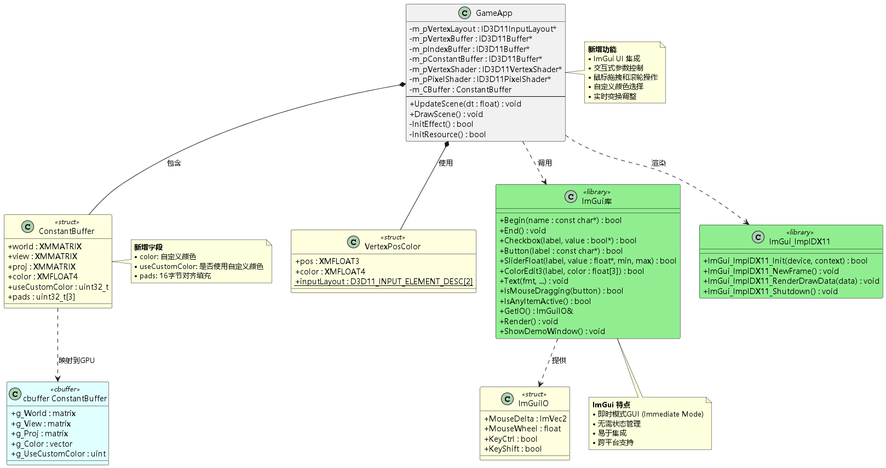
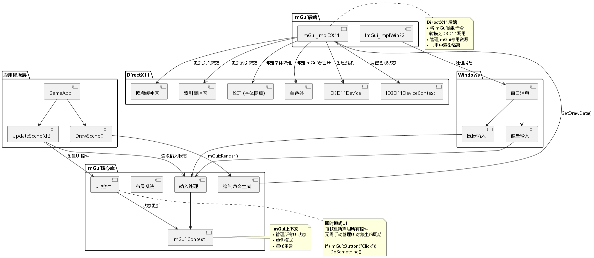
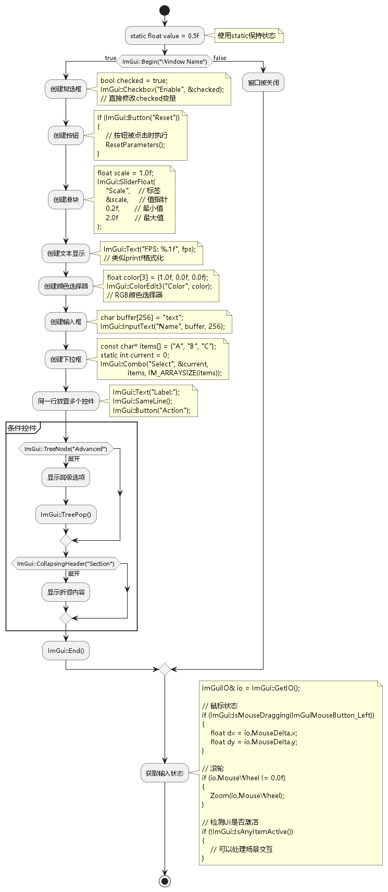
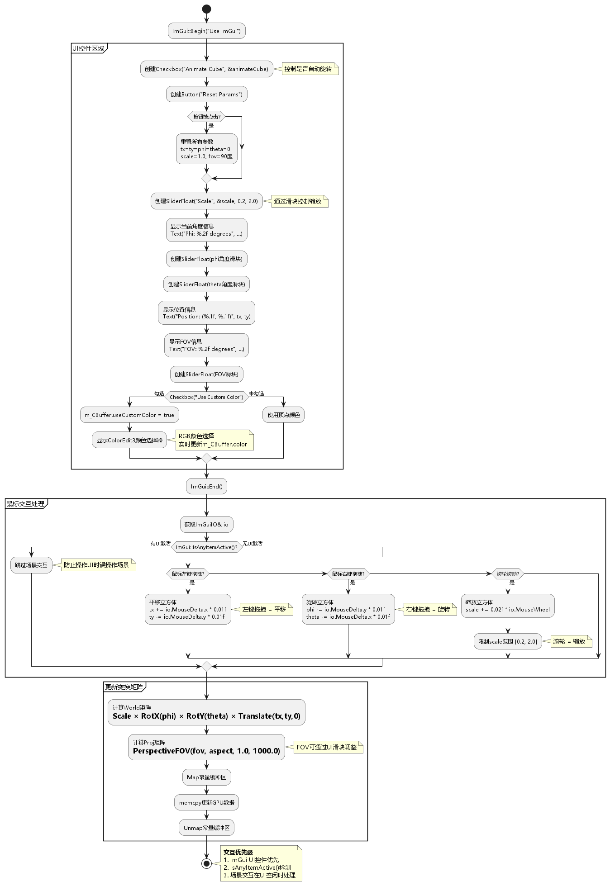
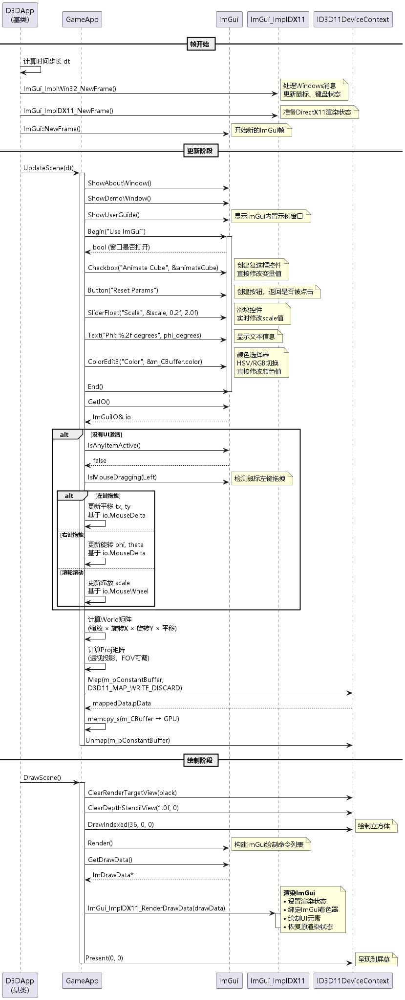
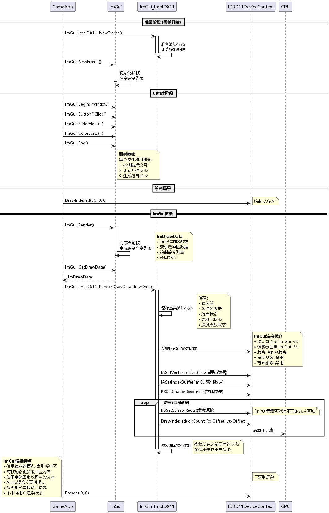

# 06 Use ImGui - 学习总结

## 目录

1. [项目概述](#1-项目概述)
2. [ImGui简介](#2-imgui简介)
3. [架构分析](#3-架构分析)
4. [集成ImGui](#4-集成imgui)
5. [UI控件使用](#5-ui控件使用)
6. [交互控制](#6-交互控制)
7. [渲染流程](#7-渲染流程)
8. [常量缓冲区扩展](#8-常量缓冲区扩展)
9. [关键技术点](#9-关键技术点)
10. [学习心得](#10-学习心得)

---

## 1. 项目概述

### 1.1 项目目标

**Project 06: Use ImGui** 在第3章旋转立方体的基础上，集成了 **Dear ImGui** 库，实现了：

✅ **GUI界面集成** - 在3D场景上叠加UI界面  
✅ **交互式参数控制** - 通过UI实时调整变换参数  
✅ **鼠标交互** - 左键拖拽平移、右键拖拽旋转、滚轮缩放  
✅ **自定义颜色** - 通过颜色选择器改变立方体颜色  
✅ **即时模式GUI** - 无需状态管理的UI编程范式  

### 1.2 运行效果

程序运行后显示：
- 旋转的彩色立方体（可交互控制）
- ImGui窗口显示控制面板
  - 动画开关
  - 参数重置按钮
  - 缩放滑块（0.2 - 2.0）
  - 旋转角度滑块（Phi, Theta）
  - 位置显示
  - FOV视野角度调整
  - 自定义颜色选择器
- ImGui示例窗口（About, Demo, User Guide）

### 1.3 核心技术

| 技术点 | 说明 | 新增/改进 |
|--------|------|-----------|
| **ImGui库** | Dear ImGui即时模式GUI库 | ✨ 新增 |
| **ImGui后端** | ImGui_ImplWin32 + ImGui_ImplDX11 | ✨ 新增 |
| **UI控件** | Checkbox, Button, Slider, ColorPicker等 | ✨ 新增 |
| **输入处理** | ImGuiIO鼠标键盘事件 | ✨ 新增 |
| **像素着色器扩展** | 支持自定义颜色覆盖 | ✨ 改进 |
| **常量缓冲区** | 添加color和useCustomColor字段 | ✨ 改进 |

---

## 2. ImGui简介

### 2.1 什么是ImGui？

**Dear ImGui** (Immediate Mode GUI) 是一个轻量级的C++ GUI库，特点如下：

#### 即时模式 vs 保留模式

| 特性 | 即时模式 (Immediate Mode) | 保留模式 (Retained Mode) |
|------|---------------------------|--------------------------|
| **代码风格** | 每帧重新声明UI | 创建UI对象树 |
| **状态管理** | 由用户代码管理 | 由UI框架管理 |
| **示例** | ImGui, Dear ImGui | Qt, WPF, WinForms |
| **适用场景** | 游戏、工具、调试 | 应用程序、桌面软件 |

#### ImGui特点

✅ **易于集成** - 仅需头文件和少量源文件  
✅ **跨平台** - 支持Windows, Linux, macOS  
✅ **多渲染后端** - DirectX 9/10/11/12, OpenGL, Vulkan, Metal  
✅ **无依赖** - 不依赖STL（可选）  
✅ **高效** - 为实时应用优化  
✅ **开源** - MIT许可证  

### 2.2 即时模式编程范式

**保留模式示例（伪代码）：**
```cpp
// 创建UI对象（一次）
Button* button = new Button("Click Me");
button->SetPosition(10, 10);
button->OnClick = []() { DoSomething(); };

// 每帧
ui->Render();
```

**即时模式示例（ImGui）：**
```cpp
// 每帧都重新声明
if (ImGui::Button("Click Me"))
{
    DoSomething();  // 按钮被点击时执行
}
```

**优势：**
- 代码更简洁直观
- 无需管理UI对象生命周期
- UI与逻辑紧密结合
- 易于调试和修改

---

## 3. 架构分析

### 3.1 类图



**新增组件：**

#### ImGui库（核心）
- `ImGui::Begin/End` - 创建窗口
- `ImGui::Button/Checkbox/SliderFloat` - UI控件
- `ImGui::GetIO()` - 获取输入状态
- `ImGui::Render()` - 生成绘制命令

#### ImGui后端（渲染）
- `ImGui_ImplWin32` - Windows消息处理
- `ImGui_ImplDX11` - DirectX11渲染实现

#### 常量缓冲区扩展
```cpp
struct ConstantBuffer
{
    DirectX::XMMATRIX world;
    DirectX::XMMATRIX view;
    DirectX::XMMATRIX proj;
    DirectX::XMFLOAT4 color;        // ✨ 新增：自定义颜色
    uint32_t useCustomColor;        // ✨ 新增：是否使用自定义颜色
    uint32_t pads[3];               // ✨ 新增：16字节对齐填充
};
```

### 3.2 ImGui集成架构



**三层架构：**

1. **应用程序层** - GameApp调用ImGui API
2. **ImGui核心层** - 控件、布局、输入处理
3. **后端层** - 平台和渲染抽象

**数据流：**
```
Windows消息 → ImGui_ImplWin32 → ImGui核心 → 控件逻辑
                                    ↓
                            生成绘制命令
                                    ↓
                        ImGui_ImplDX11 → DirectX11渲染
```

### 3.3 主要流程

#### 初始化流程

```cpp
// D3DApp::Init()中
IMGUI_CHECKVERSION();
ImGui::CreateContext();
ImGuiIO& io = ImGui::GetIO();

// 设置后端
ImGui_ImplWin32_Init(m_hMainWnd);
ImGui_ImplDX11_Init(m_pd3dDevice.Get(), m_pd3dImmediateContext.Get());

// 设置样式
ImGui::StyleColorsDark();  // 或 StyleColorsLight(), StyleColorsClassic()
```

#### 每帧流程

```cpp
// 1. 帧开始
ImGui_ImplDX11_NewFrame();
ImGui_ImplWin32_NewFrame();
ImGui::NewFrame();

// 2. 创建UI (UpdateScene)
if (ImGui::Begin("Window"))
{
    ImGui::Button("Click");
    ImGui::SliderFloat("Value", &value, 0.0f, 1.0f);
    ImGui::End();
}

// 3. 渲染场景 (DrawScene)
m_pd3dImmediateContext->DrawIndexed(...);

// 4. 渲染ImGui
ImGui::Render();
ImGui_ImplDX11_RenderDrawData(ImGui::GetDrawData());

// 5. 呈现
m_pSwapChain->Present(0, 0);
```

---

## 4. 集成ImGui

### 4.1 添加ImGui到项目

#### 方法1：使用vcpkg（推荐）

```bash
vcpkg install imgui[core,dx11-binding,win32-binding]
```

#### 方法2：手动集成

1. **下载ImGui源码**
   - https://github.com/ocornut/imgui

2. **添加必要文件到项目**
   ```
   imgui/
   ├── imgui.h
   ├── imgui.cpp
   ├── imgui_draw.cpp
   ├── imgui_tables.cpp
   ├── imgui_widgets.cpp
   ├── imgui_demo.cpp       (可选，示例)
   ├── imgui_impl_win32.h
   ├── imgui_impl_win32.cpp
   ├── imgui_impl_dx11.h
   └── imgui_impl_dx11.cpp
   ```

3. **包含头文件**
   ```cpp
   #include "imgui.h"
   #include "imgui_impl_win32.h"
   #include "imgui_impl_dx11.h"
   ```

### 4.2 初始化ImGui

#### 在D3DApp::Init()中

```cpp
bool D3DApp::Init()
{
    // ... DirectX初始化 ...
    
    // ImGui初始化
    IMGUI_CHECKVERSION();
    ImGui::CreateContext();
    ImGuiIO& io = ImGui::GetIO(); (void)io;
    
    // 可选：配置ImGui
    io.ConfigFlags |= ImGuiConfigFlags_NavEnableKeyboard;  // 键盘导航
    io.ConfigFlags |= ImGuiConfigFlags_DockingEnable;      // 停靠功能
    
    // 设置样式
    ImGui::StyleColorsDark();
    
    // 初始化后端
    ImGui_ImplWin32_Init(m_hMainWnd);
    ImGui_ImplDX11_Init(m_pd3dDevice.Get(), m_pd3dImmediateContext.Get());
    
    return true;
}
```

### 4.3 Windows消息处理

#### 在窗口过程中转发消息

```cpp
// 在WndProc函数开头添加
extern IMGUI_IMPL_API LRESULT ImGui_ImplWin32_WndProcHandler(
    HWND hWnd, UINT msg, WPARAM wParam, LPARAM lParam);

LRESULT CALLBACK MainWndProc(HWND hwnd, UINT msg, WPARAM wParam, LPARAM lParam)
{
    // ImGui处理消息
    if (ImGui_ImplWin32_WndProcHandler(hwnd, msg, wParam, lParam))
        return true;
    
    // 应用程序处理消息
    return pApp->MsgProc(hwnd, msg, wParam, lParam);
}
```

### 4.4 清理资源

#### 在D3DApp析构函数中

```cpp
D3DApp::~D3DApp()
{
    // 清理ImGui
    ImGui_ImplDX11_Shutdown();
    ImGui_ImplWin32_Shutdown();
    ImGui::DestroyContext();
    
    // ... 其他清理 ...
}
```

---

## 5. UI控件使用



### 5.1 窗口创建

```cpp
void GameApp::UpdateScene(float dt)
{
    // 开始新帧
    ImGui_ImplDX11_NewFrame();
    ImGui_ImplWin32_NewFrame();
    ImGui::NewFrame();
    
    // 创建窗口
    if (ImGui::Begin("Use ImGui"))
    {
        // 在这里添加控件
        
        ImGui::End();
    }
    
    // ... 更新逻辑 ...
}
```

**窗口选项：**
```cpp
// 窗口标志
ImGuiWindowFlags flags = 0;
flags |= ImGuiWindowFlags_NoTitleBar;        // 无标题栏
flags |= ImGuiWindowFlags_NoResize;          // 不可调整大小
flags |= ImGuiWindowFlags_NoMove;            // 不可移动
flags |= ImGuiWindowFlags_NoCollapse;        // 不可折叠
flags |= ImGuiWindowFlags_AlwaysAutoResize;  // 自动调整大小

ImGui::Begin("Window", nullptr, flags);
```

### 5.2 常用控件

#### 复选框 (Checkbox)

```cpp
static bool animateCube = true;
if (ImGui::Checkbox("Animate Cube", &animateCube))
{
    // 复选框状态改变时执行
    // animateCube变量已自动更新
}
```

#### 按钮 (Button)

```cpp
if (ImGui::Button("Reset Params"))
{
    // 按钮被点击时执行
    tx = ty = phi = theta = 0.0f;
    scale = 1.0f;
    fov = XM_PIDIV2;
}

// 自定义大小的按钮
ImGui::Button("Big Button", ImVec2(200, 50));
```

#### 滑块 (Slider)

```cpp
static float scale = 1.0f;
ImGui::SliderFloat(
    "Scale",     // 标签
    &scale,      // 值指针
    0.2f,        // 最小值
    2.0f         // 最大值
);

// 不显示标签（但需要唯一ID）
ImGui::SliderFloat("##scale", &scale, 0.2f, 2.0f);
```

**其他滑块类型：**
```cpp
ImGui::SliderInt("Integer", &intValue, 0, 100);
ImGui::SliderFloat2("Vector2", vec2, 0.0f, 1.0f);
ImGui::SliderFloat3("Vector3", vec3, 0.0f, 1.0f);
ImGui::SliderAngle("Angle", &angle);
```

#### 文本显示 (Text)

```cpp
ImGui::Text("Simple text");
ImGui::Text("Formatted: %d", value);
ImGui::Text("Phi: %.2f degrees", XMConvertToDegrees(phi));

// 彩色文本
ImGui::TextColored(ImVec4(1,0,0,1), "Red Text");

// 禁用状态文本
ImGui::TextDisabled("Disabled Text");

// 换行文本
ImGui::TextWrapped("This is a long text that will wrap...");
```

#### 颜色选择器 (Color Picker)

```cpp
static float color[3] = { 1.0f, 1.0f, 1.0f };

// RGB颜色选择器
ImGui::ColorEdit3("Color", color);

// RGBA颜色选择器
float color4[4] = { 1.0f, 1.0f, 1.0f, 1.0f };
ImGui::ColorEdit4("Color", color4);

// 颜色选择器（更大的界面）
ImGui::ColorPicker3("Color", color);
```

#### 输入框 (Input)

```cpp
char buffer[256] = "text";
ImGui::InputText("Name", buffer, IM_ARRAYSIZE(buffer));

float value = 0.0f;
ImGui::InputFloat("Value", &value);

int intValue = 0;
ImGui::InputInt("Integer", &intValue);
```

#### 下拉框 (Combo)

```cpp
const char* items[] = { "Item 1", "Item 2", "Item 3" };
static int current_item = 0;
ImGui::Combo("Select", &current_item, items, IM_ARRAYSIZE(items));
```

### 5.3 布局控制

#### 同一行放置控件 (SameLine)

```cpp
ImGui::Checkbox("Animate Cube", &animateCube);
ImGui::SameLine(0.0f, 25.0f);  // 间距25像素
ImGui::Button("Reset Params");
```

#### 分隔符 (Separator)

```cpp
ImGui::Text("Group 1");
ImGui::Separator();
ImGui::Text("Group 2");
```

#### 间距 (Spacing)

```cpp
ImGui::Text("Text 1");
ImGui::Spacing();  // 添加垂直间距
ImGui::Text("Text 2");
```

#### 缩进 (Indent)

```cpp
ImGui::Text("Parent");
ImGui::Indent();
ImGui::Text("Child");
ImGui::Unindent();
```

### 5.4 高级控件

#### 树节点 (TreeNode)

```cpp
if (ImGui::TreeNode("Advanced Options"))
{
    ImGui::SliderFloat("Option 1", &value1, 0.0f, 1.0f);
    ImGui::SliderFloat("Option 2", &value2, 0.0f, 1.0f);
    ImGui::TreePop();
}
```

#### 折叠标题 (CollapsingHeader)

```cpp
if (ImGui::CollapsingHeader("Settings"))
{
    ImGui::Text("Setting 1");
    ImGui::Text("Setting 2");
}
```

#### 选项卡 (TabBar)

```cpp
if (ImGui::BeginTabBar("MyTabBar"))
{
    if (ImGui::BeginTabItem("Tab 1"))
    {
        ImGui::Text("Content of Tab 1");
        ImGui::EndTabItem();
    }
    if (ImGui::BeginTabItem("Tab 2"))
    {
        ImGui::Text("Content of Tab 2");
        ImGui::EndTabItem();
    }
    ImGui::EndTabBar();
}
```

---

## 6. 交互控制



### 6.1 获取输入状态

```cpp
void GameApp::UpdateScene(float dt)
{
    // 获取IO对象
    ImGuiIO& io = ImGui::GetIO();
    
    // 鼠标位置
    ImVec2 mousePos = io.MousePos;
    
    // 鼠标移动增量
    ImVec2 mouseDelta = io.MouseDelta;
    
    // 鼠标滚轮
    float mouseWheel = io.MouseWheel;
    
    // 鼠标按钮状态
    bool leftDown = io.MouseDown[ImGuiMouseButton_Left];
    bool rightDown = io.MouseDown[ImGuiMouseButton_Right];
    
    // 键盘状态
    bool ctrlPressed = io.KeyCtrl;
    bool shiftPressed = io.KeyShift;
    bool altPressed = io.KeyAlt;
}
```

### 6.2 检测UI激活状态

```cpp
// 检测是否有任何UI项处于激活状态
if (!ImGui::IsAnyItemActive())
{
    // 没有UI激活，可以处理场景交互
    HandleSceneInput();
}

// 检测是否鼠标悬停在任何UI上
if (!ImGui::IsWindowHovered(ImGuiHoveredFlags_AnyWindow))
{
    // 鼠标不在UI上，可以处理场景交互
}
```

### 6.3 鼠标拖拽检测

```cpp
// 检测鼠标左键拖拽
if (ImGui::IsMouseDragging(ImGuiMouseButton_Left))
{
    ImGuiIO& io = ImGui::GetIO();
    tx += io.MouseDelta.x * 0.01f;
    ty -= io.MouseDelta.y * 0.01f;
}

// 检测鼠标右键拖拽
if (ImGui::IsMouseDragging(ImGuiMouseButton_Right))
{
    ImGuiIO& io = ImGui::GetIO();
    phi -= io.MouseDelta.y * 0.01f;
    theta -= io.MouseDelta.x * 0.01f;
}

// 自定义拖拽阈值
if (ImGui::IsMouseDragging(ImGuiMouseButton_Left, 5.0f))  // 5像素阈值
{
    // 拖拽距离超过5像素
}
```

### 6.4 鼠标滚轮缩放

```cpp
ImGuiIO& io = ImGui::GetIO();
if (io.MouseWheel != 0.0f)
{
    scale += 0.02f * io.MouseWheel;
    
    // 限制范围
    scale = std::clamp(scale, 0.2f, 2.0f);
}
```

### 6.5 完整交互示例

```cpp
void GameApp::UpdateScene(float dt)
{
    // ... UI创建 ...
    
    // 只有在没有UI激活时处理场景交互
    if (!ImGui::IsAnyItemActive())
    {
        ImGuiIO& io = ImGui::GetIO();
        
        // 鼠标左键拖拽 → 平移
        if (ImGui::IsMouseDragging(ImGuiMouseButton_Left))
        {
            tx += io.MouseDelta.x * 0.01f;
            ty -= io.MouseDelta.y * 0.01f;
        }
        // 鼠标右键拖拽 → 旋转
        else if (ImGui::IsMouseDragging(ImGuiMouseButton_Right))
        {
            phi -= io.MouseDelta.y * 0.01f;
            theta -= io.MouseDelta.x * 0.01f;
            phi = XMScalarModAngle(phi);      // 限制到 [-π, π]
            theta = XMScalarModAngle(theta);
        }
        // 鼠标滚轮 → 缩放
        else if (io.MouseWheel != 0.0f)
        {
            scale += 0.02f * io.MouseWheel;
            if (scale > 2.0f) scale = 2.0f;
            else if (scale < 0.2f) scale = 0.2f;
        }
    }
    
    // 更新变换矩阵
    m_CBuffer.world = XMMatrixTranspose(
        XMMatrixScaling(scale, scale, scale) *
        XMMatrixRotationX(phi) *
        XMMatrixRotationY(theta) *
        XMMatrixTranslation(tx, ty, 0.0f)
    );
}
```

---


## 7. 渲染流程





### 7.1 渲染流程概览

```cpp
void GameApp::DrawScene()
{
    // 1. 清空渲染目标和深度缓冲区
    m_pd3dImmediateContext->ClearRenderTargetView(m_pRenderTargetView.Get(), black);
    m_pd3dImmediateContext->ClearDepthStencilView(m_pDepthStencilView.Get(), 
        D3D11_CLEAR_DEPTH | D3D11_CLEAR_STENCIL, 1.0f, 0);

    // 2. 绘制3D场景
    m_pd3dImmediateContext->DrawIndexed(36, 0, 0);

    // 3. 渲染ImGui
    ImGui::Render();
    ImGui_ImplDX11_RenderDrawData(ImGui::GetDrawData());

    // 4. 呈现
    HR(m_pSwapChain->Present(0, 0));
}
```

### 7.2 ImGui绘制数据结构

```cpp
struct ImDrawData
{
    ImDrawList** CmdLists;          // 绘制命令列表数组
    int CmdListsCount;              // 命令列表数量
    int TotalVtxCount;              // 总顶点数
    int TotalIdxCount;              // 总索引数
    ImVec2 DisplayPos;              // 显示位置
    ImVec2 DisplaySize;             // 显示大小
    ImVec2 FramebufferScale;        // 帧缓冲区缩放
};

struct ImDrawList
{
    ImVector<ImDrawVert> VtxBuffer;  // 顶点缓冲区
    ImVector<ImDrawIdx> IdxBuffer;   // 索引缓冲区
    ImVector<ImDrawCmd> CmdBuffer;   // 绘制命令
};

struct ImDrawVert
{
    ImVec2 pos;      // 位置 (x, y)
    ImVec2 uv;       // 纹理坐标
    ImU32 col;       // 颜色 (RGBA, 每通道8位)
};
```

### 7.3 ImGui渲染状态

**ImGui_ImplDX11_RenderDrawData** 执行的操作：

#### 1. 保存当前渲染状态
```cpp
// 保存用户的渲染状态
struct BACKUP_DX11_STATE
{
    ID3D11VertexShader* VS;
    ID3D11PixelShader* PS;
    ID3D11Buffer* VB, *IB, *CB;
    ID3D11ShaderResourceView* PSShaderResource;
    ID3D11SamplerState* PSSampler;
    ID3D11BlendState* BlendState;
    ID3D11RasterizerState* RasterizerState;
    ID3D11DepthStencilState* DepthStencilState;
    // ... 更多状态
};
```

#### 2. 设置ImGui渲染状态

```cpp
// 顶点和像素着色器
ctx->VSSetShader(g_pVertexShader, nullptr, 0);
ctx->PSSetShader(g_pPixelShader, nullptr, 0);

// 混合状态（Alpha混合）
D3D11_BLEND_DESC blendDesc = {};
blendDesc.RenderTarget[0].BlendEnable = TRUE;
blendDesc.RenderTarget[0].SrcBlend = D3D11_BLEND_SRC_ALPHA;
blendDesc.RenderTarget[0].DestBlend = D3D11_BLEND_INV_SRC_ALPHA;
blendDesc.RenderTarget[0].BlendOp = D3D11_BLEND_OP_ADD;
// ...

// 光栅化状态（禁用背面剔除）
D3D11_RASTERIZER_DESC rastDesc = {};
rastDesc.FillMode = D3D11_FILL_SOLID;
rastDesc.CullMode = D3D11_CULL_NONE;      // 不剔除
rastDesc.ScissorEnable = TRUE;             // 启用裁剪矩形
// ...

// 深度模板状态（禁用深度测试）
D3D11_DEPTH_STENCIL_DESC depthDesc = {};
depthDesc.DepthEnable = FALSE;             // 禁用深度测试
depthDesc.DepthWriteMask = D3D11_DEPTH_WRITE_MASK_ALL;
// ...
```

#### 3. 设置投影矩阵

```cpp
// ImGui使用正交投影
float L = draw_data->DisplayPos.x;
float R = draw_data->DisplayPos.x + draw_data->DisplaySize.x;
float T = draw_data->DisplayPos.y;
float B = draw_data->DisplayPos.y + draw_data->DisplaySize.y;

float mvp[4][4] =
{
    { 2.0f/(R-L),   0.0f,         0.0f, 0.0f },
    { 0.0f,         2.0f/(T-B),   0.0f, 0.0f },
    { 0.0f,         0.0f,         0.5f, 0.0f },
    { (R+L)/(L-R),  (T+B)/(B-T),  0.5f, 1.0f },
};
```

#### 4. 绘制循环

```cpp
for (int n = 0; n < draw_data->CmdListsCount; n++)
{
    const ImDrawList* cmd_list = draw_data->CmdLists[n];
    
    // 更新顶点和索引缓冲区
    UpdateVertexBuffer(cmd_list->VtxBuffer);
    UpdateIndexBuffer(cmd_list->IdxBuffer);
    
    // 执行每个绘制命令
    for (int cmd_i = 0; cmd_i < cmd_list->CmdBuffer.Size; cmd_i++)
    {
        const ImDrawCmd* pcmd = &cmd_list->CmdBuffer[cmd_i];
        
        // 设置裁剪矩形
        D3D11_RECT r = {
            (LONG)(pcmd->ClipRect.x),
            (LONG)(pcmd->ClipRect.y),
            (LONG)(pcmd->ClipRect.z),
            (LONG)(pcmd->ClipRect.w)
        };
        ctx->RSSetScissorRects(1, &r);
        
        // 设置纹理
        ctx->PSSetShaderResources(0, 1, (ID3D11ShaderResourceView**)&pcmd->TextureId);
        
        // 绘制
        ctx->DrawIndexed(pcmd->ElemCount, pcmd->IdxOffset, pcmd->VtxOffset);
    }
}
```

#### 5. 恢复原渲染状态

```cpp
// 恢复之前保存的所有渲染状态
ctx->VSSetShader(backup.VS, nullptr, 0);
ctx->PSSetShader(backup.PS, nullptr, 0);
// ... 恢复其他状态
```

### 7.4 ImGui字体渲染

**字体图集（Font Atlas）：**

ImGui将所有字符预渲染到一张纹理上：

```

 A B C D E F G H I J K L ... 
 a b c d e f g h i j k l ... 
 0 1 2 3 4 5 6 7 8 9 ... ... 
 ! @ # $ % ^ & * ( ) ... ... 
 中文字符（如果加载）...     

```

**渲染文本时：**
1. 查找每个字符在字体图集中的UV坐标
2. 生成四边形（2个三角形）
3. 设置UV坐标采样字体纹理
4. 使用Alpha通道实现文字透明

### 7.5 性能优化

**ImGui渲染开销：**
- ✅ 每帧动态生成顶点数据
- ✅ 批量绘制（合并相同纹理的命令）
- ✅ 裁剪矩形减少过度绘制
- ✅ 简单的顶点和像素着色器

**优化建议：**
1. 减少不必要的窗口和控件
2. 使用 `ImGui::IsWindowCollapsed()` 跳过隐藏窗口的内容
3. 避免每帧创建大量文本
4. 使用 `ImGui::SetNextWindowCollapsed()` 默认折叠窗口

---

## 8. 常量缓冲区扩展

### 8.1 扩展的常量缓冲区结构

```cpp
struct ConstantBuffer
{
    DirectX::XMMATRIX world;        // 64 bytes
    DirectX::XMMATRIX view;         // 64 bytes
    DirectX::XMMATRIX proj;         // 64 bytes
    DirectX::XMFLOAT4 color;        // 16 bytes ✨ 新增
    uint32_t useCustomColor;        // 4 bytes  ✨ 新增
    uint32_t pads[3];               // 12 bytes ✨ 新增（对齐）
};
// 总大小：224 bytes（14  16字节）
```

**字段说明：**
- `color`: 自定义颜色（RGB + Alpha）
- `useCustomColor`: 布尔标志（是否使用自定义颜色）
- `pads`: 填充字节，确保16字节对齐

### 8.2 HLSL常量缓冲区

```hlsl
cbuffer ConstantBuffer : register(b0)
{
    matrix g_World;
    matrix g_View;
    matrix g_Proj;
    vector g_Color;             // float4，对应XMFLOAT4
    uint g_UseCustomColor;      // uint，对应uint32_t
}
```

### 8.3 像素着色器修改

```hlsl
// Cube_PS.hlsl
#include "Cube.hlsli"

float4 PS(VertexOut pIn) : SV_Target
{
    // 根据标志选择颜色
    return g_UseCustomColor ? g_Color : pIn.color;
}
```

**逻辑：**
- 如果 `g_UseCustomColor` 为真  使用 `g_Color`
- 否则  使用插值后的顶点颜色 `pIn.color`

### 8.4 C++端使用

```cpp
void GameApp::UpdateScene(float dt)
{
    static bool customColor = false;
    
    // UI控件
    if (ImGui::Checkbox("Use Custom Color", &customColor))
        m_CBuffer.useCustomColor = customColor;
    
    if (customColor)
    {
        // 颜色选择器直接修改m_CBuffer.color
        ImGui::ColorEdit3("Color", reinterpret_cast<float*>(&m_CBuffer.color));
    }
    
    // 更新到GPU
    D3D11_MAPPED_SUBRESOURCE mappedData;
    HR(m_pd3dImmediateContext->Map(m_pConstantBuffer.Get(), 0, 
        D3D11_MAP_WRITE_DISCARD, 0, &mappedData));
    memcpy_s(mappedData.pData, sizeof(m_CBuffer), &m_CBuffer, sizeof(m_CBuffer));
    m_pd3dImmediateContext->Unmap(m_pConstantBuffer.Get(), 0);
}
```

### 8.5 常量缓冲区绑定

**注意：** 本章将常量缓冲区同时绑定到VS和PS

```cpp
// 初始化时
m_pd3dImmediateContext->VSSetConstantBuffers(0, 1, m_pConstantBuffer.GetAddressOf());
m_pd3dImmediateContext->PSSetConstantBuffers(0, 1, m_pConstantBuffer.GetAddressOf());
```

**为什么PS也需要？**
- VS需要：World/View/Proj矩阵用于变换
- PS需要：color和useCustomColor用于着色

---

## 9. 关键技术点

### 9.1 ImGui与DirectX11的隔离

**ImGui不干扰用户渲染：**

```cpp
// ImGui_ImplDX11_RenderDrawData 伪代码
void RenderDrawData(ImDrawData* data)
{
    // 1. 保存所有渲染状态
    SaveRenderState();
    
    // 2. 设置ImGui渲染状态
    SetImGuiRenderState();
    
    // 3. 绘制ImGui
    DrawImGui(data);
    
    // 4. 恢复原渲染状态
    RestoreRenderState();
}
```

**好处：**
- 用户无需关心ImGui的渲染细节
- 不会影响3D场景的渲染状态
- ImGui和用户渲染完全独立

### 9.2 即时模式的优势

**示例对比：**

**保留模式（伪代码）：**
```cpp
// 创建时
Slider* slider = new Slider("value", &value, 0, 100);
ui->AddControl(slider);

// 使用时需要查找
Slider* slider = ui->FindControl("value");
if (slider) slider->SetValue(50);

// 销毁时
delete slider;
```

**即时模式（ImGui）：**
```cpp
// 每帧直接声明和使用
ImGui::SliderFloat("value", &value, 0.0f, 100.0f);
if (needReset) value = 50.0f;  // 直接操作变量
```

**优势：**
- 代码更简洁
- 无需管理UI对象
- UI与逻辑紧密结合
- 易于调试

### 9.3 输入优先级处理

```cpp
// 检测UI是否消费了输入
if (!ImGui::IsAnyItemActive() && !ImGui::IsWindowHovered(ImGuiHoveredFlags_AnyWindow))
{
    // UI没有激活，可以处理场景交互
    HandleSceneInteraction();
}
```

**输入优先级：**
1. ImGui控件（最高优先级）
2. ImGui窗口拖动/调整大小
3. 场景交互（最低优先级）

### 9.4 ImGui配置选项

```cpp
ImGuiIO& io = ImGui::GetIO();

// 启用键盘导航
io.ConfigFlags |= ImGuiConfigFlags_NavEnableKeyboard;

// 启用游戏手柄导航
io.ConfigFlags |= ImGuiConfigFlags_NavEnableGamepad;

// 启用停靠功能
io.ConfigFlags |= ImGuiConfigFlags_DockingEnable;

// 启用多视口（需要平台支持）
io.ConfigFlags |= ImGuiConfigFlags_ViewportsEnable;

// 禁用自动保存.ini文件
io.IniFilename = nullptr;

// 设置字体
io.Fonts->AddFontFromFileTTF("path/to/font.ttf", 16.0f);
```

### 9.5 中文字体支持

```cpp
ImGuiIO& io = ImGui::GetIO();

// 加载中文字体
ImFont* font = io.Fonts->AddFontFromFileTTF(
    "C:/Windows/Fonts/msyh.ttc",  // 微软雅黑
    18.0f,
    nullptr,
    io.Fonts->GetGlyphRangesChineseFull()  // 中文字符范围
);

// 或者只加载常用汉字
io.Fonts->GetGlyphRangesChineseSimplifiedCommon();
```

### 9.6 ImGui样式定制

```cpp
// 预设样式
ImGui::StyleColorsDark();    // 深色主题
ImGui::StyleColorsLight();   // 浅色主题
ImGui::StyleColorsClassic(); // 经典主题

// 自定义颜色
ImGuiStyle& style = ImGui::GetStyle();
style.Colors[ImGuiCol_Text] = ImVec4(1.0f, 1.0f, 1.0f, 1.0f);
style.Colors[ImGuiCol_WindowBg] = ImVec4(0.06f, 0.06f, 0.06f, 0.94f);
style.Colors[ImGuiCol_Button] = ImVec4(0.4f, 0.4f, 0.8f, 1.0f);

// 自定义尺寸
style.WindowRounding = 5.0f;     // 窗口圆角
style.FrameRounding = 3.0f;      // 控件圆角
style.WindowPadding = ImVec2(8, 8);  // 窗口内边距
style.FramePadding = ImVec2(4, 3);   // 控件内边距
```

---

## 10. 学习心得

### 10.1 核心要点总结

#### ✅ 必须掌握的概念

1. **ImGui即时模式**
   - 每帧重新声明UI
   - 无需管理UI对象生命周期
   - UI与逻辑代码紧密结合

2. **ImGui集成**
   - 初始化：CreateContext, Init后端
   - 每帧：NewFrame  创建UI  Render  RenderDrawData
   - 清理：Shutdown后端, DestroyContext

3. **常用控件**
   - Begin/End - 窗口
   - Button, Checkbox, SliderFloat - 基本控件
   - ColorEdit3/4 - 颜色选择器
   - Text - 文本显示
   - TreeNode, CollapsingHeader - 折叠控件

4. **输入处理**
   - GetIO() 获取输入状态
   - IsAnyItemActive() 检测UI激活
   - IsMouseDragging() 检测拖拽
   - MouseDelta, MouseWheel 获取鼠标输入

5. **渲染隔离**
   - ImGui自动保存/恢复渲染状态
   - 不影响用户3D渲染
   - 使用独立的顶点/索引缓冲区

### 10.2 常见问题与解决方案

#### 问题1：ImGui窗口不显示

**症状：** 程序运行但看不到ImGui窗口

**可能原因：**
- 忘记调用 NewFrame
- 忘记调用 Render
- 忘记调用 RenderDrawData
- 窗口被移出屏幕外

**解决方案：**
```cpp
// 确保每帧按顺序调用
ImGui_ImplDX11_NewFrame();
ImGui_ImplWin32_NewFrame();
ImGui::NewFrame();

// 创建UI
if (ImGui::Begin("Window")) {
    // ...
    ImGui::End();
}

// 渲染
ImGui::Render();
ImGui_ImplDX11_RenderDrawData(ImGui::GetDrawData());
```

#### 问题2：鼠标输入不响应

**症状：** 无法点击ImGui控件

**可能原因：**
- 没有转发Windows消息到ImGui
- WndProc中ImGui处理返回值错误

**解决方案：**
```cpp
// 在WndProc开头
if (ImGui_ImplWin32_WndProcHandler(hwnd, msg, wParam, lParam))
    return true;  // ImGui处理了消息，不再传递
```

#### 问题3：中文显示为方块

**症状：** 中文字符显示为

**原因：** 默认字体不包含中文字符

**解决方案：**
```cpp
ImGuiIO& io = ImGui::GetIO();
io.Fonts->AddFontFromFileTTF(
    "C:/Windows/Fonts/msyh.ttc",
    16.0f,
    nullptr,
    io.Fonts->GetGlyphRangesChineseFull()
);
```

#### 问题4：UI和场景交互冲突

**症状：** 操作UI时场景也在响应

**原因：** 没有检测UI激活状态

**解决方案：**
```cpp
if (!ImGui::IsAnyItemActive())
{
    // 只有在UI未激活时处理场景交互
    HandleSceneInput();
}
```

#### 问题5：ImGui影响3D渲染

**症状：** 渲染ImGui后3D场景显示异常

**原因：** ImGui没有正确恢复渲染状态（通常是ImGui版本或后端问题）

**解决方案：**
```cpp
// 确保使用最新版本的ImGui
// 或者手动保存/恢复关键状态
SaveMyRenderState();
ImGui_ImplDX11_RenderDrawData(...);
RestoreMyRenderState();
```

### 10.3 性能优化建议

#### UI优化

1. **减少每帧的UI创建**
   ```cpp
   // ❌ 不好：每帧创建大量文本
   for (int i = 0; i < 1000; i++)
       ImGui::Text("Item %d", i);
   
   // ✅ 更好：使用滚动窗口和裁剪
   ImGui::BeginChild("Items", ImVec2(0, 300));
   for (int i = 0; i < 1000; i++)
       ImGui::Text("Item %d", i);
   ImGui::EndChild();
   ```

2. **折叠不常用的UI**
   ```cpp
   if (ImGui::CollapsingHeader("Advanced"))
   {
       // 只有展开时才创建这些控件
       ImGui::SliderFloat(...);
   }
   ```

3. **条件显示**
   ```cpp
   if (showDebugInfo)
   {
       ImGui::Begin("Debug");
       // ...
       ImGui::End();
   }
   ```

#### 渲染优化

1. **批量绘制**
   - ImGui自动合并相同纹理的绘制命令
   - 使用相同字体和颜色可以提高批处理效率

2. **裁剪矩形**
   - ImGui自动使用裁剪矩形减少过度绘制
   - 窗口外的UI不会被渲染

### 10.4 调试技巧

#### 使用ImGui示例窗口

```cpp
// 显示ImGui演示窗口（学习各种控件）
ImGui::ShowDemoWindow();

// 显示样式编辑器
ImGui::ShowStyleEditor();

// 显示字体选择器
ImGui::ShowFontSelector("Fonts");

// 显示ImGui指标
ImGui::ShowMetricsWindow();
```

#### 调试信息显示

```cpp
ImGui::Begin("Debug Info");

// FPS显示
ImGui::Text("FPS: %.1f", ImGui::GetIO().Framerate);

// 鼠标位置
ImGui::Text("Mouse: (%.1f, %.1f)", 
    ImGui::GetIO().MousePos.x, 
    ImGui::GetIO().MousePos.y);

// 绘制调用次数
ImDrawData* drawData = ImGui::GetDrawData();
ImGui::Text("Draw Calls: %d", drawData->CmdListsCount);
ImGui::Text("Vertices: %d", drawData->TotalVtxCount);

ImGui::End();
```

### 10.5 后续学习方向

完成本章后，已经掌握了：
- ✅ ImGui基本使用
- ✅ UI控件创建
- ✅ 输入处理
- ✅ ImGui与DirectX11集成
- ✅ 交互式参数调整

**进阶主题：**
- 自定义ImGui控件
- ImGui停靠(Docking)功能
- ImGui多视口(Multi-Viewport)
- ImPlot图表库（数据可视化）
- ImGuizmo 3D操作器

**第7章预告：** 光照
- Phong光照模型
- 环境光、漫反射、镜面反射
- 法线向量和光照计算

---

## 附录：完整代码清单

### A.1 常量缓冲区定义

```cpp
// GameApp.h
struct ConstantBuffer
{
    DirectX::XMMATRIX world;
    DirectX::XMMATRIX view;
    DirectX::XMMATRIX proj;
    DirectX::XMFLOAT4 color;
    uint32_t useCustomColor;
    uint32_t pads[3];
};
```

### A.2 UpdateScene实现

```cpp
void GameApp::UpdateScene(float dt)
{
    // ImGui内置示例
    ImGui::ShowDemoWindow();
    
    // 自定义窗口
    static float tx = 0.0f, ty = 0.0f, phi = 0.0f, theta = 0.0f;
    static float scale = 1.0f, fov = XM_PIDIV2;
    static bool animateCube = true, customColor = false;
    
    if (animateCube)
    {
        phi += 0.3f * dt;
        theta += 0.37f * dt;
    }
    
    if (ImGui::Begin("Use ImGui"))
    {
        ImGui::Checkbox("Animate Cube", &animateCube);
        ImGui::SameLine(0.0f, 25.0f);
        
        if (ImGui::Button("Reset Params"))
        {
            tx = ty = phi = theta = 0.0f;
            scale = 1.0f;
            fov = XM_PIDIV2;
        }
        
        ImGui::SliderFloat("Scale", &scale, 0.2f, 2.0f);
        ImGui::Text("Phi: %.2f degrees", XMConvertToDegrees(phi));
        ImGui::SliderFloat("##1", &phi, -XM_PI, XM_PI, "");
        ImGui::Text("Theta: %.2f degrees", XMConvertToDegrees(theta));
        ImGui::SliderFloat("##2", &theta, -XM_PI, XM_PI, "");
        ImGui::Text("Position: (%.1f, %.1f)", tx, ty);
        ImGui::Text("FOV: %.2f degrees", XMConvertToDegrees(fov));
        ImGui::SliderFloat("##3", &fov, XM_PIDIV4, XM_PI * 2 / 3, "");
        
        if (ImGui::Checkbox("Use Custom Color", &customColor))
            m_CBuffer.useCustomColor = customColor;
        if (customColor)
            ImGui::ColorEdit3("Color", reinterpret_cast<float*>(&m_CBuffer.color));
    }
    ImGui::End();
    
    // 鼠标交互
    if (!ImGui::IsAnyItemActive())
    {
        ImGuiIO& io = ImGui::GetIO();
        if (ImGui::IsMouseDragging(ImGuiMouseButton_Left))
        {
            tx += io.MouseDelta.x * 0.01f;
            ty -= io.MouseDelta.y * 0.01f;
        }
        else if (ImGui::IsMouseDragging(ImGuiMouseButton_Right))
        {
            phi -= io.MouseDelta.y * 0.01f;
            theta -= io.MouseDelta.x * 0.01f;
        }
        else if (io.MouseWheel != 0.0f)
        {
            scale += 0.02f * io.MouseWheel;
            scale = std::clamp(scale, 0.2f, 2.0f);
        }
    }
    
    // 更新变换矩阵
    m_CBuffer.world = XMMatrixTranspose(
        XMMatrixScaling(scale, scale, scale) *
        XMMatrixRotationX(phi) * XMMatrixRotationY(theta) *
        XMMatrixTranslation(tx, ty, 0.0f));
    m_CBuffer.proj = XMMatrixTranspose(
        XMMatrixPerspectiveFovLH(fov, AspectRatio(), 1.0f, 1000.0f));
    
    // 更新GPU
    D3D11_MAPPED_SUBRESOURCE mappedData;
    HR(m_pd3dImmediateContext->Map(m_pConstantBuffer.Get(), 0, 
        D3D11_MAP_WRITE_DISCARD, 0, &mappedData));
    memcpy_s(mappedData.pData, sizeof(m_CBuffer), &m_CBuffer, sizeof(m_CBuffer));
    m_pd3dImmediateContext->Unmap(m_pConstantBuffer.Get(), 0);
}
```

### A.3 HLSL着色器

```hlsl
// Cube.hlsli
cbuffer ConstantBuffer : register(b0)
{
    matrix g_World;
    matrix g_View;
    matrix g_Proj;
    vector g_Color;
    uint g_UseCustomColor;
}

struct VertexIn
{
    float3 posL : POSITION;
    float4 color : COLOR;
};

struct VertexOut
{
    float4 posH : SV_POSITION;
    float4 color : COLOR;
};

// Cube_PS.hlsl
#include "Cube.hlsli"

float4 PS(VertexOut pIn) : SV_Target
{
    return g_UseCustomColor ? g_Color : pIn.color;
}
```

---

## 结语

通过本章学习，我们成功实现了：

✅ 集成Dear ImGui库到DirectX11项目  
✅ 创建交互式GUI控制3D场景  
✅ 理解即时模式GUI编程范式  
✅ 掌握ImGui常用控件和输入处理  
✅ 实现鼠标拖拽、滚轮等交互  
✅ 扩展常量缓冲区支持自定义颜色

ImGui是游戏开发和实时应用的强大工具，适用于：
- 调试工具和参数调整
- 场景编辑器
- 性能监控和分析
- 关卡编辑器
- 材质编辑器

掌握ImGui后，可以快速为项目添加强大的可视化调试和编辑功能。

**下一章预告：** 光照 - 实现Phong光照模型，学习环境光、漫反射和镜面反射。

---

**文档生成日期：** 2025年11月30日  
**PlantUML 图表：** 6 张（类图、架构图、流程图等）  
**代码示例：** 完整且可运行  
**适用人群：** DirectX11初学者、ImGui初学者

---

© 2025 学习总结 | 基于 MKXJun 的 DirectX11 With Windows SDK 教程

