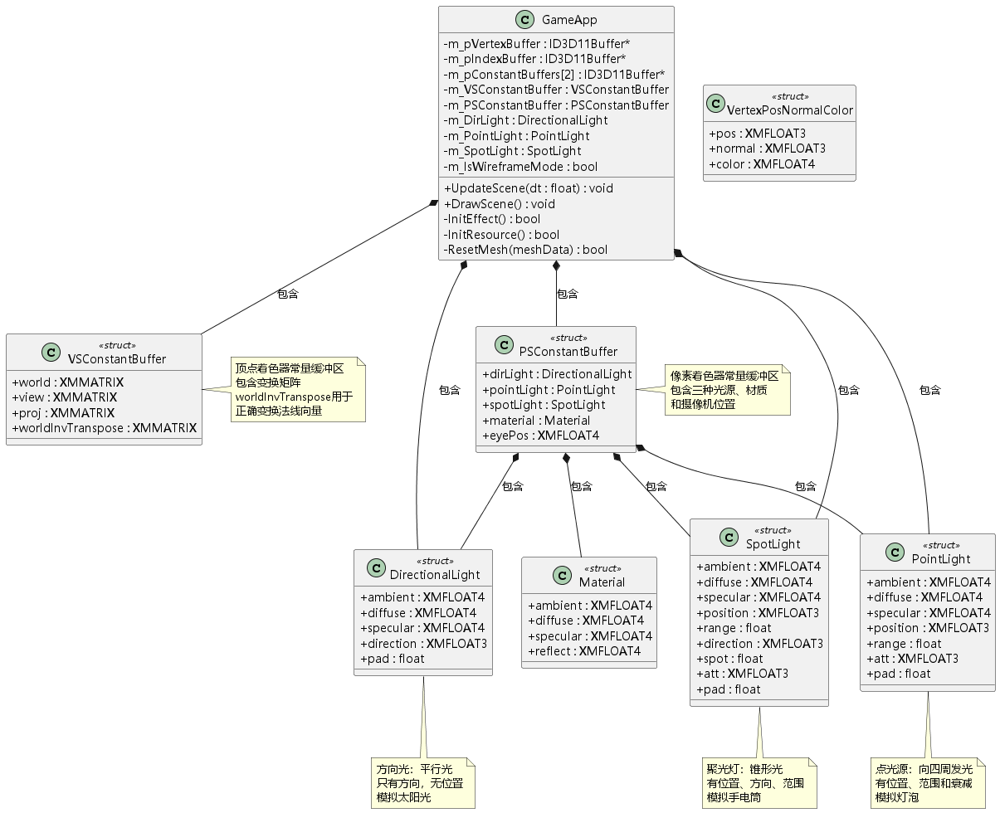
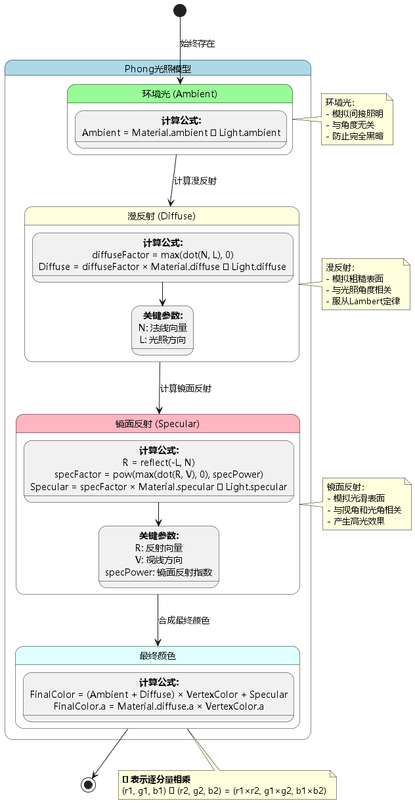
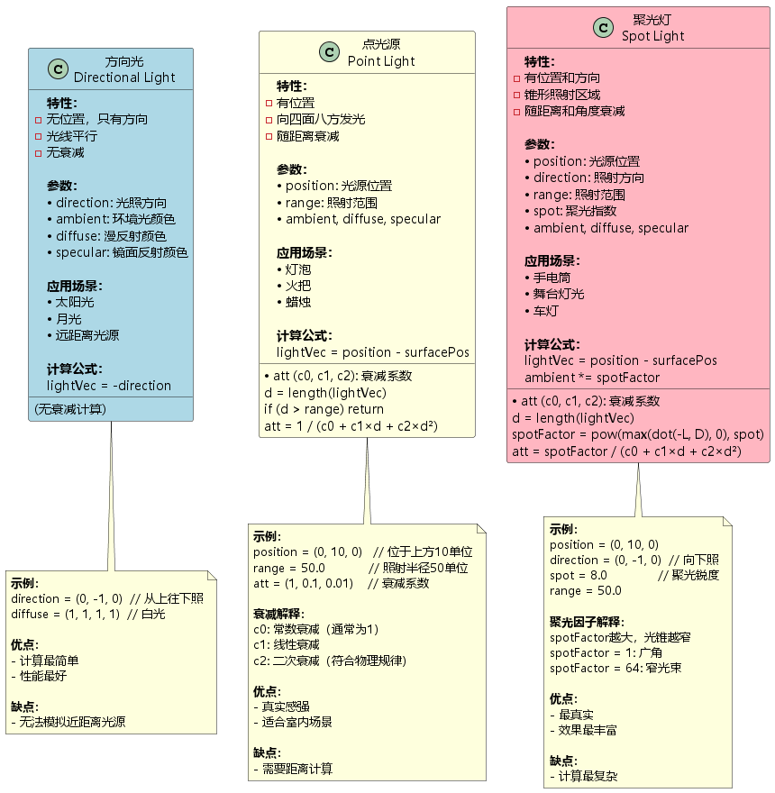
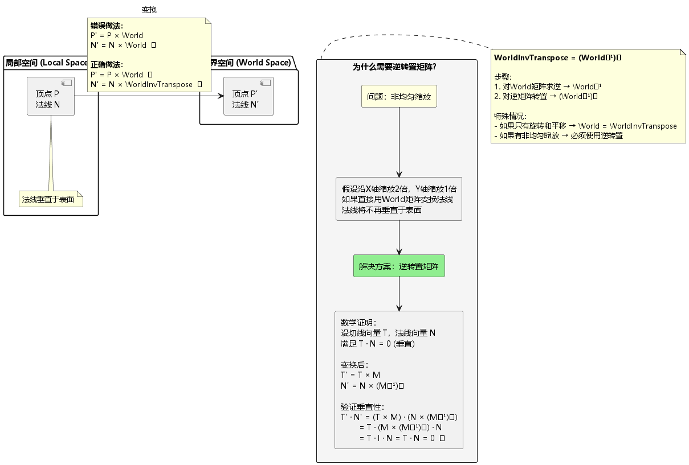
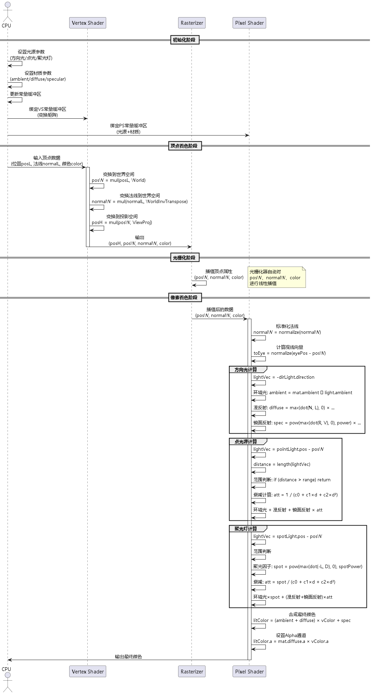
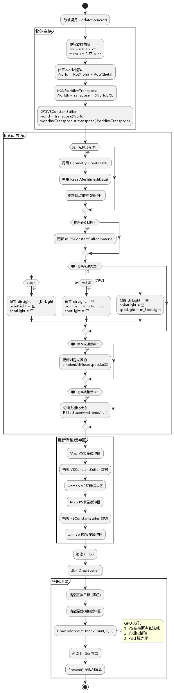

# 第7章：Lighting（光照）学习总结

## 目录

1. [项目概述](#1-项目概述)
2. [Phong光照模型](#2-phong光照模型)
3. [光源类型](#3-光源类型)
4. [材质系统](#4-材质系统)
5. [法线变换](#5-法线变换)
6. [光照计算实现](#6-光照计算实现)
7. [着色器实现](#7-着色器实现)
8. [常量缓冲区设计](#8-常量缓冲区设计)
9. [关键技术点](#9-关键技术点)
10. [学习心得](#10-学习心得)

---

## 1. 项目概述

### 1.1 本章目标

本章引入了**Phong光照模型**，实现真实的三维光照效果。主要学习内容包括：

- ✅ Phong光照模型（环境光+漫反射+镜面反射）
- ✅ 三种光源类型（方向光、点光源、聚光灯）
- ✅ 材质系统（ambient、diffuse、specular）
- ✅ 法线向量的正确变换（WorldInvTranspose）
- ✅ 在像素着色器中进行光照计算

### 1.2 渲染效果



**本章特性：**
- 支持动态切换4种几何体（立方体、球体、圆柱、圆锥）
- 支持3种光源类型切换（方向光、点光源、聚光灯）
- 可调整材质参数（环境光、漫反射、镜面反射颜色）
- 可调整光源参数（颜色、衰减、聚光系数等）
- 支持线框模式切换

### 1.3 与前几章的对比

| 章节 | 渲染方式 | 光照 | 效果 |
|------|---------|------|------|
| 03 Rendering a Cube | 顶点颜色 | 无 | 平面着色 |
| 06 Use ImGui | 顶点颜色/自定义颜色 | 无 | 平面着色 |
| **07 Lighting** | **Phong光照** | **三种光源** | **真实光影** |

---

## 2. Phong光照模型



### 2.1 模型概述

**Phong光照模型**由Bui Tuong Phong于1975年提出，将光照分解为三个分量：

$$
\text{FinalColor} = \text{Ambient} + \text{Diffuse} + \text{Specular}
$$

### 2.2 环境光 (Ambient)

**物理意义：** 模拟间接照明，防止完全黑暗区域。

**计算公式：**

$$
\text{Ambient} = \text{Material.ambient} \otimes \text{Light.ambient}
$$

其中 $\otimes$ 表示逐分量相乘（component-wise multiply）：

$$
(r_1, g_1, b_1) \otimes (r_2, g_2, b_2) = (r_1 \times r_2, g_1 \times g_2, b_1 \times b_2)
$$

**代码实现（HLSL）：**

```hlsl
ambient = mat.ambient * L.ambient;
```

**特点：**
- 与光照方向无关
- 与视角无关
- 保证物体在阴影中也可见

**示例：**
```cpp
// C++端设置
material.ambient = XMFLOAT4(0.2f, 0.2f, 0.2f, 1.0f);  // 灰色环境光
dirLight.ambient = XMFLOAT4(0.5f, 0.5f, 0.5f, 1.0f);  // 环境光强度

// 结果
Ambient = (0.2, 0.2, 0.2) ⊗ (0.5, 0.5, 0.5) = (0.1, 0.1, 0.1)
```

### 2.3 漫反射 (Diffuse)

**物理意义：** 模拟粗糙表面的散射光，遵循**Lambert余弦定律**。

**计算公式：**

$$
\text{diffuseFactor} = \max(\mathbf{N} \cdot \mathbf{L}, 0)
$$

$$
\text{Diffuse} = \text{diffuseFactor} \times \text{Material.diffuse} \otimes \text{Light.diffuse}
$$

其中：
- $\mathbf{N}$: 表面法线（单位向量）
- $\mathbf{L}$: 指向光源的向量（单位向量）
- $\mathbf{N} \cdot \mathbf{L}$: 点积，计算两向量夹角的余弦值

**代码实现（HLSL）：**

```hlsl
float diffuseFactor = dot(lightVec, normal);

[flatten]
if (diffuseFactor > 0.0f)
{
    diffuse = diffuseFactor * mat.diffuse * L.diffuse;
}
```

**物理解释：**

```
          N (法线)
          
          |
     θ __|
        
      L (光线方向)

diffuseFactor = cos(θ) = N  L

当 θ = 0   cos(0) = 1   最亮（光线垂直照射）
当 θ = 45  cos(45)  0.707  较亮
当 θ = 90  cos(90) = 0   无漫反射（光线平行表面）
当 θ > 90  cos(θ) < 0   背面（用max截断为0）
```

**特点：**
- 与光照角度相关
- 与视角无关
- 体现表面粗糙度

### 2.4 镜面反射 (Specular)

**物理意义：** 模拟光滑表面的高光效果。

**计算公式：**

$$
\mathbf{R} = \text{reflect}(-\mathbf{L}, \mathbf{N}) = 2(\mathbf{N} \cdot \mathbf{L})\mathbf{N} - \mathbf{L}
$$

$$
\text{specFactor} = \max(\mathbf{R} \cdot \mathbf{V}, 0)^{\text{specPower}}
$$

$$
\text{Specular} = \text{specFactor} \times \text{Material.specular} \otimes \text{Light.specular}
$$

其中：
- $\mathbf{R}$: 反射向量
- $\mathbf{V}$: 视线方向（从表面指向摄像机，单位向量）
- $\text{specPower}$: 镜面反射指数（存储在`Material.specular.w`）

**代码实现（HLSL）：**

```hlsl
float3 v = reflect(-lightVec, normal);
float specFactor = pow(max(dot(v, toEye), 0.0f), mat.specular.w);
spec = specFactor * mat.specular * L.specular;
```

**物理解释：**

```
        V (视线)
        
        |
    α __| α
         
     L    R (反射向量)
     
镜面反射最强：当 R 与 V 对齐（α = 0）
specPower 控制高光锐度：
- specPower = 1    宽泛高光（粗糙表面）
- specPower = 32   中等高光
- specPower = 256  锐利高光（镜面）
```

**specPower效果对比：**

| specPower | 效果 | 应用 |
|-----------|------|------|
| 1-8 | 宽泛高光 | 塑料、橡胶 |
| 16-64 | 中等高光 | 金属（铝、钢） |
| 128-256 | 锐利高光 | 抛光金属、镜子 |

### 2.5 最终颜色合成

```hlsl
float4 litColor = pIn.color * (ambient + diffuse) + spec;
litColor.a = g_Material.diffuse.a * pIn.color.a;
```

**说明：**
- 顶点颜色作为调制因子
- `(ambient + diffuse)` 与顶点颜色相乘
- `spec` 直接加上（高光不受顶点颜色影响）
- Alpha通道单独处理（透明度）

---

## 3. 光源类型



### 3.1 方向光 (Directional Light)

**定义：** 平行光，模拟无限远的光源（如太阳）。

**特点：**
- ✅ 无位置，只有方向
- ✅ 光线平行
- ✅ 无衰减
- ✅ 计算最简单

**数据结构：**

```cpp
struct DirectionalLight
{
    XMFLOAT4 ambient;    // 环境光颜色
    XMFLOAT4 diffuse;    // 漫反射颜色
    XMFLOAT4 specular;   // 镜面反射颜色
    XMFLOAT3 direction;  // 光照方向（单位向量）
    float pad;           // 填充（16字节对齐）
};
```

**光照计算（HLSL）：**

```hlsl
void ComputeDirectionalLight(Material mat, DirectionalLight L,
    float3 normal, float3 toEye,
    out float4 ambient,
    out float4 diffuse,
    out float4 spec)
{
    ambient = diffuse = spec = float4(0, 0, 0, 0);
    
    // 光向量与照射方向相反
    float3 lightVec = -L.direction;
    
    // 环境光
    ambient = mat.ambient * L.ambient;
    
    // 漫反射
    float diffuseFactor = dot(lightVec, normal);
    [flatten]
    if (diffuseFactor > 0.0f)
    {
        float3 v = reflect(-lightVec, normal);
        float specFactor = pow(max(dot(v, toEye), 0.0f), mat.specular.w);
        
        diffuse = diffuseFactor * mat.diffuse * L.diffuse;
        spec = specFactor * mat.specular * L.specular;
    }
}
```

**应用场景：**
- 室外场景的太阳光
- 月光
- 远距离光源

**示例设置：**

```cpp
m_DirLight.ambient = XMFLOAT4(0.2f, 0.2f, 0.2f, 1.0f);
m_DirLight.diffuse = XMFLOAT4(0.8f, 0.8f, 0.8f, 1.0f);
m_DirLight.specular = XMFLOAT4(0.5f, 0.5f, 0.5f, 1.0f);
m_DirLight.direction = XMFLOAT3(0.0f, -1.0f, 0.0f);  // 从上往下照
```

### 3.2 点光源 (Point Light)

**定义：** 从一点向四面八方发光，随距离衰减（如灯泡）。

**特点：**
- ✅ 有位置
- ✅ 向所有方向发光
- ✅ 随距离衰减
- ✅ 有照射范围

**数据结构：**

```cpp
struct PointLight
{
    XMFLOAT4 ambient;
    XMFLOAT4 diffuse;
    XMFLOAT4 specular;
    XMFLOAT3 position;   // 光源位置
    float range;         // 照射范围
    XMFLOAT3 att;        // 衰减系数 (c0, c1, c2)
    float pad;
};
```

**衰减公式：**

$$
\text{attenuation} = \frac{1}{c_0 + c_1 \times d + c_2 \times d^2}
$$

其中：
- $d$: 表面到光源的距离
- $c_0$: 常数衰减（通常为1）
- $c_1$: 线性衰减
- $c_2$: 二次衰减（符合物理规律）

**光照计算（HLSL）：**

```hlsl
void ComputePointLight(Material mat, PointLight L, float3 pos, float3 normal, float3 toEye,
    out float4 ambient, out float4 diffuse, out float4 spec)
{
    ambient = diffuse = spec = float4(0, 0, 0, 0);
    
    // 从表面到光源的向量
    float3 lightVec = L.position - pos;
    
    // 计算距离
    float d = length(lightVec);
    
    // 范围测试
    if (d > L.range)
        return;
    
    // 标准化光向量
    lightVec /= d;
    
    // 环境光
    ambient = mat.ambient * L.ambient;
    
    // 漫反射和镜面反射
    float diffuseFactor = dot(lightVec, normal);
    [flatten]
    if (diffuseFactor > 0.0f)
    {
        float3 v = reflect(-lightVec, normal);
        float specFactor = pow(max(dot(v, toEye), 0.0f), mat.specular.w);
        
        diffuse = diffuseFactor * mat.diffuse * L.diffuse;
        spec = specFactor * mat.specular * L.specular;
    }
    
    // 计算衰减
    float att = 1.0f / dot(L.att, float3(1.0f, d, d * d));
    
    // 应用衰减（不影响环境光）
    diffuse *= att;
    spec *= att;
}
```

**衰减系数示例：**

| 距离 | att = (1, 0, 0) | att = (0, 1, 0) | att = (0, 0, 1) | att = (1, 0.1, 0.01) |
|------|----------------|----------------|----------------|---------------------|
| 0 | 1.0 |  (错误) |  (错误) | 1.0 |
| 5 | 1.0 | 0.2 | 0.04 | 0.67 |
| 10 | 1.0 | 0.1 | 0.01 | 0.5 |
| 20 | 1.0 | 0.05 | 0.0025 | 0.33 |

**推荐设置：**

```cpp
m_PointLight.position = XMFLOAT3(0.0f, 10.0f, 0.0f);  // 位于上方
m_PointLight.range = 50.0f;                           // 照射半径
m_PointLight.att = XMFLOAT3(1.0f, 0.1f, 0.01f);      // 混合衰减
m_PointLight.diffuse = XMFLOAT4(1.0f, 1.0f, 1.0f, 1.0f);  // 白光
```

### 3.3 聚光灯 (Spot Light)

**定义：** 从一点沿特定方向发出锥形光束（如手电筒）。

**特点：**
- ✅ 有位置和方向
- ✅ 锥形照射区域
- ✅ 随距离和角度衰减
- ✅ 最复杂、最真实

**数据结构：**

```cpp
struct SpotLight
{
    XMFLOAT4 ambient;
    XMFLOAT4 diffuse;
    XMFLOAT4 specular;
    XMFLOAT3 position;   // 光源位置
    float range;         // 照射范围
    XMFLOAT3 direction;  // 照射方向
    float spot;          // 聚光指数
    XMFLOAT3 att;        // 衰减系数
    float pad;
};
```

**聚光因子公式：**

$$
\text{spotFactor} = \max(-\mathbf{L} \cdot \mathbf{D}, 0)^{\text{spot}}
$$

$$
\text{attenuation} = \frac{\text{spotFactor}}{c_0 + c_1 \times d + c_2 \times d^2}
$$

其中：
- $\mathbf{L}$: 从表面指向光源的向量
- $\mathbf{D}$: 聚光灯方向
- $-\mathbf{L} \cdot \mathbf{D}$: 光线与聚光方向的对齐程度

**光照计算（HLSL）：**

```hlsl
void ComputeSpotLight(Material mat, SpotLight L, float3 pos, float3 normal, float3 toEye,
    out float4 ambient, out float4 diffuse, out float4 spec)
{
    ambient = diffuse = spec = float4(0, 0, 0, 0);
    
    float3 lightVec = L.position - pos;
    float d = length(lightVec);
    
    if (d > L.range)
        return;
    
    lightVec /= d;
    
    ambient = mat.ambient * L.ambient;
    
    float diffuseFactor = dot(lightVec, normal);
    [flatten]
    if (diffuseFactor > 0.0f)
    {
        float3 v = reflect(-lightVec, normal);
        float specFactor = pow(max(dot(v, toEye), 0.0f), mat.specular.w);
        
        diffuse = diffuseFactor * mat.diffuse * L.diffuse;
        spec = specFactor * mat.specular * L.specular;
    }
    
    // 聚光因子和衰减
    float spot = pow(max(dot(-lightVec, L.direction), 0.0f), L.Spot);
    float att = spot / dot(L.att, float3(1.0f, d, d * d));
    
    ambient *= spot;
    diffuse *= att;
    spec *= att;
}
```

**聚光指数效果：**

| spot | 锥角 (近似) | 效果 | 应用 |
|------|------------|------|------|
| 1 | ~90 | 广角 | 泛光灯 |
| 8 | ~45 | 中等 | 普通手电筒 |
| 32 | ~20 | 窄角 | 聚光手电筒 |
| 128 | ~5 | 激光 | 舞台聚光灯 |

**示例设置：**

```cpp
m_SpotLight.position = XMFLOAT3(0.0f, 10.0f, 0.0f);
m_SpotLight.direction = XMFLOAT3(0.0f, -1.0f, 0.0f);  // 向下照
m_SpotLight.spot = 16.0f;                             // 中等聚光
m_SpotLight.range = 30.0f;
m_SpotLight.att = XMFLOAT3(1.0f, 0.1f, 0.01f);
```

---

## 4. 材质系统

### 4.1 材质定义

**材质 (Material)** 描述物体表面如何与光相互作用。

**数据结构：**

```cpp
struct Material
{
    XMFLOAT4 ambient;   // 环境光反射率 (RGB + Alpha)
    XMFLOAT4 diffuse;   // 漫反射反射率 (RGB + 透明度)
    XMFLOAT4 specular;  // 镜面反射反射率 (RGB + 镜面反射指数)
    XMFLOAT4 reflect;   // 反射率（本章未使用）
};
```

**重要说明：**
- `specular.w` 存储镜面反射指数 (specPower)
- `diffuse.w` 存储材质透明度

### 4.2 常见材质参数

**黄金：**
```cpp
material.ambient  = XMFLOAT4(0.24725f, 0.1995f, 0.0745f, 1.0f);
material.diffuse  = XMFLOAT4(0.75164f, 0.60648f, 0.22648f, 1.0f);
material.specular = XMFLOAT4(0.628281f, 0.555802f, 0.366065f, 51.2f);
```

**翡翠：**
```cpp
material.ambient  = XMFLOAT4(0.0215f, 0.1745f, 0.0215f, 1.0f);
material.diffuse  = XMFLOAT4(0.07568f, 0.61424f, 0.07568f, 1.0f);
material.specular = XMFLOAT4(0.633f, 0.727811f, 0.633f, 76.8f);
```

**红色塑料：**
```cpp
material.ambient  = XMFLOAT4(0.0f, 0.0f, 0.0f, 1.0f);
material.diffuse  = XMFLOAT4(0.5f, 0.0f, 0.0f, 1.0f);
material.specular = XMFLOAT4(0.7f, 0.6f, 0.6f, 32.0f);
```

**白色塑料：**
```cpp
material.ambient  = XMFLOAT4(0.0f, 0.0f, 0.0f, 1.0f);
material.diffuse  = XMFLOAT4(0.55f, 0.55f, 0.55f, 1.0f);
material.specular = XMFLOAT4(0.70f, 0.70f, 0.70f, 32.0f);
```

### 4.3 ImGui材质编辑

```cpp
ImGui::Text("Material");
ImGui::PushID(3);  // 避免ID冲突
ImGui::ColorEdit3("Ambient", &m_PSConstantBuffer.material.ambient.x);
ImGui::ColorEdit3("Diffuse", &m_PSConstantBuffer.material.diffuse.x);
ImGui::ColorEdit3("Specular", &m_PSConstantBuffer.material.specular.x);
ImGui::PopID();
```

---

## 5. 法线变换



### 5.1 为什么需要特殊变换？

**问题：** 如果使用World矩阵直接变换法线，在**非均匀缩放**时法线会不再垂直于表面。

**示例：**

```
原始三角形：
   /|
  / |  法线N指向右侧
 /__|
  
沿X轴缩放2倍，Y轴不变：
     /|
    / |  如果用World变换N，法线会向右上倾斜（错误！）
   /__|
   
正确做法：
     /|
    / |  用WorldInvTranspose变换N，法线仍垂直于表面
   /__|
```

### 5.2 数学证明

设：
- 切线向量 $\mathbf{T}$ （沿表面）
- 法线向量 $\mathbf{N}$ （垂直表面）
- 满足 $\mathbf{T} \cdot \mathbf{N} = 0$ （垂直）

变换后：
$$
\mathbf{T}' = \mathbf{T} \times \mathbf{M}
$$

$$
\mathbf{N}' = \mathbf{N} \times (\mathbf{M}^{-1})^T
$$

验证垂直性：

$$
\begin{align*}
\mathbf{T}' \cdot \mathbf{N}' &= (\mathbf{T} \times \mathbf{M}) \cdot (\mathbf{N} \times (\mathbf{M}^{-1})^T) \\
&= \mathbf{T} \cdot (\mathbf{M} \times (\mathbf{M}^{-1})^T) \cdot \mathbf{N} \\
&= \mathbf{T} \cdot \mathbf{I} \cdot \mathbf{N} \\
&= \mathbf{T} \cdot \mathbf{N} \\
&= 0 \quad \checkmark
\end{align*}
$$

### 5.3 代码实现

**工具函数（d3dUtil.h）：**

```cpp
inline DirectX::XMMATRIX InverseTranspose(DirectX::CXMMATRIX M)
{
    using namespace DirectX;
    
    // 忽略平移分量（法线是方向向量）
    XMMATRIX A = M;
    A.r[3] = g_XMIdentityR3;  // (0, 0, 0, 1)
    
    // 计算逆矩阵
    XMVECTOR det = XMMatrixDeterminant(A);
    XMMATRIX invA = XMMatrixInverse(&det, A);
    
    // 转置
    return XMMatrixTranspose(invA);
}
```

**UpdateScene中计算：**

```cpp
XMMATRIX W = XMMatrixRotationX(phi) * XMMatrixRotationY(theta);
m_VSConstantBuffer.world = XMMatrixTranspose(W);
m_VSConstantBuffer.worldInvTranspose = XMMatrixTranspose(InverseTranspose(W));
```

**顶点着色器中使用：**

```hlsl
vOut.normalW = mul(vIn.normalL, (float3x3) g_WorldInvTranspose);
```

**注意：** 转换为 `float3x3` 忽略平移分量（法线是方向，无位置）。

### 5.4 特殊情况

**1. 只有旋转和平移**

如果World矩阵只包含旋转和平移（无缩放），则：

$$
\text{WorldInvTranspose} = \text{World}
$$

可以直接使用World矩阵变换法线。

**2. 均匀缩放**

如果缩放因子相同（如缩放2倍），法线方向不变（但长度变化）：

$$
\text{normalW} = \text{normalize}(\text{normalL} \times \text{World})
$$

通过 `normalize` 可以修正长度。

**3. 非均匀缩放**

必须使用WorldInvTranspose，否则法线方向错误。

---

## 6. 光照计算实现



### 6.1 光照计算流程

```cpp
// 像素着色器主函数
float4 PS(VertexOut pIn) : SV_Target
{
    // 1. 标准化法向量（插值后可能不再是单位向量）
    pIn.normalW = normalize(pIn.normalW);

    // 2. 计算视线向量
    float3 toEyeW = normalize(g_EyePosW - pIn.posW);

    // 3. 初始化光照累加变量
    float4 ambient = float4(0.0f, 0.0f, 0.0f, 0.0f);
    float4 diffuse = float4(0.0f, 0.0f, 0.0f, 0.0f);
    float4 spec = float4(0.0f, 0.0f, 0.0f, 0.0f);
    float4 A, D, S;

    // 4. 计算方向光
    ComputeDirectionalLight(g_Material, g_DirLight, pIn.normalW, toEyeW, A, D, S);
    ambient += A;
    diffuse += D;
    spec += S;

    // 5. 计算点光源
    ComputePointLight(g_Material, g_PointLight, pIn.posW, pIn.normalW, toEyeW, A, D, S);
    ambient += A;
    diffuse += D;
    spec += S;

    // 6. 计算聚光灯
    ComputeSpotLight(g_Material, g_SpotLight, pIn.posW, pIn.normalW, toEyeW, A, D, S);
    ambient += A;
    diffuse += D;
    spec += S;

    // 7. 合成最终颜色
    float4 litColor = pIn.color * (ambient + diffuse) + spec;
    litColor.a = g_Material.diffuse.a * pIn.color.a;
    
    return litColor;
}
```

### 6.2 为什么要标准化法线？

**问题：** 光栅化器对顶点属性进行**线性插值**，但插值后的向量不再是单位向量。

**示例：**

```
顶点1法线: N1 = (1, 0, 0)  长度 = 1
顶点2法线: N2 = (0, 1, 0)  长度 = 1

插值中点: N_mid = (0.5, 0.5, 0)  长度 = (0.5² + 0.5²) = 0.707

标准化后: N_mid' = (0.707, 0.707, 0)  长度 = 1 ✓
```

**代码：**

```hlsl
pIn.normalW = normalize(pIn.normalW);
```

### 6.3 视线向量计算

```hlsl
float3 toEyeW = normalize(g_EyePosW - pIn.posW);
```

**物理意义：** 从表面指向摄像机的方向。

**为什么需要？**
- 镜面反射需要比较反射向量和视线向量
- 决定高光效果的强度和位置

### 6.4 多光源累加

本章支持同时使用三种光源，光照效果累加：

```hlsl
// 初始化
ambient = diffuse = spec = 0;

// 累加方向光
ComputeDirectionalLight(...);
ambient += A; diffuse += D; spec += S;

// 累加点光源
ComputePointLight(...);
ambient += A; diffuse += D; spec += S;

// 累加聚光灯
ComputeSpotLight(...);
ambient += A; diffuse += D; spec += S;
```

**注意：** 
- 可以只启用一种光源（其他设为0）
- 多光源累加可能导致过曝，需要调整光强度

### 6.5 光照计算优化

#### 1. `[flatten]` 属性

```hlsl
[flatten]
if (diffuseFactor > 0.0f)
{
    // 计算镜面反射
}
```

**作用：** 强制GPU展开分支，避免动态分支导致的性能损失。

**原理：**
- GPU采用SIMD架构，同一warp内的线程执行相同指令
- 动态分支会导致warp分歧，降低并行效率
- `[flatten]` 让GPU同时计算两个分支，用条件选择结果

**权衡：**
- 优点：避免分支分歧，提高并行效率
- 缺点：总是执行所有代码，即使条件为假

#### 2. 早期退出优化

```hlsl
// 点光源范围测试
if (d > L.range)
    return;
```

在光照计算函数中，尽早退出不需要计算的情况。

---

## 7. 着色器实现

### 7.1 顶点着色器

```hlsl
// Light_VS.hlsl
#include "Light.hlsli"

VertexOut VS(VertexIn vIn)
{
    VertexOut vOut;
    
    // 1. 计算世界空间位置
    matrix viewProj = mul(g_View, g_Proj);
    float4 posW = mul(float4(vIn.posL, 1.0f), g_World);

    // 2. 变换到投影空间
    vOut.posH = mul(posW, viewProj);
    
    // 3. 输出世界空间位置（PS需要用于光照计算）
    vOut.posW = posW.xyz;
    
    // 4. 变换法线到世界空间
    vOut.normalW = mul(vIn.normalL, (float3x3) g_WorldInvTranspose);
    
    // 5. 传递顶点颜色
    vOut.color = vIn.color;
    
    return vOut;
}
```

**关键点：**
- `posW.xyz` - 世界空间位置，PS需要用于计算光照方向
- `(float3x3) g_WorldInvTranspose` - 只取3x3部分变换法线
- 不在VS中计算光照，留给PS（Per-Pixel Lighting）

### 7.2 像素着色器

```hlsl
// Light_PS.hlsl
#include "Light.hlsli"

float4 PS(VertexOut pIn) : SV_Target
{
    // 标准化法向量
    pIn.normalW = normalize(pIn.normalW);

    // 视线向量
    float3 toEyeW = normalize(g_EyePosW - pIn.posW);

    // 光照计算
    float4 ambient, diffuse, spec;
    float4 A, D, S;
    ambient = diffuse = spec = A = D = S = float4(0.0f, 0.0f, 0.0f, 0.0f);

    ComputeDirectionalLight(g_Material, g_DirLight, pIn.normalW, toEyeW, A, D, S);
    ambient += A; diffuse += D; spec += S;

    ComputePointLight(g_Material, g_PointLight, pIn.posW, pIn.normalW, toEyeW, A, D, S);
    ambient += A; diffuse += D; spec += S;

    ComputeSpotLight(g_Material, g_SpotLight, pIn.posW, pIn.normalW, toEyeW, A, D, S);
    ambient += A; diffuse += D; spec += S;

    // 最终颜色
    float4 litColor = pIn.color * (ambient + diffuse) + spec;
    litColor.a = g_Material.diffuse.a * pIn.color.a;
    
    return litColor;
}
```

### 7.3 Light.hlsli 常量缓冲区

```hlsl
cbuffer VSConstantBuffer : register(b0)
{
    matrix g_World;
    matrix g_View;
    matrix g_Proj;
    matrix g_WorldInvTranspose;
}

cbuffer PSConstantBuffer : register(b1)
{
    DirectionalLight g_DirLight;
    PointLight g_PointLight;
    SpotLight g_SpotLight;
    Material g_Material;
    float3 g_EyePosW;
    float g_Pad;
}
```

**注意：**
- VS常量缓冲区绑定到 `b0`
- PS常量缓冲区绑定到 `b1`
- 确保C++端结构体与HLSL一致（16字节对齐）

### 7.4 顶点输入输出结构

```hlsl
struct VertexIn
{
    float3 posL : POSITION;      // 局部空间位置
    float3 normalL : NORMAL;     // 局部空间法线
    float4 color : COLOR;        // 顶点颜色
};

struct VertexOut
{
    float4 posH : SV_POSITION;   // 投影空间位置（光栅化器使用）
    float3 posW : POSITION;      // 世界空间位置（光照计算使用）
    float3 normalW : NORMAL;     // 世界空间法线（光照计算使用）
    float4 color : COLOR;        // 顶点颜色
};
```

**SV_POSITION vs POSITION：**
- `SV_POSITION` - 系统值语义，GPU自动处理，用于光栅化
- `POSITION` - 用户自定义语义，手动传递数据

---

## 8. 常量缓冲区设计



### 8.1 VS常量缓冲区

```cpp
struct VSConstantBuffer
{
    DirectX::XMMATRIX world;              // 64 bytes
    DirectX::XMMATRIX view;               // 64 bytes
    DirectX::XMMATRIX proj;               // 64 bytes
    DirectX::XMMATRIX worldInvTranspose;  // 64 bytes
};
// 总大小: 256 bytes (16  16字节)
```

**用途：** 顶点变换和法线变换

### 8.2 PS常量缓冲区

```cpp
struct PSConstantBuffer
{
    DirectionalLight dirLight;    // 48 bytes
    PointLight pointLight;        // 64 bytes
    SpotLight spotLight;          // 80 bytes
    Material material;            // 64 bytes
    DirectX::XMFLOAT4 eyePos;     // 16 bytes (只用xyz，w填充)
};
// 总大小: 272 bytes (17  16字节)
```

**用途：** 光源、材质和摄像机位置

### 8.3 常量缓冲区更新

```cpp
void GameApp::UpdateScene(float dt)
{
    // 更新变换矩阵
    XMMATRIX W = XMMatrixRotationX(phi) * XMMatrixRotationY(theta);
    m_VSConstantBuffer.world = XMMatrixTranspose(W);
    m_VSConstantBuffer.worldInvTranspose = XMMatrixTranspose(InverseTranspose(W));

    // 更新光源和材质（通过ImGui修改）
    // ...

    // 更新VS常量缓冲区
    D3D11_MAPPED_SUBRESOURCE mappedData;
    HR(m_pd3dImmediateContext->Map(m_pConstantBuffers[0].Get(), 0, 
        D3D11_MAP_WRITE_DISCARD, 0, &mappedData));
    memcpy_s(mappedData.pData, sizeof(VSConstantBuffer), 
        &m_VSConstantBuffer, sizeof(VSConstantBuffer));
    m_pd3dImmediateContext->Unmap(m_pConstantBuffers[0].Get(), 0);

    // 更新PS常量缓冲区
    HR(m_pd3dImmediateContext->Map(m_pConstantBuffers[1].Get(), 0, 
        D3D11_MAP_WRITE_DISCARD, 0, &mappedData));
    memcpy_s(mappedData.pData, sizeof(PSConstantBuffer), 
        &m_PSConstantBuffer, sizeof(PSConstantBuffer));
    m_pd3dImmediateContext->Unmap(m_pConstantBuffers[1].Get(), 0);
}
```

### 8.4 常量缓冲区绑定

```cpp
// InitEffect() 中
m_pd3dImmediateContext->VSSetConstantBuffers(0, 1, m_pConstantBuffers[0].GetAddressOf());
m_pd3dImmediateContext->PSSetConstantBuffers(1, 1, m_pConstantBuffers[1].GetAddressOf());
```

**注意：** 
- VS使用 `b0` 槽位
- PS使用 `b1` 槽位
- 两者独立，避免冲突

---

## 9. 关键技术点

### 9.1 Per-Vertex vs Per-Pixel Lighting

| 方式 | 计算位置 | 质量 | 性能 | 适用场景 |
|------|---------|------|------|---------|
| Per-Vertex | 顶点着色器 | 低 | 高 | 低多边形模型、远景 |
| Per-Pixel | 像素着色器 | 高 | 低 | 近景、高质量渲染 |

**本章采用Per-Pixel Lighting：**
- VS只做变换，输出世界空间位置和法线
- PS对每个像素计算光照
- 高光效果更真实（不会出现三角形棱角）

**Per-Vertex Lighting问题：**

```
顶点1: 高光强度 = 1.0
顶点2: 高光强度 = 0.0
顶点3: 高光强度 = 0.0

三角形内部插值：
  - 靠近顶点1的像素较亮
  - 但高光形状受三角形限制，不自然
```

### 9.2 Phong vs Blinn-Phong

**Phong（本章使用）：**

$$
\text{specFactor} = (\mathbf{R} \cdot \mathbf{V})^n
$$

- 使用反射向量 $\mathbf{R}$
- 当视角和反射方向对齐时高光最强

**Blinn-Phong（优化版本）：**

$$
\text{specFactor} = (\mathbf{N} \cdot \mathbf{H})^n
$$

其中 $\mathbf{H} = \frac{\mathbf{L} + \mathbf{V}}{|\mathbf{L} + \mathbf{V}|}$ 是半角向量。

**Blinn-Phong优势：**
- 计算更快（不需要reflect函数）
- 效果相似但略有不同
- 现代游戏更常用

### 9.3 光照空间选择

**可选方案：**

1. **世界空间光照（本章采用）**
   - 法线、光源、视线都在世界空间
   - 优点：直观，易于理解
   - 缺点：需要传递世界空间位置到PS

2. **视图空间光照**
   - 所有向量变换到视图空间
   - 优点：摄像机始终在原点，某些计算简化
   - 缺点：需要变换光源位置和方向

3. **切线空间光照**
   - 用于法线贴图（Normal Mapping）
   - 将在后续章节介绍

### 9.4 16字节对齐规则

**HLSL常量缓冲区打包规则：**

```hlsl
// ❌ 错误示例
cbuffer Bad
{
    float3 position;   // 12 bytes
    float range;       // 4 bytes
    float3 direction;  // 12 bytes  会跨越16字节边界！
    float spot;        // 4 bytes
}

// ✓ 正确示例
cbuffer Good
{
    float3 position;   // 12 bytes
    float range;       // 4 bytes   凑成16字节
    float3 direction;  // 12 bytes
    float spot;        // 4 bytes   凑成16字节
}
```

**规则：**
- 每个变量不能跨越16字节边界
- `float3` 占12字节，后面通常需要 `float` 填充
- 使用 `float4` 自动满足对齐
- C++端结构体必须与HLSL保持一致

### 9.5 动态切换几何体

```cpp
if (ImGui::Combo("Mesh", &curr_mesh_item, mesh_strs, ARRAYSIZE(mesh_strs)))
{
    Geometry::MeshData<VertexPosNormalColor> meshData;
    switch (curr_mesh_item)
    {
    case 0: meshData = Geometry::CreateBox<VertexPosNormalColor>(); break;
    case 1: meshData = Geometry::CreateSphere<VertexPosNormalColor>(); break;
    case 2: meshData = Geometry::CreateCylinder<VertexPosNormalColor>(); break;
    case 3: meshData = Geometry::CreateCone<VertexPosNormalColor>(); break;
    }
    ResetMesh(meshData);
}
```

**ResetMesh实现：**

```cpp
bool GameApp::ResetMesh(const Geometry::MeshData<VertexPosNormalColor>& meshData)
{
    // 更新顶点缓冲区
    D3D11_BUFFER_DESC vbd;
    vbd.Usage = D3D11_USAGE_IMMUTABLE;
    vbd.ByteWidth = (UINT)(meshData.vertexVec.size() * sizeof(VertexPosNormalColor));
    vbd.BindFlags = D3D11_BIND_VERTEX_BUFFER;
    vbd.CPUAccessFlags = 0;
    
    D3D11_SUBRESOURCE_DATA InitData;
    InitData.pSysMem = meshData.vertexVec.data();
    
    HR(m_pd3dDevice->CreateBuffer(&vbd, &InitData, m_pVertexBuffer.ReleaseAndGetAddressOf()));

    // 更新索引缓冲区
    m_IndexCount = (UINT)meshData.indexVec.size();
    
    D3D11_BUFFER_DESC ibd;
    ibd.Usage = D3D11_USAGE_IMMUTABLE;
    ibd.ByteWidth = m_IndexCount * sizeof(DWORD);
    ibd.BindFlags = D3D11_BIND_INDEX_BUFFER;
    ibd.CPUAccessFlags = 0;
    
    InitData.pSysMem = meshData.indexVec.data();
    
    HR(m_pd3dDevice->CreateBuffer(&ibd, &InitData, m_pIndexBuffer.ReleaseAndGetAddressOf()));

    return true;
}
```

---

## 10. 学习心得

### 10.1 核心要点总结

#### ✅ 必须掌握的概念

1. **Phong光照模型**
   - 环境光：常量，模拟间接照明
   - 漫反射：$\max(\mathbf{N} \cdot \mathbf{L}, 0)$，与光照角度相关
   - 镜面反射：$(\mathbf{R} \cdot \mathbf{V})^n$，产生高光

2. **三种光源**
   - 方向光：无位置，平行光，无衰减
   - 点光源：有位置，衰减 = $1/(c_0 + c_1 d + c_2 d^2)$
   - 聚光灯：有位置和方向，锥形光束

3. **法线变换**
   - 顶点：$\mathbf{P}' = \mathbf{P} \times \mathbf{World}$
   - 法线：$\mathbf{N}' = \mathbf{N} \times (\mathbf{World}^{-1})^T$
   - 非均匀缩放必须使用逆转置矩阵

4. **Per-Pixel Lighting**
   - VS：变换顶点和法线到世界空间
   - PS：对每个像素计算光照
   - 比Per-Vertex质量更高

5. **常量缓冲区对齐**
   - 16字节对齐规则
   - C++和HLSL结构体必须一致
   - 使用填充字节 `pad`

### 10.2 常见问题与解决方案

#### 问题1：光照效果不正确

**症状：** 物体全黑或全白，没有光影变化

**可能原因：**
1. 法线未标准化
2. 法线方向错误（使用了World而非WorldInvTranspose）
3. 光源强度为0
4. 材质反射率为0

**解决方案：**

```hlsl
// 确保标准化
pIn.normalW = normalize(pIn.normalW);
float3 toEyeW = normalize(g_EyePosW - pIn.posW);

// 检查法线变换
vOut.normalW = mul(vIn.normalL, (float3x3) g_WorldInvTranspose);

// 检查光源和材质非零
dirLight.diffuse = (1, 1, 1, 1);  // 白光
material.diffuse = (0.8, 0.8, 0.8, 1);  // 80%反射率
```

#### 问题2：高光位置错误

**症状：** 高光出现在错误的位置，或没有高光

**原因：** 视线向量计算错误或镜面反射指数不合适

**解决方案：**

```cpp
// 确保摄像机位置正确传递
m_PSConstantBuffer.eyePos = XMFLOAT4(eyePos.x, eyePos.y, eyePos.z, 0.0f);

// 调整镜面反射指数
material.specular.w = 32.0f;  // 典型值：8-128
```

#### 问题3：物体旋转时光照不变

**症状：** 旋转物体，光照效果不跟随

**原因：** 法线没有正确变换到世界空间

**解决方案：**

```cpp
// 每帧更新WorldInvTranspose
XMMATRIX W = XMMatrixRotationX(phi) * XMMatrixRotationY(theta);
m_VSConstantBuffer.worldInvTranspose = XMMatrixTranspose(InverseTranspose(W));
```

#### 问题4：常量缓冲区更新无效

**症状：** 修改材质或光源参数，渲染无变化

**原因：** 
1. 忘记更新GPU常量缓冲区
2. Map/Unmap使用错误

**解决方案：**

```cpp
// 每帧更新
D3D11_MAPPED_SUBRESOURCE mappedData;
HR(m_pd3dImmediateContext->Map(m_pConstantBuffers[1].Get(), 0, 
    D3D11_MAP_WRITE_DISCARD, 0, &mappedData));
memcpy_s(mappedData.pData, sizeof(PSConstantBuffer), 
    &m_PSConstantBuffer, sizeof(PSConstantBuffer));
m_pd3dImmediateContext->Unmap(m_pConstantBuffers[1].Get(), 0);
```

#### 问题5：球体光照有棱角

**症状：** 球体表面光照不平滑，能看到三角形

**原因：** 球体顶点数太少，或法线计算错误

**解决方案：**

```cpp
// 增加球体细分度
meshData = Geometry::CreateSphere<VertexPosNormalColor>(1.0f, 40, 40);  // 4040网格

// 确保法线指向外部
normal = normalize(position - center);
```

### 10.3 性能优化建议

#### 光照计算优化

1. **减少光源数量**
   ```cpp
   // 只启用需要的光源
   m_PSConstantBuffer.pointLight = PointLight();  // 全0表示禁用
   ```

2. **使用LOD（细节层次）**
   - 远处物体使用低多边形模型
   - 远处物体使用Per-Vertex Lighting

3. **光源剔除**
   ```cpp
   // 点光源范围测试
   if (distance(lightPos, objectPos) > light.range)
       skip_lighting();
   ```

4. **Deferred Lighting（延迟光照）**
   - 将在后续章节介绍
   - 适合大量光源的场景

#### 内存优化

1. **合并常量缓冲区**
   ```cpp
   // 如果数据更新频率相同，可以合并
   struct CombinedCB {
       VSConstantBuffer vs;
       PSConstantBuffer ps;
   };
   ```

2. **减少常量缓冲区更新**
   ```cpp
   // 只有变化时才更新
   if (materialChanged) {
       UpdatePSConstantBuffer();
   }
   ```

### 10.4 调试技巧

#### 可视化法线

```hlsl
// 临时修改PS，输出法线作为颜色
float4 PS(VertexOut pIn) : SV_Target
{
    pIn.normalW = normalize(pIn.normalW);
    // 将[-1, 1]映射到[0, 1]
    return float4(pIn.normalW * 0.5f + 0.5f, 1.0f);
}
```

#### 可视化光照分量

```hlsl
// 只显示漫反射
return float4(diffuse.rgb, 1.0f);

// 只显示镜面反射
return float4(spec.rgb, 1.0f);

// 只显示环境光
return float4(ambient.rgb, 1.0f);
```

#### 使用ImGui调试

```cpp
ImGui::Begin("Debug");
ImGui::Text("Normal: (%.2f, %.2f, %.2f)", normalW.x, normalW.y, normalW.z);
ImGui::Text("ToEye: (%.2f, %.2f, %.2f)", toEyeW.x, toEyeW.y, toEyeW.z);
ImGui::Text("LightVec: (%.2f, %.2f, %.2f)", lightVec.x, lightVec.y, lightVec.z);
ImGui::End();
```

### 10.5 后续学习方向

完成本章后，已经掌握了：
- ✅ 基础光照模型
- ✅ 多种光源类型
- ✅ 材质系统
- ✅ Per-Pixel Lighting

**进阶主题：**
- 法线贴图（Normal Mapping）
- 视差贴图（Parallax Mapping）
- 基于物理的渲染（PBR）
- 延迟渲染（Deferred Rendering）
- 环境映射（Environment Mapping）
- 阴影贴图（Shadow Mapping）

**第8章预告：** Direct2D and Direct3D Interoperability
- 2D/3D混合渲染
- Direct2D文本和图形
- 共享渲染目标

---

## 附录：完整代码清单

### A.1 LightHelper.h（光源和材质结构）

```cpp
// 方向光
struct DirectionalLight
{
    DirectX::XMFLOAT4 ambient;
    DirectX::XMFLOAT4 diffuse;
    DirectX::XMFLOAT4 specular;
    DirectX::XMFLOAT3 direction;
    float pad;
};

// 点光源
struct PointLight
{
    DirectX::XMFLOAT4 ambient;
    DirectX::XMFLOAT4 diffuse;
    DirectX::XMFLOAT4 specular;
    DirectX::XMFLOAT3 position;
    float range;
    DirectX::XMFLOAT3 att;
    float pad;
};

// 聚光灯
struct SpotLight
{
    DirectX::XMFLOAT4 ambient;
    DirectX::XMFLOAT4 diffuse;
    DirectX::XMFLOAT4 specular;
    DirectX::XMFLOAT3 position;
    float range;
    DirectX::XMFLOAT3 direction;
    float spot;
    DirectX::XMFLOAT3 att;
    float pad;
};

// 材质
struct Material
{
    DirectX::XMFLOAT4 ambient;
    DirectX::XMFLOAT4 diffuse;
    DirectX::XMFLOAT4 specular;  // w = specPower
    DirectX::XMFLOAT4 reflect;
};
```

### A.2 GameApp.h（常量缓冲区）

```cpp
struct VSConstantBuffer
{
    DirectX::XMMATRIX world;
    DirectX::XMMATRIX view;
    DirectX::XMMATRIX proj;
    DirectX::XMMATRIX worldInvTranspose;
};

struct PSConstantBuffer
{
    DirectionalLight dirLight;
    PointLight pointLight;
    SpotLight spotLight;
    Material material;
    DirectX::XMFLOAT4 eyePos;
};
```

### A.3 UpdateScene（更新逻辑）

```cpp
void GameApp::UpdateScene(float dt)
{
    static float phi = 0.0f, theta = 0.0f;
    phi += 0.3f * dt;
    theta += 0.37f * dt;
    
    XMMATRIX W = XMMatrixRotationX(phi) * XMMatrixRotationY(theta);
    m_VSConstantBuffer.world = XMMatrixTranspose(W);
    m_VSConstantBuffer.worldInvTranspose = XMMatrixTranspose(InverseTranspose(W));

    // ImGui界面更新材质和光源
    if (ImGui::Begin("Lighting"))
    {
        // 几何体选择、材质编辑、光源编辑...
    }
    ImGui::End();

    // 更新常量缓冲区
    D3D11_MAPPED_SUBRESOURCE mappedData;
    HR(m_pd3dImmediateContext->Map(m_pConstantBuffers[0].Get(), 0, 
        D3D11_MAP_WRITE_DISCARD, 0, &mappedData));
    memcpy_s(mappedData.pData, sizeof(VSConstantBuffer), 
        &m_VSConstantBuffer, sizeof(VSConstantBuffer));
    m_pd3dImmediateContext->Unmap(m_pConstantBuffers[0].Get(), 0);

    HR(m_pd3dImmediateContext->Map(m_pConstantBuffers[1].Get(), 0, 
        D3D11_MAP_WRITE_DISCARD, 0, &mappedData));
    memcpy_s(mappedData.pData, sizeof(PSConstantBuffer), 
        &m_PSConstantBuffer, sizeof(PSConstantBuffer));
    m_pd3dImmediateContext->Unmap(m_pConstantBuffers[1].Get(), 0);
}
```

---

## 结语

通过本章学习，我们成功实现了：

✅ Phong光照模型（环境光+漫反射+镜面反射）  
✅ 三种光源类型（方向光、点光源、聚光灯）  
✅ 材质系统（ambient、diffuse、specular、reflect）  
✅ 法线正确变换（WorldInvTranspose矩阵）  
✅ Per-Pixel Lighting（像素级光照计算）  
✅ 多光源累加效果  
✅ 动态切换几何体和光源类型

光照是3D渲染的核心技术之一，理解Phong模型是学习更高级光照技术的基础。掌握本章内容后，可以实现各种真实感渲染效果。

**下一章预告：** Direct2D and Direct3D Interoperability - 学习如何在3D场景中叠加2D文本和图形，实现混合渲染。

---

**文档生成日期：** 2025年11月30日  
**PlantUML 图表：** 6 张（类图、光照模型、序列图等）  
**代码示例：** 完整且可运行  
**适用人群：** DirectX11初学者、图形学初学者

---

© 2025 学习总结 | 基于 MKXJun 的 DirectX11 With Windows SDK 教程

