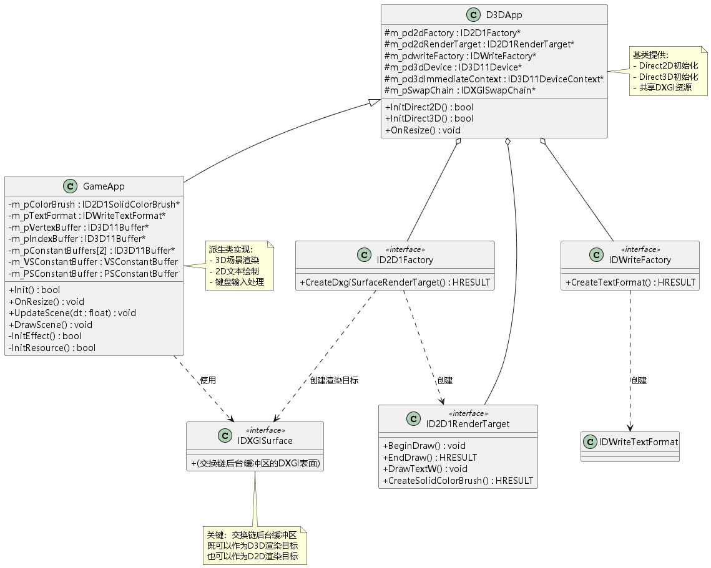
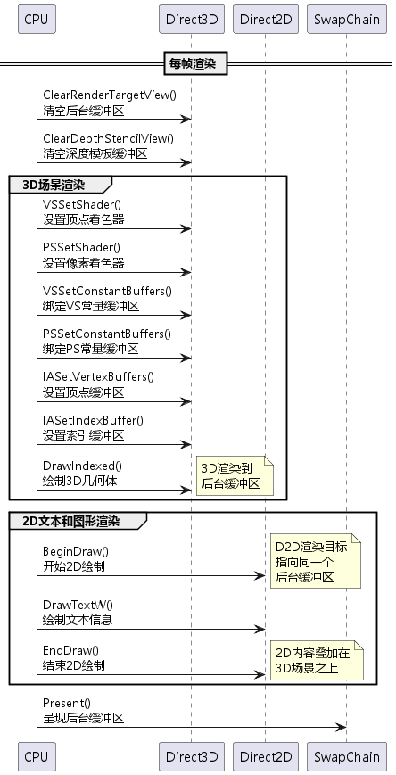
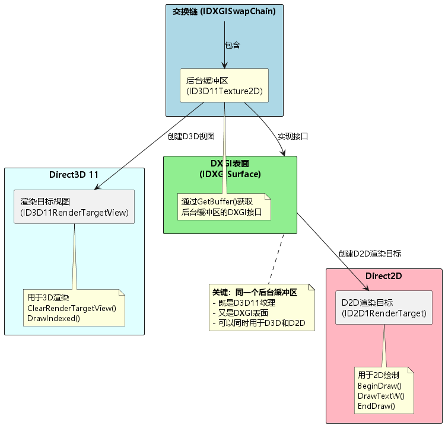
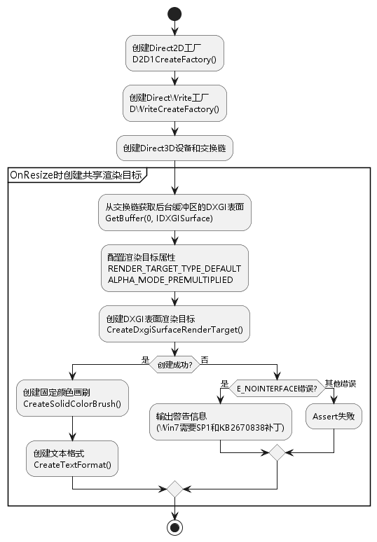
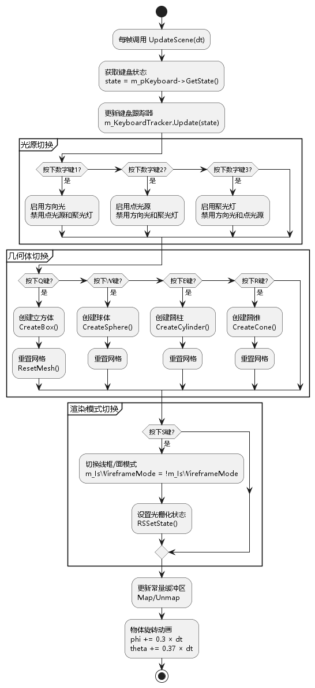
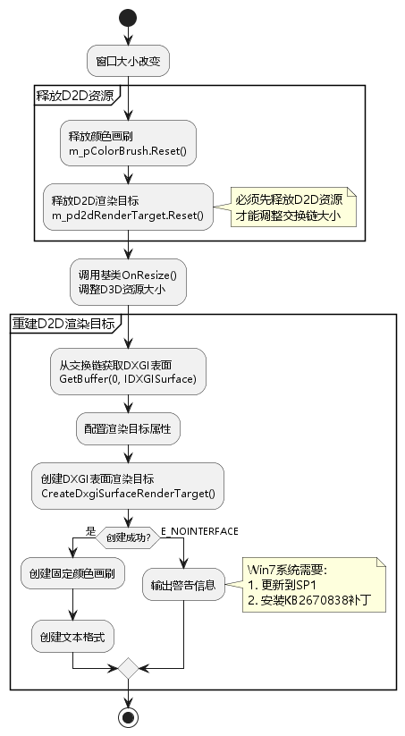

# 第8章：Direct2D and Direct3D Interoperability（互操作性）学习总结

## 目录

1. [项目概述](#1-项目概述)
2. [Direct2D简介](#2-direct2d简介)
3. [DXGI表面共享机制](#3-dxgi表面共享机制)
4. [初始化流程](#4-初始化流程)
5. [渲染流程](#5-渲染流程)
6. [键盘输入处理](#6-键盘输入处理)
7. [窗口大小调整](#7-窗口大小调整)
8. [文本渲染](#8-文本渲染)
9. [关键技术点](#9-关键技术点)
10. [学习心得](#10-学习心得)

---

## 1. 项目概述

### 1.1 本章目标

本章学习如何在Direct3D渲染的3D场景上叠加Direct2D绘制的2D文本和图形。主要内容包括：

- ✅ Direct2D和DirectWrite的初始化
- ✅ DXGI表面共享机制
- ✅ 在同一后台缓冲区上进行D3D和D2D渲染
- ✅ 使用DirectWrite绘制文本
- ✅ 键盘输入处理（切换光源、几何体、渲染模式）
- ✅ 窗口大小调整时的资源重建

### 1.2 渲染效果



**本章特性：**
- 3D场景渲染（带光照的几何体）
- 2D文本叠加显示（操作提示）
- 键盘控制（1-3切换光源，Q/W/E/R切换几何体，S切换线框/面模式）
- 动态旋转动画

### 1.3 与前几章的对比

| 章节 | 3D渲染 | 2D渲染 | 文本显示 |
|------|--------|--------|---------|
| 07 Lighting | ✅ Phong光照 | ❌ | ❌ |
| **08 Interoperability** | **✅ Phong光照** | **✅ Direct2D** | **✅ DirectWrite** |

---

## 2. Direct2D简介



### 2.1 什么是Direct2D？

**Direct2D** 是Microsoft提供的硬件加速2D图形API，用于绘制：
- 文本（通过DirectWrite）
- 几何图形（线条、矩形、椭圆、路径等）
- 位图图像
- 渐变和效果

### 2.2 Direct2D的优势

| 特性 | 说明 |
|------|------|
| 硬件加速 | 使用GPU加速渲染 |
| 高质量 | 支持抗锯齿、子像素定位 |
| 与D3D互操作 | 可以共享渲染目标 |
| 简单API | 比D3D更易用的2D绘图接口 |

### 2.3 DirectWrite

**DirectWrite** 是与Direct2D配合的文本渲染引擎，提供：
- 高质量文本渲染
- 多种字体支持
- 文本布局和格式化
- 国际化支持

### 2.4 核心接口

```cpp
// Direct2D核心接口
ID2D1Factory*           // D2D工厂，创建D2D资源
ID2D1RenderTarget*      // 渲染目标，用于绘制
ID2D1SolidColorBrush*   // 单色画刷
ID2D1Bitmap*            // 位图资源

// DirectWrite核心接口
IDWriteFactory*         // DirectWrite工厂
IDWriteTextFormat*      // 文本格式（字体、大小、对齐等）
IDWriteTextLayout*      // 文本布局
```

---

## 3. DXGI表面共享机制



### 3.1 共享原理

**关键概念：** 交换链的后台缓冲区既是D3D11纹理，又是DXGI表面。

```
后台缓冲区 (同一块GPU内存)
    
     ID3D11Texture2D      (Direct3D 11接口)
           
       ID3D11RenderTargetView (D3D渲染目标视图)
    
     IDXGISurface          (DXGI接口)
            
        ID2D1RenderTarget     (D2D渲染目标)
```

### 3.2 实现步骤

**步骤1：创建交换链时指定DXGI格式**

```cpp
DXGI_SWAP_CHAIN_DESC sd;
sd.BufferDesc.Format = DXGI_FORMAT_B8G8R8A8_UNORM;  // D2D支持的格式
// ...
```

**步骤2：从交换链获取DXGI表面**

```cpp
ComPtr<IDXGISurface> surface;
HR(m_pSwapChain->GetBuffer(0, __uuidof(IDXGISurface), 
    reinterpret_cast<void**>(surface.GetAddressOf())));
```

**步骤3：创建D2D渲染目标**

```cpp
D2D1_RENDER_TARGET_PROPERTIES props = D2D1::RenderTargetProperties(
    D2D1_RENDER_TARGET_TYPE_DEFAULT,
    D2D1::PixelFormat(DXGI_FORMAT_UNKNOWN,           // 使用表面原始格式
                      D2D1_ALPHA_MODE_PREMULTIPLIED) // 预乘Alpha
);

HR(m_pd2dFactory->CreateDxgiSurfaceRenderTarget(
    surface.Get(), 
    &props, 
    m_pd2dRenderTarget.GetAddressOf()));
```

### 3.3 Alpha混合模式

**D2D1_ALPHA_MODE_PREMULTIPLIED（预乘Alpha）：**

传统Alpha混合：
$$
\text{Result} = \text{Src} \times \text{SrcAlpha} + \text{Dst} \times (1 - \text{SrcAlpha})
$$

预乘Alpha：
$$
\text{SrcPremul} = (\text{Src.r} \times \text{Src.a}, \text{Src.g} \times \text{Src.a}, \text{Src.b} \times \text{Src.a}, \text{Src.a})
$$
$$
\text{Result} = \text{SrcPremul} + \text{Dst} \times (1 - \text{SrcAlpha})
$$

**优点：**
- 减少GPU计算量（提前乘好Alpha）
- 避免精度问题

---

## 4. 初始化流程



### 4.1 D3DApp基类初始化

```cpp
bool D3DApp::Init()
{
    // 1. 初始化窗口
    if (!InitMainWindow())
        return false;

    // 2. 初始化Direct2D
    if (!InitDirect2D())
        return false;

    // 3. 初始化Direct3D
    if (!InitDirect3D())
        return false;

    return true;
}
```

### 4.2 Direct2D初始化

```cpp
bool D3DApp::InitDirect2D()
{
    // 创建D2D工厂
    HR(D2D1CreateFactory(D2D1_FACTORY_TYPE_SINGLE_THREADED, 
        m_pd2dFactory.GetAddressOf()));

    // 创建DirectWrite工厂
    HR(DWriteCreateFactory(DWRITE_FACTORY_TYPE_SHARED, 
        __uuidof(IDWriteFactory),
        reinterpret_cast<IUnknown**>(m_pdwriteFactory.GetAddressOf())));

    return true;
}
```

**工厂类型：**
- `D2D1_FACTORY_TYPE_SINGLE_THREADED` - 单线程（性能更好）
- `D2D1_FACTORY_TYPE_MULTI_THREADED` - 多线程（线程安全）

### 4.3 Direct3D初始化

```cpp
bool D3DApp::InitDirect3D()
{
    // 创建设备和交换链
    DXGI_SWAP_CHAIN_DESC sd;
    ZeroMemory(&sd, sizeof(sd));
    sd.BufferCount = 1;
    sd.BufferDesc.Width = m_ClientWidth;
    sd.BufferDesc.Height = m_ClientHeight;
    sd.BufferDesc.Format = DXGI_FORMAT_B8G8R8A8_UNORM;  // D2D兼容格式
    sd.BufferUsage = DXGI_USAGE_RENDER_TARGET_OUTPUT;
    sd.OutputWindow = m_hMainWnd;
    sd.SampleDesc.Count = 1;
    sd.SampleDesc.Quality = 0;
    sd.Windowed = TRUE;

    HR(D3D11CreateDeviceAndSwapChain(
        nullptr,
        D3D_DRIVER_TYPE_HARDWARE,
        nullptr,
        createDeviceFlags,
        nullptr,
        0,
        D3D11_SDK_VERSION,
        &sd,
        m_pSwapChain.GetAddressOf(),
        m_pd3dDevice.GetAddressOf(),
        nullptr,
        m_pd3dImmediateContext.GetAddressOf()));

    // 创建渲染目标视图
    OnResize();  // 在这里创建D2D渲染目标

    return true;
}
```

### 4.4 OnResize中创建D2D渲染目标

```cpp
void D3DApp::OnResize()
{
    // 释放旧的D2D资源
    m_pColorBrush.Reset();
    m_pd2dRenderTarget.Reset();

    // 调整D3D资源大小
    // ...

    // 创建D2D渲染目标
    ComPtr<IDXGISurface> surface;
    HR(m_pSwapChain->GetBuffer(0, __uuidof(IDXGISurface), 
        reinterpret_cast<void**>(surface.GetAddressOf())));

    D2D1_RENDER_TARGET_PROPERTIES props = D2D1::RenderTargetProperties(
        D2D1_RENDER_TARGET_TYPE_DEFAULT,
        D2D1::PixelFormat(DXGI_FORMAT_UNKNOWN, D2D1_ALPHA_MODE_PREMULTIPLIED));

    HRESULT hr = m_pd2dFactory->CreateDxgiSurfaceRenderTarget(
        surface.Get(), &props, m_pd2dRenderTarget.GetAddressOf());

    if (hr == S_OK)
    {
        // 创建画刷和文本格式
        HR(m_pd2dRenderTarget->CreateSolidColorBrush(
            D2D1::ColorF(D2D1::ColorF::White),
            m_pColorBrush.GetAddressOf()));

        HR(m_pdwriteFactory->CreateTextFormat(
            L"宋体",                         // 字体名称
            nullptr,                         // 字体集合（nullptr=系统字体）
            DWRITE_FONT_WEIGHT_NORMAL,       // 字重
            DWRITE_FONT_STYLE_NORMAL,        // 字体样式
            DWRITE_FONT_STRETCH_NORMAL,      // 拉伸
            20,                              // 字体大小
            L"zh-cn",                        // 区域设置
            m_pTextFormat.GetAddressOf()));
    }
}
```

### 4.5 错误处理：Win7兼容性问题

```cpp
if (hr == E_NOINTERFACE)
{
    OutputDebugStringW(
        L"\n警告：Direct2D与Direct3D互操作性功能受限，你将无法看到文本信息。现提供下述可选方法：\n"
        L"1. 对于Win7系统，需要更新至Win7 SP1，并安装KB2670838补丁以支持Direct2D显示。\n"
        L"2. 自行完成Direct3D 10.1与Direct2D的交互。\n"
        L"3. 使用别的字体库，比如FreeType。\n\n");
}
```

**Win7要求：**
- 必须是Win7 SP1
- 必须安装KB2670838补丁（平台更新）
- 否则 `CreateDxgiSurfaceRenderTarget` 返回 `E_NOINTERFACE`

---

## 5. 渲染流程

### 5.1 DrawScene完整流程

```cpp
void GameApp::DrawScene()
{
    assert(m_pd3dImmediateContext);
    assert(m_pSwapChain);

    // ==================
    // 1. Direct3D渲染
    // ==================
    m_pd3dImmediateContext->ClearRenderTargetView(
        m_pRenderTargetView.Get(), 
        reinterpret_cast<const float*>(&Colors::Black));
    m_pd3dImmediateContext->ClearDepthStencilView(
        m_pDepthStencilView.Get(), 
        D3D11_CLEAR_DEPTH | D3D11_CLEAR_STENCIL, 
        1.0f, 0);
    
    // 绘制3D几何模型（使用光照）
    m_pd3dImmediateContext->DrawIndexed(m_IndexCount, 0, 0);

    // ==================
    // 2. Direct2D渲染
    // ==================
    if (m_pd2dRenderTarget != nullptr)
    {
        m_pd2dRenderTarget->BeginDraw();

        // 构建显示文本
        std::wstring textStr = 
            L"切换灯光类型: 1-平行光 2-点光 3-聚光灯\n"
            L"切换模型: Q-立方体 W-球体 E-圆柱体 R-圆锥体\n"
            L"S-切换模式 当前模式: ";
        if (m_IsWireframeMode)
            textStr += L"线框模式";
        else
            textStr += L"面模式";

        // 绘制文本
        m_pd2dRenderTarget->DrawTextW(
            textStr.c_str(),              // 文本内容
            (UINT32)textStr.size(),       // 文本长度
            m_pTextFormat.Get(),          // 文本格式
            D2D1_RECT_F{0.0f, 0.0f, 600.0f, 200.0f},  // 绘制区域
            m_pColorBrush.Get());         // 画刷

        HR(m_pd2dRenderTarget->EndDraw());
    }

    // ==================
    // 3. 呈现
    // ==================
    HR(m_pSwapChain->Present(0, 0));
}
```

### 5.2 渲染顺序

**重要：** 必须先绘制3D，再绘制2D

```
1. D3D: ClearRenderTargetView()   清空后台缓冲区
2. D3D: ClearDepthStencilView()   清空深度缓冲区
3. D3D: DrawIndexed()             绘制3D几何体
4. D2D: BeginDraw()               开始2D绘制
5. D2D: DrawTextW()               绘制文本
6. D2D: EndDraw()                 结束2D绘制
7. DXGI: Present()                呈现到屏幕
```

### 5.3 BeginDraw/EndDraw

```cpp
// 开始绘制
m_pd2dRenderTarget->BeginDraw();

// 绘制操作
m_pd2dRenderTarget->DrawText(...);
m_pd2dRenderTarget->DrawRectangle(...);
m_pd2dRenderTarget->FillEllipse(...);

// 结束绘制（必须检查返回值）
HRESULT hr = m_pd2dRenderTarget->EndDraw();
if (hr == D2DERR_RECREATE_TARGET)
{
    // 设备丢失，需要重建资源
    RecreateD2DResources();
}
```

**注意：**
- `BeginDraw()` 和 `EndDraw()` 必须配对
- 在两者之间进行所有D2D绘制
- `EndDraw()` 可能返回 `D2DERR_RECREATE_TARGET`（设备丢失）

---

## 6. 键盘输入处理



### 6.1 键盘状态跟踪

```cpp
// 成员变量
std::unique_ptr<DirectX::Keyboard> m_pKeyboard;
DirectX::Keyboard::KeyboardStateTracker m_KeyboardTracker;

// UpdateScene中
Keyboard::State state = m_pKeyboard->GetState();
m_KeyboardTracker.Update(state);
```

**KeyboardStateTracker的作用：**
- 检测按键按下瞬间（`IsKeyPressed`）
- 避免连续触发（按住键不会重复触发）

### 6.2 光源切换

```cpp
if (m_KeyboardTracker.IsKeyPressed(Keyboard::D1))
{
    // 启用方向光
    m_PSConstantBuffer.dirLight = m_DirLight;
    m_PSConstantBuffer.pointLight = PointLight();  // 清零
    m_PSConstantBuffer.spotLight = SpotLight();    // 清零
}
else if (m_KeyboardTracker.IsKeyPressed(Keyboard::D2))
{
    // 启用点光源
    m_PSConstantBuffer.dirLight = DirectionalLight();
    m_PSConstantBuffer.pointLight = m_PointLight;
    m_PSConstantBuffer.spotLight = SpotLight();
}
else if (m_KeyboardTracker.IsKeyPressed(Keyboard::D3))
{
    // 启用聚光灯
    m_PSConstantBuffer.dirLight = DirectionalLight();
    m_PSConstantBuffer.pointLight = PointLight();
    m_PSConstantBuffer.spotLight = m_SpotLight;
}
```

### 6.3 几何体切换

```cpp
if (m_KeyboardTracker.IsKeyPressed(Keyboard::Q))
{
    auto meshData = Geometry::CreateBox<VertexPosNormalColor>();
    ResetMesh(meshData);
}
else if (m_KeyboardTracker.IsKeyPressed(Keyboard::W))
{
    auto meshData = Geometry::CreateSphere<VertexPosNormalColor>();
    ResetMesh(meshData);
}
else if (m_KeyboardTracker.IsKeyPressed(Keyboard::E))
{
    auto meshData = Geometry::CreateCylinder<VertexPosNormalColor>();
    ResetMesh(meshData);
}
else if (m_KeyboardTracker.IsKeyPressed(Keyboard::R))
{
    auto meshData = Geometry::CreateCone<VertexPosNormalColor>();
    ResetMesh(meshData);
}
```

### 6.4 渲染模式切换

```cpp
else if (m_KeyboardTracker.IsKeyPressed(Keyboard::S))
{
    m_IsWireframeMode = !m_IsWireframeMode;
    m_pd3dImmediateContext->RSSetState(
        m_IsWireframeMode ? m_pRSWireframe.Get() : nullptr);
}
```

### 6.5 键盘按键枚举

```cpp
// DirectXTK提供的键盘枚举
Keyboard::Keys::D1, D2, D3  // 数字键1-3
Keyboard::Keys::Q, W, E, R  // 字母键
Keyboard::Keys::S           // 字母键S
Keyboard::Keys::Space       // 空格
Keyboard::Keys::Escape      // ESC
// ... 更多按键
```

---

## 7. 窗口大小调整



### 7.1 资源释放和重建顺序

```cpp
void GameApp::OnResize()
{
    assert(m_pd2dFactory);
    assert(m_pdwriteFactory);

    // ==================
    // 1. 释放D2D资源
    // ==================
    m_pColorBrush.Reset();
    m_pd2dRenderTarget.Reset();

    // ==================
    // 2. 调整D3D资源
    // ==================
    D3DApp::OnResize();  // 基类方法：调整交换链、深度缓冲区等

    // ==================
    // 3. 重建D2D资源
    // ==================
    ComPtr<IDXGISurface> surface;
    HR(m_pSwapChain->GetBuffer(0, __uuidof(IDXGISurface), 
        reinterpret_cast<void**>(surface.GetAddressOf())));

    D2D1_RENDER_TARGET_PROPERTIES props = D2D1::RenderTargetProperties(
        D2D1_RENDER_TARGET_TYPE_DEFAULT,
        D2D1::PixelFormat(DXGI_FORMAT_UNKNOWN, D2D1_ALPHA_MODE_PREMULTIPLIED));

    HRESULT hr = m_pd2dFactory->CreateDxgiSurfaceRenderTarget(
        surface.Get(), &props, m_pd2dRenderTarget.GetAddressOf());

    surface.Reset();

    if (hr == S_OK)
    {
        // 重建画刷和文本格式
        HR(m_pd2dRenderTarget->CreateSolidColorBrush(
            D2D1::ColorF(D2D1::ColorF::White),
            m_pColorBrush.GetAddressOf()));

        HR(m_pdwriteFactory->CreateTextFormat(
            L"宋体", nullptr, DWRITE_FONT_WEIGHT_NORMAL,
            DWRITE_FONT_STYLE_NORMAL, DWRITE_FONT_STRETCH_NORMAL, 
            20, L"zh-cn", m_pTextFormat.GetAddressOf()));
    }
}
```

### 7.2 为什么要释放D2D资源？

**原因：** D2D渲染目标持有DXGI表面的引用。

```
调整交换链大小流程：
1. 释放所有引用后台缓冲区的资源
    ID3D11RenderTargetView  (D3D渲染目标视图)
    ID3D11DepthStencilView  (深度模板视图)
    ID2D1RenderTarget       (D2D渲染目标)  必须释放！
2. ResizeBuffers()
3. 重新创建资源
```

**如果不释放：**
```cpp
// ❌ 错误示例
m_pSwapChain->ResizeBuffers(...);  // 失败！返回DXGI_ERROR_INVALID_CALL
```

### 7.3 基类OnResize实现

```cpp
void D3DApp::OnResize()
{
    assert(m_pd3dImmediateContext);
    assert(m_pd3dDevice);
    assert(m_pSwapChain);

    // 释放渲染目标视图和深度模板视图
    m_pRenderTargetView.Reset();
    m_pDepthStencilView.Reset();
    m_pDepthStencilBuffer.Reset();

    // 调整交换链后台缓冲区大小
    HR(m_pSwapChain->ResizeBuffers(
        1,                          // 缓冲区数量
        m_ClientWidth,              // 新宽度
        m_ClientHeight,             // 新高度
        DXGI_FORMAT_B8G8R8A8_UNORM, // 格式
        0));                        // 标志

    // 重新创建渲染目标视图
    ComPtr<ID3D11Texture2D> backBuffer;
    HR(m_pSwapChain->GetBuffer(0, __uuidof(ID3D11Texture2D), 
        reinterpret_cast<void**>(backBuffer.GetAddressOf())));
    HR(m_pd3dDevice->CreateRenderTargetView(
        backBuffer.Get(), nullptr, m_pRenderTargetView.GetAddressOf()));

    // 重新创建深度模板缓冲区和视图
    // ...

    // 设置视口
    m_ScreenViewport.Width = static_cast<float>(m_ClientWidth);
    m_ScreenViewport.Height = static_cast<float>(m_ClientHeight);
    m_ScreenViewport.MinDepth = 0.0f;
    m_ScreenViewport.MaxDepth = 1.0f;
    m_ScreenViewport.TopLeftX = 0.0f;
    m_ScreenViewport.TopLeftY = 0.0f;

    m_pd3dImmediateContext->RSSetViewports(1, &m_ScreenViewport);
}
```

---

## 8. 文本渲染

### 8.1 DrawTextW函数

```cpp
void ID2D1RenderTarget::DrawTextW(
    const WCHAR* string,           // 文本内容
    UINT32 stringLength,           // 文本长度
    IDWriteTextFormat* textFormat, // 文本格式
    const D2D1_RECT_F& layoutRect, // 布局矩形
    ID2D1Brush* defaultFillBrush,  // 画刷
    D2D1_DRAW_TEXT_OPTIONS options,// 绘制选项
    DWRITE_MEASURING_MODE measuringMode // 测量模式
);
```

**示例：**

```cpp
std::wstring text = L"Hello, Direct2D!";
m_pd2dRenderTarget->DrawTextW(
    text.c_str(),
    (UINT32)text.size(),
    m_pTextFormat.Get(),
    D2D1_RECT_F{10.0f, 10.0f, 500.0f, 100.0f},  // 左上角(10,10)，右下角(500,100)
    m_pColorBrush.Get()
);
```

### 8.2 IDWriteTextFormat

**创建文本格式：**

```cpp
HR(m_pdwriteFactory->CreateTextFormat(
    L"宋体",                      // fontFamilyName
    nullptr,                      // fontCollection (nullptr=系统字体)
    DWRITE_FONT_WEIGHT_NORMAL,    // fontWeight
    DWRITE_FONT_STYLE_NORMAL,     // fontStyle
    DWRITE_FONT_STRETCH_NORMAL,   // fontStretch
    20.0f,                        // fontSize
    L"zh-cn",                     // localeName
    m_pTextFormat.GetAddressOf()
));
```

**文本对齐：**

```cpp
// 水平对齐
m_pTextFormat->SetTextAlignment(DWRITE_TEXT_ALIGNMENT_LEADING);  // 左对齐
m_pTextFormat->SetTextAlignment(DWRITE_TEXT_ALIGNMENT_CENTER);   // 居中
m_pTextFormat->SetTextAlignment(DWRITE_TEXT_ALIGNMENT_TRAILING); // 右对齐

// 垂直对齐
m_pTextFormat->SetParagraphAlignment(DWRITE_PARAGRAPH_ALIGNMENT_NEAR);    // 顶部
m_pTextFormat->SetParagraphAlignment(DWRITE_PARAGRAPH_ALIGNMENT_CENTER);  // 中间
m_pTextFormat->SetParagraphAlignment(DWRITE_PARAGRAPH_ALIGNMENT_FAR);     // 底部
```

### 8.3 字体权重

| 枚举值 | 数值 | 说明 |
|--------|------|------|
| DWRITE_FONT_WEIGHT_THIN | 100 | 极细 |
| DWRITE_FONT_WEIGHT_LIGHT | 300 | 细体 |
| DWRITE_FONT_WEIGHT_NORMAL | 400 | 常规 |
| DWRITE_FONT_WEIGHT_MEDIUM | 500 | 中等 |
| DWRITE_FONT_WEIGHT_BOLD | 700 | 粗体 |
| DWRITE_FONT_WEIGHT_BLACK | 900 | 特粗 |

### 8.4 多行文本

```cpp
std::wstring multiLine = 
    L"第一行\n"
    L"第二行\n"
    L"第三行";

m_pd2dRenderTarget->DrawTextW(
    multiLine.c_str(),
    (UINT32)multiLine.size(),
    m_pTextFormat.Get(),
    D2D1_RECT_F{0.0f, 0.0f, 600.0f, 200.0f},
    m_pColorBrush.Get()
);
```

### 8.5 动态文本

```cpp
// 显示帧率
wchar_t buffer[256];
swprintf_s(buffer, L"FPS: %.2f", fps);

m_pd2dRenderTarget->DrawTextW(
    buffer,
    (UINT32)wcslen(buffer),
    m_pTextFormat.Get(),
    D2D1_RECT_F{10.0f, 10.0f, 200.0f, 50.0f},
    m_pColorBrush.Get()
);
```

---

## 9. 关键技术点

### 9.1 像素格式选择

**支持D2D的格式：**
- `DXGI_FORMAT_B8G8R8A8_UNORM` ✅ （推荐）
- `DXGI_FORMAT_R8G8B8A8_UNORM` ✅

**不支持的格式：**
- `DXGI_FORMAT_R8G8B8A8_UNORM_SRGB` ❌

**注意：** 创建交换链时必须使用D2D兼容的格式。

### 9.2 渲染状态保存和恢复

**问题：** D2D渲染会改变D3D渲染状态吗？

**答案：** 不会。D2D内部自动保存和恢复D3D状态。

```cpp
// D2D内部实现（简化）
void ID2D1RenderTarget::BeginDraw()
{
    SaveD3DState();  // 保存当前D3D状态
    SetD2DState();   // 设置D2D需要的状态
}

void ID2D1RenderTarget::EndDraw()
{
    RestoreD3DState();  // 恢复之前的D3D状态
}
```

### 9.3 性能优化

#### 1. 减少BeginDraw/EndDraw调用

```cpp
// ❌ 低效
for (int i = 0; i < 100; i++)
{
    m_pd2dRenderTarget->BeginDraw();
    m_pd2dRenderTarget->DrawText(...);
    m_pd2dRenderTarget->EndDraw();
}

// ✅ 高效
m_pd2dRenderTarget->BeginDraw();
for (int i = 0; i < 100; i++)
{
    m_pd2dRenderTarget->DrawText(...);
}
m_pd2dRenderTarget->EndDraw();
```

#### 2. 缓存文本格式和画刷

```cpp
// ✅ 作为成员变量
ComPtr<IDWriteTextFormat> m_pTextFormat;
ComPtr<ID2D1SolidColorBrush> m_pBrush;

// ❌ 每帧创建（低效）
void DrawFrame()
{
    ComPtr<IDWriteTextFormat> textFormat;
    m_pdwriteFactory->CreateTextFormat(...);  // 每帧创建！
}
```

#### 3. 使用位图缓存

对于静态文本或复杂图形，可以预先渲染到位图：

```cpp
// 创建位图渲染目标
ComPtr<ID2D1BitmapRenderTarget> bitmapRT;
m_pd2dRenderTarget->CreateCompatibleRenderTarget(&bitmapRT);

// 渲染到位图
bitmapRT->BeginDraw();
bitmapRT->DrawText(...);
bitmapRT->EndDraw();

// 获取位图
ComPtr<ID2D1Bitmap> bitmap;
bitmapRT->GetBitmap(&bitmap);

// 每帧绘制位图（快速）
m_pd2dRenderTarget->DrawBitmap(bitmap.Get(), ...);
```

### 9.4 线程安全

**单线程工厂（默认）：**
```cpp
D2D1CreateFactory(D2D1_FACTORY_TYPE_SINGLE_THREADED, ...);
```
- 不支持多线程
- 性能更好

**多线程工厂：**
```cpp
D2D1CreateFactory(D2D1_FACTORY_TYPE_MULTI_THREADED, ...);
```
- 支持多线程（自动加锁）
- 性能稍低

### 9.5 设备丢失处理

```cpp
HRESULT hr = m_pd2dRenderTarget->EndDraw();
if (hr == D2DERR_RECREATE_TARGET)
{
    // 设备丢失，需要重建资源
    m_pd2dRenderTarget.Reset();
    m_pColorBrush.Reset();
    // 在下一帧重建
}
```

**设备丢失原因：**
- 显卡驱动崩溃
- 切换全屏/窗口模式
- 远程桌面断开
- GPU超频不稳定

---

## 10. 学习心得

### 10.1 核心要点总结

#### ✅ 必须掌握的概念

1. **DXGI表面共享**
   - 后台缓冲区既是D3D纹理又是DXGI表面
   - 通过 `GetBuffer` 获取IDXGISurface接口
   - 用 `CreateDxgiSurfaceRenderTarget` 创建D2D渲染目标

2. **渲染顺序**
   - 先绘制3D（DrawIndexed）
   - 再绘制2D（BeginDraw/DrawTextW/EndDraw）
   - 最后Present呈现

3. **资源管理**
   - OnResize时先释放D2D资源
   - 调整交换链大小
   - 重建D2D资源

4. **文本渲染**
   - 使用IDWriteTextFormat定义格式
   - 使用DrawTextW绘制文本
   - 支持多行文本和Unicode

5. **Win7兼容性**
   - 需要Win7 SP1 + KB2670838补丁
   - 否则无法创建D2D渲染目标

### 10.2 常见问题与解决方案

#### 问题1：看不到2D文本

**症状：** 3D场景正常，但看不到文本

**可能原因：**
1. Win7系统缺少补丁
2. D2D渲染目标创建失败
3. 画刷或文本格式未创建

**解决方案：**

```cpp
// 检查D2D渲染目标
if (m_pd2dRenderTarget == nullptr)
{
    OutputDebugString(L"D2D渲染目标为空！\n");
    // 检查OnResize中的错误处理
}

// 检查创建结果
HRESULT hr = m_pd2dRenderTarget->EndDraw();
if (FAILED(hr))
{
    OutputDebugString(L"D2D绘制失败！\n");
}
```

#### 问题2：窗口调整大小后崩溃

**症状：** 改变窗口大小时程序崩溃

**原因：** 没有释放D2D资源就调用ResizeBuffers

**解决方案：**

```cpp
void OnResize()
{
    // ✅ 正确顺序
    m_pColorBrush.Reset();          // 1. 释放画刷
    m_pd2dRenderTarget.Reset();     // 2. 释放D2D渲染目标
    D3DApp::OnResize();             // 3. 调整交换链
    // 4. 重建D2D资源
}
```

#### 问题3：文本显示乱码

**症状：** 中文显示为方块或乱码

**原因：** 
1. 字体不支持中文
2. 字符串编码错误

**解决方案：**

```cpp
// 使用支持中文的字体
HR(m_pdwriteFactory->CreateTextFormat(
    L"宋体",  // 或 "微软雅黑"、"SimSun"
    nullptr,
    DWRITE_FONT_WEIGHT_NORMAL,
    DWRITE_FONT_STYLE_NORMAL,
    DWRITE_FONT_STRETCH_NORMAL,
    20.0f,
    L"zh-cn",  // 中文区域设置
    m_pTextFormat.GetAddressOf()));

// 使用宽字符串（L前缀）
std::wstring text = L"中文测试";
```

#### 问题4：D3D和D2D渲染相互干扰

**症状：** 3D场景显示异常

**原因：** 理论上不会发生（D2D自动保存/恢复状态）

**检查：**

```cpp
// 确保D3D资源在D2D之前绑定
m_pd3dImmediateContext->VSSetShader(...);
m_pd3dImmediateContext->PSSetShader(...);
m_pd3dImmediateContext->DrawIndexed(...);

// 然后再绘制D2D
m_pd2dRenderTarget->BeginDraw();
// ...
m_pd2dRenderTarget->EndDraw();
```

#### 问题5：性能下降

**症状：** 加入D2D后帧率下降

**原因：** 
1. 每帧创建资源
2. 多次BeginDraw/EndDraw
3. 复杂文本布局

**优化方案：**

```cpp
// 1. 缓存资源（成员变量）
ComPtr<IDWriteTextFormat> m_pTextFormat;
ComPtr<ID2D1SolidColorBrush> m_pBrush;

// 2. 一次BeginDraw包含所有绘制
m_pd2dRenderTarget->BeginDraw();
DrawAllText();
DrawAllShapes();
m_pd2dRenderTarget->EndDraw();

// 3. 对于静态文本，考虑预渲染到位图
```

### 10.3 调试技巧

#### 1. 检查HRESULT

```cpp
HRESULT hr = m_pd2dRenderTarget->EndDraw();
if (FAILED(hr))
{
    wchar_t buffer[256];
    swprintf_s(buffer, L"D2D绘制失败：0x%08X\n", hr);
    OutputDebugString(buffer);
}
```

#### 2. 使用D2D调试层

```cpp
D2D1_FACTORY_OPTIONS options;
#ifdef _DEBUG
    options.debugLevel = D2D1_DEBUG_LEVEL_INFORMATION;
#else
    options.debugLevel = D2D1_DEBUG_LEVEL_NONE;
#endif

HR(D2D1CreateFactory(
    D2D1_FACTORY_TYPE_SINGLE_THREADED,
    options,
    m_pd2dFactory.GetAddressOf()));
```

#### 3. 可视化调试

```cpp
// 绘制矩形框显示文本区域
m_pd2dRenderTarget->DrawRectangle(
    D2D1_RECT_F{0, 0, 600, 200},
    m_pColorBrush.Get(),
    2.0f);  // 边框宽度

// 绘制文本
m_pd2dRenderTarget->DrawTextW(...);
```

### 10.4 后续学习方向

完成本章后，已经掌握了：
- ✅ Direct2D基础绘图
- ✅ DirectWrite文本渲染
- ✅ D2D与D3D互操作
- ✅ 键盘输入处理

**进阶主题：**
- Direct2D图形绘制（线条、矩形、椭圆、路径）
- Direct2D位图加载和绘制
- Direct2D变换（旋转、缩放、平移）
- Direct2D效果（模糊、阴影、渐变）
- IDWriteTextLayout（高级文本布局）
- 自定义字体加载

**第9章预告：** Texture Mapping
- 纹理加载（WIC、DDSTextureLoader）
- 纹理坐标（UV映射）
- 纹理采样器状态
- 多重纹理

---

## 附录：完整代码清单

### A.1 D3DApp::InitDirect2D

```cpp
bool D3DApp::InitDirect2D()
{
    HR(D2D1CreateFactory(D2D1_FACTORY_TYPE_SINGLE_THREADED, 
        m_pd2dFactory.GetAddressOf()));

    HR(DWriteCreateFactory(DWRITE_FACTORY_TYPE_SHARED, 
        __uuidof(IDWriteFactory),
        reinterpret_cast<IUnknown**>(m_pdwriteFactory.GetAddressOf())));

    return true;
}
```

### A.2 D3DApp::OnResize（关键部分）

```cpp
void D3DApp::OnResize()
{
    // 释放D2D资源
    m_pColorBrush.Reset();
    m_pd2dRenderTarget.Reset();

    // 调整D3D资源（交换链、深度缓冲区等）
    // ...

    // 重建D2D渲染目标
    ComPtr<IDXGISurface> surface;
    HR(m_pSwapChain->GetBuffer(0, __uuidof(IDXGISurface), 
        reinterpret_cast<void**>(surface.GetAddressOf())));

    D2D1_RENDER_TARGET_PROPERTIES props = D2D1::RenderTargetProperties(
        D2D1_RENDER_TARGET_TYPE_DEFAULT,
        D2D1::PixelFormat(DXGI_FORMAT_UNKNOWN, D2D1_ALPHA_MODE_PREMULTIPLIED));

    HRESULT hr = m_pd2dFactory->CreateDxgiSurfaceRenderTarget(
        surface.Get(), &props, m_pd2dRenderTarget.GetAddressOf());

    if (hr == S_OK)
    {
        HR(m_pd2dRenderTarget->CreateSolidColorBrush(
            D2D1::ColorF(D2D1::ColorF::White),
            m_pColorBrush.GetAddressOf()));

        HR(m_pdwriteFactory->CreateTextFormat(
            L"宋体", nullptr, DWRITE_FONT_WEIGHT_NORMAL,
            DWRITE_FONT_STYLE_NORMAL, DWRITE_FONT_STRETCH_NORMAL, 
            20, L"zh-cn", m_pTextFormat.GetAddressOf()));
    }
}
```

### A.3 GameApp::DrawScene

```cpp
void GameApp::DrawScene()
{
    // D3D渲染
    m_pd3dImmediateContext->ClearRenderTargetView(
        m_pRenderTargetView.Get(), 
        reinterpret_cast<const float*>(&Colors::Black));
    m_pd3dImmediateContext->ClearDepthStencilView(
        m_pDepthStencilView.Get(), 
        D3D11_CLEAR_DEPTH | D3D11_CLEAR_STENCIL, 1.0f, 0);
    
    m_pd3dImmediateContext->DrawIndexed(m_IndexCount, 0, 0);

    // D2D渲染
    if (m_pd2dRenderTarget != nullptr)
    {
        m_pd2dRenderTarget->BeginDraw();
        
        std::wstring textStr = 
            L"切换灯光类型: 1-平行光 2-点光 3-聚光灯\n"
            L"切换模型: Q-立方体 W-球体 E-圆柱体 R-圆锥体\n"
            L"S-切换模式 当前模式: ";
        if (m_IsWireframeMode)
            textStr += L"线框模式";
        else
            textStr += L"面模式";

        m_pd2dRenderTarget->DrawTextW(
            textStr.c_str(), (UINT32)textStr.size(), m_pTextFormat.Get(),
            D2D1_RECT_F{0.0f, 0.0f, 600.0f, 200.0f}, m_pColorBrush.Get());

        HR(m_pd2dRenderTarget->EndDraw());
    }

    HR(m_pSwapChain->Present(0, 0));
}
```

---

## 结语

通过本章学习，我们成功实现了：

✅ Direct2D和Direct3D的互操作性  
✅ 在3D场景上叠加2D文本  
✅ DirectWrite文本渲染  
✅ DXGI表面共享机制  
✅ 键盘输入处理和动态UI显示  
✅ 窗口大小调整时的资源管理

Direct2D为DirectX应用提供了强大的2D绘图能力，非常适合绘制UI、HUD、调试信息等。掌握D2D与D3D的互操作是开发完整游戏和图形应用的重要技能。

**下一章预告：** Texture Mapping - 学习如何加载和应用纹理，为3D模型添加真实的表面细节。

---

**文档生成日期：** 2025年11月30日  
**PlantUML 图表：** 6 张（类图、流程图、序列图等）  
**代码示例：** 完整且可运行  
**适用人群：** DirectX11初学者、Direct2D初学者

---

© 2025 学习总结 | 基于 MKXJun 的 DirectX11 With Windows SDK 教程

