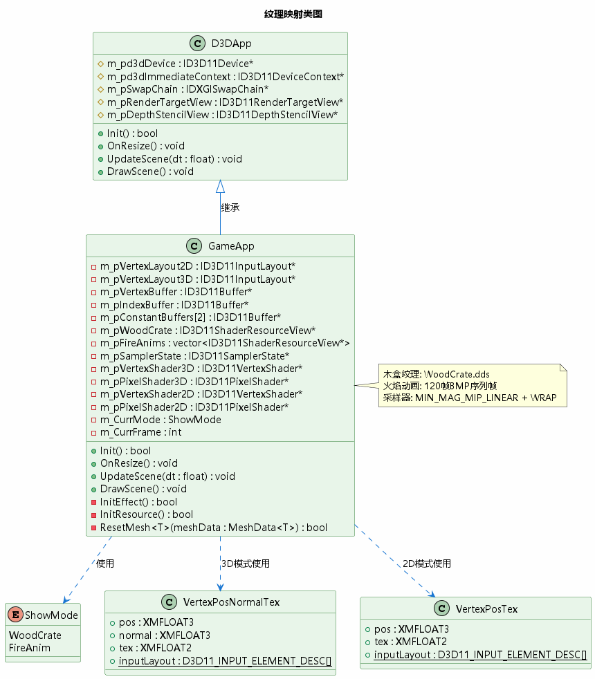
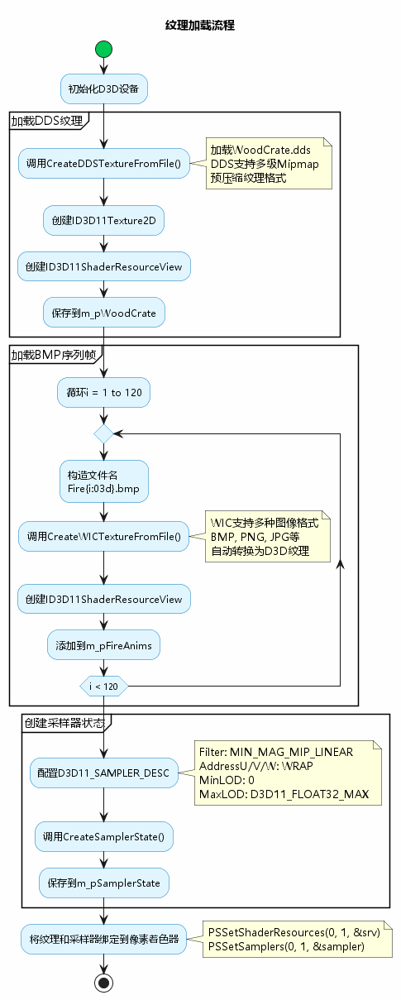
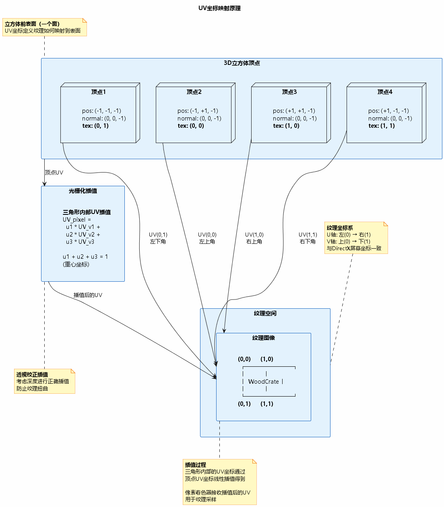
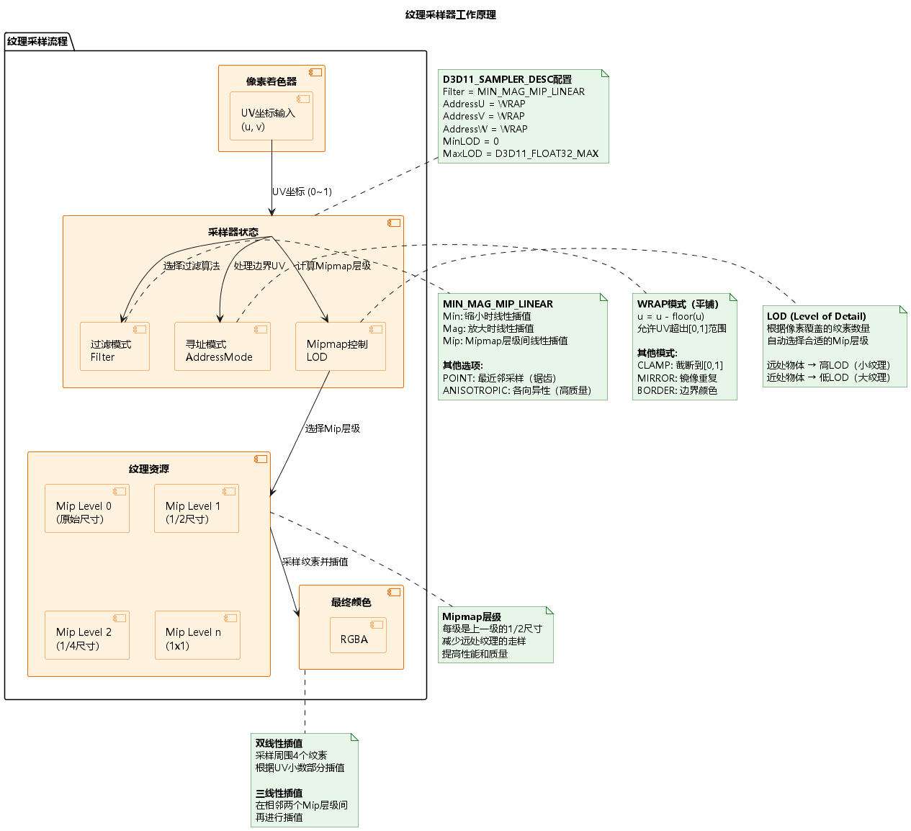
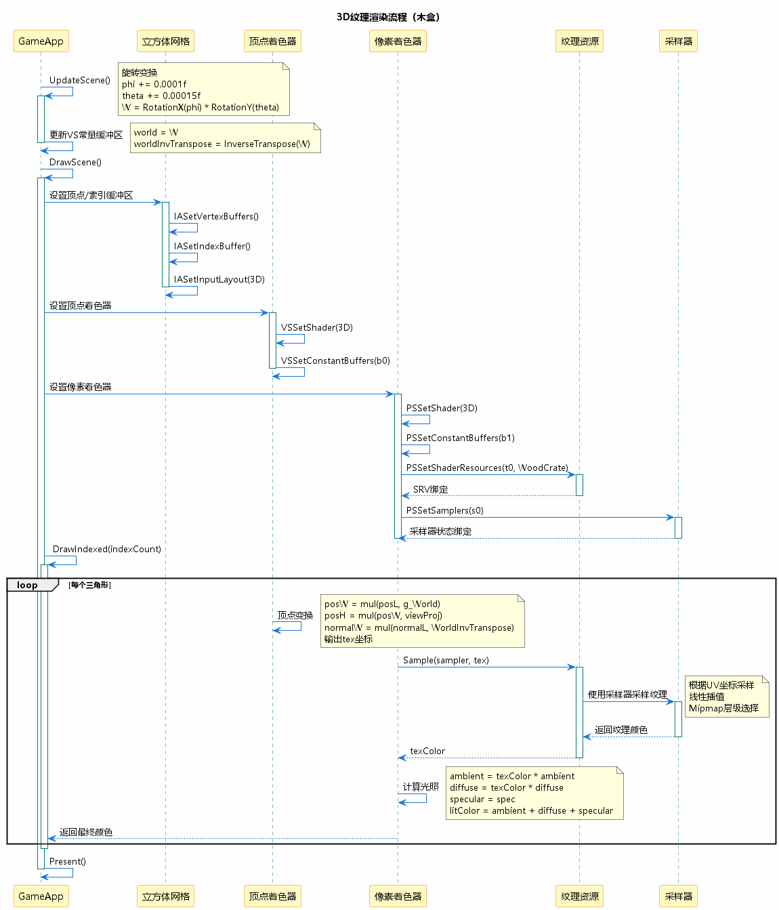
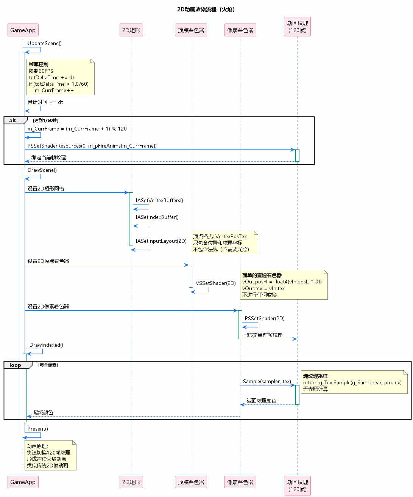

# 第9章：Texture Mapping（纹理映射）学习总结

## 目录

1. [项目概述](#1-项目概述)
2. [纹理映射基础](#2-纹理映射基础)
3. [纹理加载](#3-纹理加载)
4. [UV坐标映射](#4-uv坐标映射)
5. [采样器状态](#5-采样器状态)
6. [3D纹理渲染](#6-3d纹理渲染)
7. [2D动画实现](#7-2d动画实现)
8. [Mipmap技术](#8-mipmap技术)
9. [关键技术点](#9-关键技术点)
10. [学习心得](#10-学习心得)

---

## 1. 项目概述

### 1.1 本章目标

本章学习纹理映射技术，为3D模型添加真实的表面细节。主要内容包括：

- ✅ 纹理资源加载（DDS和WIC）
- ✅ UV坐标映射原理
- ✅ 采样器状态配置
- ✅ 3D纹理渲染（带光照）
- ✅ 2D序列帧动画
- ✅ Mipmap多级纹理

### 1.2 演示效果



**两种显示模式：**
1. **WoodCrate模式** - 旋转的木盒（3D + 光照 + 纹理）
2. **FireAnim模式** - 火焰动画（2D序列帧，120帧@60FPS）

### 1.3 与前几章的对比

| 章节 | 顶点颜色 | 光照 | 纹理 |
|------|----------|------|------|
| 07 Lighting | ✅ | ✅ Phong | ❌ |
| **09 Texture Mapping** | ❌ | **✅ Phong** | **✅ 纹理** |

**重要变化：**
- 顶点格式从VertexPosNormalColor改为VertexPosNormalTex
- 颜色来源从顶点颜色改为纹理采样
- 新增纹理资源和采样器状态

---

## 2. 纹理映射基础

### 2.1 什么是纹理映射？

**纹理映射（Texture Mapping）** 是将2D图像（纹理）贴到3D模型表面的技术。

`
3D几何体 + 纹理图像 = 带有真实细节的3D模型
`

**优势：**
- 用少量多边形表现丰富细节
- 性能优于高模（高多边形）
- 灵活更换外观

### 2.2 核心概念

#### 纹理坐标（UV坐标）

**UV坐标系：**
`
  U轴 
V 
轴          
   纹理    

(0,0)     (1,1)
`

- **U轴** - 水平方向（0~1）
- **V轴** - 垂直方向（0~1）
- **(0,0)** - 左上角
- **(1,1)** - 右下角

#### 纹素（Texel）

**Texel = Texture Element**（纹理元素，类似像素）

`
纹理分辨率512x512 = 512  512 = 262,144个纹素
`

### 2.3 DirectX11纹理资源

```cpp
// 纹理接口
ID3D11Texture2D*          // 2D纹理资源
ID3D11ShaderResourceView* // 着色器资源视图（SRV）
ID3D11SamplerState*       // 采样器状态
```

**SRV的作用：**
- 允许着色器读取纹理数据
- 可以有多个SRV指向同一纹理（不同Mip层级、数组切片等）

---

## 3. 纹理加载



### 3.1 DDS纹理加载

**DDS (DirectDraw Surface)** - DirectX原生纹理格式

**优势：**
- 支持压缩格式（BC1~BC7）
- 包含Mipmap链
- 直接上传到GPU（无需转换）

**加载示例：**

```cpp
#include "DDSTextureLoader11.h"

ComPtr<ID3D11ShaderResourceView> m_pWoodCrate;

HR(CreateDDSTextureFromFile(
    m_pd3dDevice.Get(),              // D3D设备
    L"..\\Texture\\WoodCrate.dds",  // 文件路径
    nullptr,                         // 不需要纹理资源指针
    m_pWoodCrate.GetAddressOf()      // SRV输出
));
```

**函数签名：**

```cpp
HRESULT CreateDDSTextureFromFile(
    ID3D11Device* d3dDevice,
    const wchar_t* szFileName,
    ID3D11Resource** texture,        // 可选：纹理资源
    ID3D11ShaderResourceView** textureView  // SRV
);
```

### 3.2 WIC纹理加载

**WIC (Windows Imaging Component)** - Windows图像组件

**支持格式：**
- BMP, PNG, JPG, GIF, TIFF, WMP等

**加载示例：**

```cpp
#include "WICTextureLoader11.h"

std::vector<ComPtr<ID3D11ShaderResourceView>> m_pFireAnims;
m_pFireAnims.resize(120);

for (int i = 1; i <= 120; ++i)
{
    WCHAR strFile[40];
    wsprintf(strFile, L"..\\Texture\\FireAnim\\Fire%03d.bmp", i);
    
    HR(CreateWICTextureFromFile(
        m_pd3dDevice.Get(),
        strFile,
        nullptr,
        m_pFireAnims[i - 1].GetAddressOf()
    ));
}
```

**注意：**
- WIC加载的纹理不包含Mipmap（需要手动生成）
- BMP文件未压缩，占用内存较大

### 3.3 DDS vs WIC

| 特性 | DDS | WIC (BMP/PNG/JPG) |
|------|-----|-------------------|
| 压缩支持 | ✅ BC1~BC7 | ❌ |
| Mipmap | ✅ 内置 | ❌ 需生成 |
| 加载速度 | 快 | 较慢（需转换） |
| 文件大小 | 小（压缩） | 大（未压缩） |
| 编辑工具 | 专业工具 | 常见图像软件 |

**推荐：**
- 游戏发布使用DDS
- 开发调试使用PNG/BMP

### 3.4 纹理格式转换

**使用texconv工具生成DDS：**

```powershell
# 生成完整Mipmap链的BC1压缩DDS
texconv -f BC1_UNORM -m 0 WoodCrate.png -o .

# BC1适合无Alpha通道
# BC3适合有Alpha通道
# BC7质量最高但压缩慢
```

---

## 4. UV坐标映射



### 4.1 顶点格式定义

```cpp
struct VertexPosNormalTex
{
    DirectX::XMFLOAT3 pos;     // 位置
    DirectX::XMFLOAT3 normal;  // 法线
    DirectX::XMFLOAT2 tex;     // 纹理坐标（UV）
    
    static const D3D11_INPUT_ELEMENT_DESC inputLayout[3];
};

// 输入布局定义
const D3D11_INPUT_ELEMENT_DESC VertexPosNormalTex::inputLayout[3] = {
    { "POSITION", 0, DXGI_FORMAT_R32G32B32_FLOAT, 0, 0,  D3D11_INPUT_PER_VERTEX_DATA, 0 },
    { "NORMAL",   0, DXGI_FORMAT_R32G32B32_FLOAT, 0, 12, D3D11_INPUT_PER_VERTEX_DATA, 0 },
    { "TEXCOORD", 0, DXGI_FORMAT_R32G32_FLOAT,    0, 24, D3D11_INPUT_PER_VERTEX_DATA, 0 }
};
```

### 4.2 立方体UV坐标示例

**立方体前表面（-Z面）：**

```cpp
VertexPosNormalTex vertices[4] = {
    // 位置                 法线           UV坐标
    { {-1.0f, -1.0f, -1.0f}, {0.0f, 0.0f, -1.0f}, {0.0f, 1.0f} }, // 左下
    { {-1.0f, +1.0f, -1.0f}, {0.0f, 0.0f, -1.0f}, {0.0f, 0.0f} }, // 左上
    { {+1.0f, +1.0f, -1.0f}, {0.0f, 0.0f, -1.0f}, {1.0f, 0.0f} }, // 右上
    { {+1.0f, -1.0f, -1.0f}, {0.0f, 0.0f, -1.0f}, {1.0f, 1.0f} }  // 右下
};
```

**UV映射：**

`
纹理空间            3D空间
(0,0)(1,0)      V2V3
                         
   纹理            面   
                         
(0,1)(1,1)      V1V4
`

### 4.3 UV坐标插值

**硬件自动插值：**

```cpp
// 顶点着色器输出
struct VS_OUTPUT
{
    float4 posH : SV_POSITION;  // 齐次裁剪空间位置
    float2 tex  : TEXCOORD0;    // UV坐标（会被插值）
};

// 像素着色器输入
// tex已经过透视校正插值
float4 PS(VS_OUTPUT input) : SV_Target
{
    // input.tex是插值后的UV坐标
    return g_Tex.Sample(g_SamLinear, input.tex);
}
```

**透视校正插值：**

*.puml
\text{UV}_{\text{pixel}} = \frac{\frac{\text{UV}_1}{w_1} \alpha + \frac{\text{UV}_2}{w_2} \beta + \frac{\text{UV}_3}{w_3} \gamma}{\frac{1}{w_1} \alpha + \frac{1}{w_2} \beta + \frac{1}{w_3} \gamma}
*.puml

- $ - 齐次坐标的w分量（深度）
- $\alpha, \beta, \gamma$ - 重心坐标

**为什么需要透视校正？**
- 防止远处纹理扭曲
- 保证纹理在投影后的正确性

### 4.4 UV坐标超出[0,1]范围

**处理方式由采样器的AddressMode决定：**

| 模式 | UV = 1.5的效果 |
|------|----------------|
| WRAP | 0.5（重复平铺） |
| CLAMP | 1.0（截断） |
| MIRROR | 0.5（镜像） |
| BORDER | 边界颜色 |

---

## 5. 采样器状态



### 5.1 采样器配置

```cpp
ComPtr<ID3D11SamplerState> m_pSamplerState;

D3D11_SAMPLER_DESC sampDesc;
ZeroMemory(&sampDesc, sizeof(sampDesc));

// 过滤模式
sampDesc.Filter = D3D11_FILTER_MIN_MAG_MIP_LINEAR;

// 寻址模式（边界处理）
sampDesc.AddressU = D3D11_TEXTURE_ADDRESS_WRAP;
sampDesc.AddressV = D3D11_TEXTURE_ADDRESS_WRAP;
sampDesc.AddressW = D3D11_TEXTURE_ADDRESS_WRAP;

// 比较函数（用于阴影贴图等）
sampDesc.ComparisonFunc = D3D11_COMPARISON_NEVER;

// Mipmap层级范围
sampDesc.MinLOD = 0;
sampDesc.MaxLOD = D3D11_FLOAT32_MAX;

HR(m_pd3dDevice->CreateSamplerState(&sampDesc, m_pSamplerState.GetAddressOf()));

// 绑定到像素着色器
m_pd3dImmediateContext->PSSetSamplers(0, 1, m_pSamplerState.GetAddressOf());
```

### 5.2 过滤模式详解

**D3D11_FILTER枚举：**

| 过滤模式 | 缩小(Min) | 放大(Mag) | Mipmap | 质量 | 性能 |
|----------|-----------|-----------|--------|------|------|
| MIN_MAG_MIP_POINT | 最近邻 | 最近邻 | 最近邻 | 低 | 快 |
| MIN_MAG_MIP_LINEAR | 线性 | 线性 | 线性 | 高 | 中 |
| ANISOTROPIC | 各向异性 | 各向异性 | - | 最高 | 慢 |

**各向异性过滤（Anisotropic）：**

```cpp
sampDesc.Filter = D3D11_FILTER_ANISOTROPIC;
sampDesc.MaxAnisotropy = 16;  // 1~16，越大质量越高
```

**适用场景：**
- 斜视角看地面（防止模糊）
- 远处道路纹理
- 赛车游戏地面

### 5.3 寻址模式

**WRAP（重复平铺）：**

`
UV = 2.3  2.3 - floor(2.3) = 0.3
`

`

 T  T  T   (T = 纹理)

 T  T  T 

 T  T  T 

`

**CLAMP（截断）：**

`
UV < 0  0
UV > 1  1
`

`


   T     (边缘拉伸)
    

`

**MIRROR（镜像）：**

`

 T  T' T   (T' = 镜像翻转)

 T' T  T'

 T  T' T 

`

**BORDER（边界颜色）：**

```cpp
sampDesc.BorderColor[0] = 0.0f;  // R
sampDesc.BorderColor[1] = 0.0f;  // G
sampDesc.BorderColor[2] = 0.0f;  // B
sampDesc.BorderColor[3] = 1.0f;  // A（不透明黑色）
`
```

### 5.4 HLSL中使用采样器

```hlsl
// 纹理资源（寄存器t0）
Texture2D g_Tex : register(t0);


// 采样器状态（寄存器s0）
SamplerState g_SamLinear : register(s0);

float4 PS(VS_OUTPUT input) : SV_Target
{
    // 采样纹理
    float4 texColor = g_Tex.Sample(g_SamLinear, input.tex);
    return texColor;
}
```

**Sample函数：**

```hlsl
float4 Texture2D::Sample(
    SamplerState S,   // 采样器状态
    float2 Location   // UV坐标
);
```

**其他采样函数：**

```hlsl
// 指定Mip层级
float4 SampleLevel(SamplerState S, float2 Location, float LOD);

// 带偏移采样
float4 SampleBias(SamplerState S, float2 Location, float Bias);

// 带梯度采样
float4 SampleGrad(SamplerState S, float2 Location, float2 DDX, float2 DDY);
```

---

## 6. 3D纹理渲染



### 6.1 顶点着色器（3D）

```hlsl
// 输入：VertexPosNormalTex
struct VertexPosNormalTex
{
    float3 posL    : POSITION;
    float3 normalL : NORMAL;
    float2 tex     : TEXCOORD;
};

// 输出
struct VertexPosHWNormalTex
{
    float4 posH    : SV_POSITION;  // 裁剪空间位置
    float3 posW    : POSITION;     // 世界空间位置（用于光照）
    float3 normalW : NORMAL;       // 世界空间法线
    float2 tex     : TEXCOORD;     // UV坐标
};

VertexPosHWNormalTex VS(VertexPosNormalTex vIn)
{
    VertexPosHWNormalTex vOut;
    
    // 变换到世界空间
    matrix viewProj = mul(g_View, g_Proj);
    float4 posW = mul(float4(vIn.posL, 1.0f), g_World);
    
    // 输出裁剪空间位置
    vOut.posH = mul(posW, viewProj);
    
    // 输出世界空间位置和法线
    vOut.posW = posW.xyz;
    vOut.normalW = mul(vIn.normalL, (float3x3)g_WorldInvTranspose);
    
    // 直接传递UV坐标
    vOut.tex = vIn.tex;
    
    return vOut;
}
```

### 6.2 像素着色器（3D带光照）

```hlsl
float4 PS(VertexPosHWNormalTex pIn) : SV_Target
{
    // 标准化法向量
    pIn.normalW = normalize(pIn.normalW);
    
    // 眼睛方向
    float3 toEyeW = normalize(g_EyePosW - pIn.posW);
    
    // 累计光照
    float4 ambient = float4(0.0f, 0.0f, 0.0f, 0.0f);
    float4 diffuse = float4(0.0f, 0.0f, 0.0f, 0.0f);
    float4 spec = float4(0.0f, 0.0f, 0.0f, 0.0f);
    
    // 计算所有光源（方向光、点光、聚光灯）
    for (int i = 0; i < g_NumPointLight; ++i)
    {
        float4 A, D, S;
        ComputePointLight(g_Material, g_PointLight[i], 
                          pIn.posW, pIn.normalW, toEyeW, A, D, S);
        ambient += A;
        diffuse += D;
        spec += S;
    }
    
    // 采样纹理
    float4 texColor = g_Tex.Sample(g_SamLinear, pIn.tex);
    
    // 组合光照和纹理
    float4 litColor = texColor * (ambient + diffuse) + spec;
    litColor.a = texColor.a * g_Material.diffuse.a;
    
    return litColor;
}
```

**关键步骤：**
1. 标准化法线和视线方向
2. 计算环境光、漫反射、镜面反射
3. **采样纹理颜色**
4. **纹理颜色与光照相乘**（环境光+漫反射）
5. **高光直接加上**（不受纹理影响）

### 6.3 纹理与光照的组合

**公式：**

*.puml
\text{最终颜色} = \text{纹理颜色} \times (\text{环境光} + \text{漫反射}) + \text{镜面反射}
*.puml

**代码：**

```hlsl
float4 texColor = g_Tex.Sample(g_SamLinear, pIn.tex);
float4 litColor = texColor * (ambient + diffuse) + spec;
```

**为什么高光不乘纹理颜色？**
- 高光是光源直接反射，颜色取决于光源和材质
- 纹理颜色影响表面基础色和漫反射
- 高光通常是白色或光源颜色

### 6.4 C++端更新

```cpp
void GameApp::UpdateScene(float dt)
{
    if (m_CurrMode == ShowMode::WoodCrate)
    {
        // 旋转动画
        static float phi = 0.0f, theta = 0.0f;
        phi += 0.0001f;
        theta += 0.00015f;
        
        XMMATRIX W = XMMatrixRotationX(phi) * XMMatrixRotationY(theta);
        m_VSConstantBuffer.world = XMMatrixTranspose(W);
        m_VSConstantBuffer.worldInvTranspose = XMMatrixTranspose(InverseTranspose(W));
        
        // 更新常量缓冲区
        D3D11_MAPPED_SUBRESOURCE mappedData;
        HR(m_pd3dImmediateContext->Map(
            m_pConstantBuffers[0].Get(), 0, D3D11_MAP_WRITE_DISCARD, 0, &mappedData));
        memcpy_s(mappedData.pData, sizeof(VSConstantBuffer), 
                 &m_VSConstantBuffer, sizeof(VSConstantBuffer));
        m_pd3dImmediateContext->Unmap(m_pConstantBuffers[0].Get(), 0);
    }
}
```

---

## 7. 2D动画实现



### 7.1 序列帧动画原理

**序列帧动画（Sprite Animation）** - 快速播放一系列静态图像

`
Frame 1    Frame 2    Frame 3    ...    Frame 120
  🔥        🔥🔥      🔥🔥🔥    ...     🔥
`

**本项目参数：**
- 总帧数：120帧
- 帧率：60 FPS
- 循环时长：2秒（120 / 60 = 2s）

### 7.2 帧率控制

```cpp
void GameApp::UpdateScene(float dt)
{
    if (m_CurrMode == ShowMode::FireAnim)
    {
        // 累计时间
        static float totDeltaTime = 0;
        totDeltaTime += dt;
        
        // 达到1/60秒切换下一帧
        if (totDeltaTime > 1.0f / 60)
        {
            totDeltaTime -= 1.0f / 60;  // 减去而不是清零（精确计时）
            
            // 循环播放
            m_CurrFrame = (m_CurrFrame + 1) % 120;
            
            // 切换纹理
            m_pd3dImmediateContext->PSSetShaderResources(
                0, 1, m_pFireAnims[m_CurrFrame].GetAddressOf());
        }
    }
}
```

**关键点：**
- 使用	otDeltaTime -= 1.0f / 60而非= 0（保留余数，防止累计误差）
- 使用模运算% 120实现循环
- 只更新SRV绑定，不更新顶点/常量缓冲区

### 7.3 2D顶点着色器

```hlsl
struct VertexPosTex
{
    float3 posL : POSITION;
    float2 tex  : TEXCOORD;
};

struct VertexPosHTex
{
    float4 posH : SV_POSITION;
    float2 tex  : TEXCOORD;
};

VertexPosHTex VS(VertexPosTex vIn)
{
    VertexPosHTex vOut;
    
    // 直接输出到裁剪空间（无任何变换）
    vOut.posH = float4(vIn.posL, 1.0f);
    vOut.tex = vIn.tex;
    
    return vOut;
}
```

**为什么不需要变换？**
- 2D quad已经在NDC空间定义
- 顶点坐标范围：[-1, 1]（裁剪空间）
- 不需要世界/视图/投影变换

### 7.4 2D像素着色器

```hlsl
float4 PS(VertexPosHTex pIn) : SV_Target
{
    // 纯纹理采样，无光照计算
    return g_Tex.Sample(g_SamLinear, pIn.tex);
}
```

**与3D PS的区别：**
- 无光照计算
- 直接返回纹理颜色
- 更简单、更快

### 7.5 模式切换

```cpp
if (ImGui::Combo("Mode", &curr_mode_item, mode_strs, ARRAYSIZE(mode_strs)))
{
    if (curr_mode_item == 0)  // WoodCrate
    {
        m_CurrMode = ShowMode::WoodCrate;
        
        // 切换到3D
        m_pd3dImmediateContext->IASetInputLayout(m_pVertexLayout3D.Get());
        auto meshData = Geometry::CreateBox();
        ResetMesh(meshData);
        
        m_pd3dImmediateContext->VSSetShader(m_pVertexShader3D.Get(), nullptr, 0);
        m_pd3dImmediateContext->PSSetShader(m_pPixelShader3D.Get(), nullptr, 0);
        m_pd3dImmediateContext->PSSetShaderResources(0, 1, m_pWoodCrate.GetAddressOf());
    }
    else  // FireAnim
    {
        m_CurrMode = ShowMode::FireAnim;
        m_CurrFrame = 0;
        
        // 切换到2D
        m_pd3dImmediateContext->IASetInputLayout(m_pVertexLayout2D.Get());
        auto meshData = Geometry::Create2DShow();
        ResetMesh(meshData);
        
        m_pd3dImmediateContext->VSSetShader(m_pVertexShader2D.Get(), nullptr, 0);
        m_pd3dImmediateContext->PSSetShader(m_pPixelShader2D.Get(), nullptr, 0);
        m_pd3dImmediateContext->PSSetShaderResources(0, 1, m_pFireAnims[0].GetAddressOf());
    }
}
```

---

## 8. Mipmap技术

### 8.1 什么是Mipmap？

**Mipmap** - 一组预先生成的、分辨率递减的纹理链

`
Level 0: 512x512 (原始)
Level 1: 256x256 (1/2)
Level 2: 128x128 (1/4)
Level 3:  64x64  (1/8)
...
Level 9:   1x1   (1/512)
`

**内存占用：**

*.puml
\text{总内存} = \text{原始大小} \times \left(1 + \frac{1}{4} + \frac{1}{16} + ... \right) \approx \text{原始大小} \times 1.33
*.puml

**只增加33%内存，换来巨大性能和质量提升！**

### 8.2 Mipmap的作用

#### 问题1：纹理走样（Aliasing）

**场景：** 远处物体，1个像素覆盖100个纹素

`
不使用Mipmap:

░▒░▒░▒░▒░▒░▒░▒░▒░▒  闪烁、摩尔纹
▒░▒░▒░▒░▒░▒░▒░▒░▒░
░▒░▒░▒░▒░▒░▒░▒░▒░▒

         缩小到1像素
       [?]  采样哪个纹素？

使用Mipmap:
Level 9: []  1x1纹理（所有纹素的平均）
        
       []  完美采样
`

#### 问题2：缓存未命中

**远处物体：**
- 1个像素需要采样分散的100个纹素
- 100次缓存未命中（Cache Miss）
- 性能严重下降

**使用Mipmap：**
- 1个像素只采样1~4个纹素（低级Mip）
- 纹素在内存中连续
- 缓存命中率高

### 8.3 LOD计算

**LOD (Level of Detail)** - 选择哪个Mip层级

**自动计算：**
`hlsl
float4 color = g_Tex.Sample(g_SamLinear, uv);  // 自动计算LOD
`

**LOD公式（简化）：**

*.puml
\text{LOD} = \log_2\left(\frac{\text{纹素距离}}{\text{像素距离}}\right)
*.puml

**示例：**
- 1像素覆盖4纹素  LOD = log₂(4) = 2  使用Level 2
- 1像素覆盖1纹素  LOD = log₂(1) = 0  使用Level 0
- 4像素覆盖1纹素  LOD = log₂(0.25) = -2  使用Level 0（放大）

### 8.4 三线性插值

**Min_Mag_Mip_Linear：**

`
1. 在Mip Level N中双线性插值
2. 在Mip Level N+1中双线性插值
3. 在两个Mip层级间线性插值
`

**示例（LOD = 1.3）：**

`
Level 1 (256x256):  
  采样4个纹素      A  B 
  双线性插值得C    
                     C  D 
                    
                        
                      颜色C

Level 2 (128x128):  
  采样4个纹素      E  F 
  双线性插值得G    
                     G  H 
                    
                        
                      颜色G

最终颜色 = lerp(C, G, 0.3)
          (70% Level 1 + 30% Level 2)
`

### 8.5 Mipmap生成

**DDS文件：**
- 使用texconv等工具预生成Mipmap链
- 加载时自动包含所有Mip层级

**运行时生成：**

```cpp
// 创建纹理时指定MipLevels=0（自动生成所有层级）
D3D11_TEXTURE2D_DESC texDesc;
texDesc.Width = 512;
texDesc.Height = 512;
texDesc.MipLevels = 0;  // 自动生成完整Mipmap链
texDesc.BindFlags = D3D11_BIND_SHADER_RESOURCE | D3D11_BIND_RENDER_TARGET;
texDesc.MiscFlags = D3D11_RESOURCE_MISC_GENERATE_MIPS;

HR(device->CreateTexture2D(&texDesc, nullptr, &texture));

// 生成Mipmap
m_pd3dImmediateContext->GenerateMips(srv);
```

---

## 9. 关键技术点

### 9.1 纹理坐标的注意事项

#### 1. UV原点

**DirectX：**
`
(0,0) 左上角
(1,1) 右下角
`

**OpenGL：**
`
(0,0) 左下角   不同！
(1,1) 右上角
`

**转换OpenGL纹理：**
```cpp
// 翻转V坐标
vOut.tex.y = 1.0f - vIn.tex.y;
```

#### 2. 纹理坐标精度

**使用loat2（DXGI_FORMAT_R32G32_FLOAT）：**
- 充足的精度（32位浮点）
- 标准做法

**不要使用half2：**
- 16位半精度可能不够
- 远处物体可能出现精度问题

### 9.2 常见错误

#### 错误1：纹理显示为黑色

**症状：** 模型显示纯黑色

**可能原因：**
1. 纹理加载失败（检查文件路径）
2. 未绑定纹理到着色器
3. UV坐标全为0

**检查：**

```cpp
// 检查加载结果
HRESULT hr = CreateDDSTextureFromFile(...);
if (FAILED(hr))
{
    OutputDebugString(L"纹理加载失败！\n");
}

// 检查绑定
m_pd3dImmediateContext->PSSetShaderResources(0, 1, m_pTexture.GetAddressOf());
```

#### 错误2：纹理显示为白色

**症状：** 模型显示纯白色

**可能原因：**
1. 采样器未绑定
2. 采样器状态错误
3. 纹理格式不支持

**解决：**

```cpp
// 确保绑定采样器
m_pd3dImmediateContext->PSSetSamplers(0, 1, m_pSamplerState.GetAddressOf());
```

#### 错误3：纹理拉伸或重复错误

**症状：** 纹理在边缘出现奇怪的重复或拉伸

**原因：** AddressMode设置不正确

**解决：**

```cpp
// 对于非重复纹理使用CLAMP
sampDesc.AddressU = D3D11_TEXTURE_ADDRESS_CLAMP;
sampDesc.AddressV = D3D11_TEXTURE_ADDRESS_CLAMP;

// 对于平铺纹理使用WRAP
sampDesc.AddressU = D3D11_TEXTURE_ADDRESS_WRAP;
sampDesc.AddressV = D3D11_TEXTURE_ADDRESS_WRAP;
```

#### 错误4：纹理闪烁

**症状：** 远处纹理闪烁、摩尔纹

**原因：** 
1. 缺少Mipmap
2. 过滤模式为POINT

**解决：**

```cpp
// 使用三线性过滤
sampDesc.Filter = D3D11_FILTER_MIN_MAG_MIP_LINEAR;

// 确保纹理包含Mipmap
// 使用DDS或GenerateMips()
```

### 9.3 性能优化

#### 1. 使用纹理压缩

`
未压缩 512x512 RGBA:  512  512  4 = 1 MB
BC1压缩:               512  512 / 2 = 128 KB  (8:1压缩)
BC7压缩:               512  512 / 1 = 256 KB  (4:1压缩，更高质量)
`

#### 2. 纹理图集（Texture Atlas）

**将多个小纹理合并到一张大纹理：**

`
分离纹理:     合并纹理:
     
 A   B     A  B 
     
      C  D 
 C   D     

`

**优势：**
- 减少纹理切换（批处理）
- 减少Draw Call
- 提高缓存效率

#### 3. Mipmap流式加载

**远处物体只加载低级Mip：**

```cpp
// 设置最小Mip层级
sampDesc.MinLOD = 2;  // 跳过Level 0和1
```

**应用：**
- 大世界游戏
- 减少显存占用
- 动态加载高清纹理

### 9.4 调试技巧

#### 可视化UV坐标

```hlsl
float4 PS(VS_OUTPUT input) : SV_Target
{
    // 显示UV坐标为颜色
    return float4(input.tex.x, input.tex.y, 0.0f, 1.0f);
    // 红色=U轴，绿色=V轴
}
```

#### 可视化Mip层级

```hlsl
float4 PS(VS_OUTPUT input) : SV_Target
{
    // 计算Mip层级
    float2 dx = ddx(input.tex * textureSize);
    float2 dy = ddy(input.tex * textureSize);
    float d = max(dot(dx, dx), dot(dy, dy));
    float mipLevel = 0.5 * log2(d);
    
    // 不同层级显示不同颜色
    float3 colors[10] = { ... };
    return float4(colors[int(mipLevel)], 1.0f);
}
```

---

## 10. 学习心得

### 10.1 核心要点总结

#### ✅ 必须掌握的概念

1. **纹理映射原理**
   - UV坐标系（U=水平，V=垂直）
   - 纹理坐标插值（透视校正）
   - 纹素采样

2. **纹理加载**
   - DDS格式（压缩、Mipmap）
   - WIC格式（BMP、PNG、JPG）
   - CreateDDSTextureFromFile / CreateWICTextureFromFile

3. **采样器状态**
   - 过滤模式（POINT、LINEAR、ANISOTROPIC）
   - 寻址模式（WRAP、CLAMP、MIRROR、BORDER）
   - Mipmap控制（MinLOD、MaxLOD）

4. **Mipmap技术**
   - 减少走样
   - 提高性能
   - 三线性插值

5. **纹理与光照结合**
   - litColor = texColor * (ambient + diffuse) + spec
   - 纹理影响环境光和漫反射
   - 高光不受纹理颜色影响

### 10.2 常见问题与解决方案

#### 问题1：纹理模糊

**症状：** 纹理看起来很模糊，缺少细节

**原因：**
1. 使用POINT过滤（锯齿）或LINEAR过滤（模糊）
2. 纹理分辨率过低
3. Mipmap生成质量差

**解决方案：**

```cpp
// 使用各向异性过滤
sampDesc.Filter = D3D11_FILTER_ANISOTROPIC;
sampDesc.MaxAnisotropy = 16;

// 提高纹理分辨率
// 使用高质量DDS纹理
```

#### 问题2：纹理接缝

**症状：** 平铺纹理在边界出现明显接缝

**原因：**
1. 纹理本身不可平铺
2. 使用CLAMP而非WRAP

**解决方案：**

```cpp
// 使用WRAP模式
sampDesc.AddressU = D3D11_TEXTURE_ADDRESS_WRAP;
sampDesc.AddressV = D3D11_TEXTURE_ADDRESS_WRAP;

// 确保纹理是可平铺的（seamless）
```

#### 问题3：动画卡顿

**症状：** 2D序列帧动画不流畅

**原因：**
1. 帧率控制不精确
2. 未扣除累计时间

**解决方案：**

```cpp
// 正确的帧率控制
static float totDeltaTime = 0;
totDeltaTime += dt;

if (totDeltaTime > 1.0f / 60)
{
    totDeltaTime -= 1.0f / 60;  // 减去而不是清零
    m_CurrFrame = (m_CurrFrame + 1) % 120;
    // ...
}
```

#### 问题4：纹理显示不正确

**症状：** 纹理颜色异常、Alpha通道问题

**原因：**
1. 纹理格式不匹配
2. sRGB/Linear空间混淆

**解决方案：**

```cpp
// 检查纹理格式
D3D11_TEXTURE2D_DESC desc;
texture->GetDesc(&desc);
// 确保格式正确（如DXGI_FORMAT_R8G8B8A8_UNORM）

// sRGB纹理使用_SRGB格式
// DXGI_FORMAT_R8G8B8A8_UNORM_SRGB
```

### 10.3 实践建议

#### 1. 纹理资源管理

```cpp
class TextureManager
{
private:
    std::unordered_map<std::wstring, ComPtr<ID3D11ShaderResourceView>> m_Textures;
    
public:
    ID3D11ShaderResourceView* Load(const std::wstring& filename)
    {
        // 检查是否已加载
        auto it = m_Textures.find(filename);
        if (it != m_Textures.end())
            return it->second.Get();
        
        // 加载新纹理
        ComPtr<ID3D11ShaderResourceView> srv;
        HR(CreateDDSTextureFromFile(m_pd3dDevice.Get(), filename.c_str(), 
                                     nullptr, srv.GetAddressOf()));
        m_Textures[filename] = srv;
        return srv.Get();
    }
};
```

#### 2. 材质系统

```cpp
struct Material
{
    ComPtr<ID3D11ShaderResourceView> DiffuseMap;
    ComPtr<ID3D11ShaderResourceView> NormalMap;
    ComPtr<ID3D11ShaderResourceView> SpecularMap;
    
    XMFLOAT4 AmbientColor;
    XMFLOAT4 DiffuseColor;
    XMFLOAT4 SpecularColor;
    float Shininess;
};
```

#### 3. 纹理工作流

**推荐流程：**
1. 美术提供PNG/TGA源文件
2. 使用texconv转换为DDS（开发/测试）
3. 最终发布使用BC压缩DDS
4. 为所有纹理生成Mipmap

**texconv示例：**

```powershell
# 生成BC1压缩DDS（无Alpha）
texconv -f BC1_UNORM -m 0 Diffuse.png -o Output/

# 生成BC3压缩DDS（有Alpha）
texconv -f BC3_UNORM -m 0 AlbedoAlpha.png -o Output/

# 生成BC7压缩DDS（最高质量）
texconv -f BC7_UNORM -m 0 HighQuality.png -o Output/

# 批量处理
texconv -f BC1_UNORM -m 0 *.png -o Output/
```

### 10.4 后续学习方向

完成本章后，已经掌握了：
- ✅ 纹理映射基础
- ✅ 纹理加载和采样
- ✅ UV坐标映射
- ✅ Mipmap技术
- ✅ 2D序列帧动画

**进阶主题：**
- 法线贴图（Normal Mapping）
- 视差贴图（Parallax Mapping）
- 立方体贴图（Cube Mapping）
- 环境反射（Environment Reflection）
- 多重纹理混合（Multitexturing）
- 纹理数组（Texture Arrays）
- 体积纹理（3D Textures）

**下一章预告：** Camera（摄像机）
- 摄像机类设计
- 第一人称摄像机
- 第三人称摄像机
- 视图矩阵构建
- 鼠标和键盘控制

---

## 结语

通过本章学习，我们成功实现了：

✅ DDS和WIC纹理加载  
✅ UV坐标映射到3D模型  
✅ 采样器状态配置  
✅ 3D纹理渲染（带光照）  
✅ 2D序列帧动画  
✅ Mipmap多级纹理技术

纹理映射是3D图形学中最基础也是最重要的技术之一。掌握纹理映射后，可以用少量多边形创造出极其丰富的视觉效果。后续章节将在此基础上学习更高级的纹理技术，如法线贴图、环境贴图等。

---

**文档生成日期：** 2025年  
**PlantUML 图表：** 6 张（类图、流程图、原理图等）  
**代码示例：** 完整且可运行  
**适用人群：** DirectX11初学者、纹理映射初学者

---

© 2025 学习总结 | 基于 MKXJun 的 DirectX11 With Windows SDK 教程
