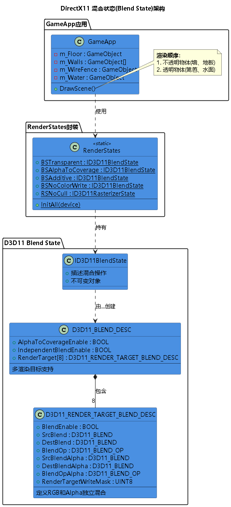
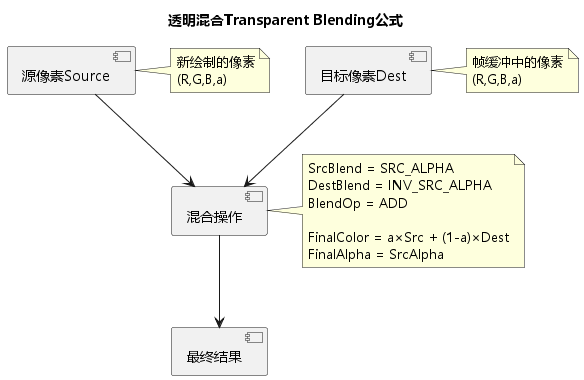
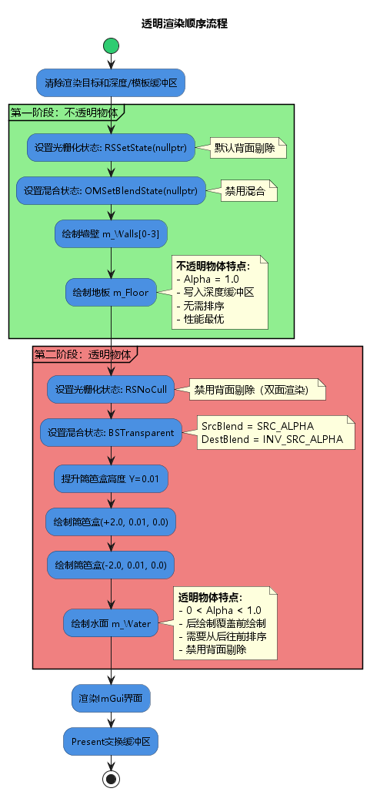
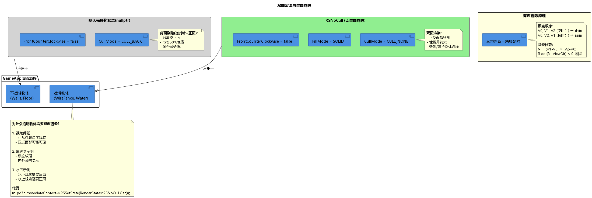
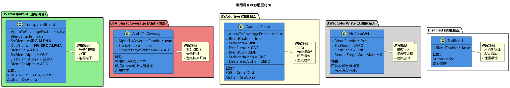

# 第11章：Blending（混合）学习总结

## 目录

1. [项目概述](#1-项目概述)
2. [混合状态基础](#2-混合状态基础)
3. [透明混合原理](#3-透明混合原理)
4. [Alpha裁剪技术](#4-alpha裁剪技术)
5. [渲染顺序策略](#5-渲染顺序策略)
6. [双面渲染](#6-双面渲染)
7. [混合状态配置](#7-混合状态配置)
8. [RenderStates封装](#8-renderstates封装)
9. [关键技术点](#9-关键技术点)
10. [学习心得](#10-学习心得)

---

## 1. 项目概述

### 1.1 本章目标

深入学习DirectX11的混合(Blending)技术，实现透明和半透明效果。主要内容包括：

- ✅ 混合状态(Blend State)的创建和配置
- ✅ 透明混合(Transparent Blending)算法
- ✅ Alpha裁剪(Alpha Clipping)技术
- ✅ 渲染顺序管理（不透明物体优先）
- ✅ 双面渲染（禁用背面剔除）
- ✅ 多种混合模式（透明、加法、Alpha覆盖）
- ✅ RenderStates静态管理类

### 1.2 演示效果

本章实现了一个房间场景，包含：
- **地板和墙壁**（不透明物体）
- **篱笆盒**（使用Alpha裁剪的半透明纹理）
- **水面**（透明混合效果）



**场景特点：**
- 第三人称摄像机环绕观察
- 透明物体可以看到背后的不透明物体
- 篱笆纹理的镂空效果
- 水面的半透明效果

---

## 2. 混合状态基础

### 2.1 什么是混合？

混合(Blending)是GPU在写入渲染目标前，将**源像素(Source Pixel)**和**目标像素(Destination Pixel)**进行数学运算的过程。

**概念解释：**
- **源像素(Source)**：当前像素着色器输出的颜色
- **目标像素(Destination)**：渲染目标(RenderTarget)中已存在的颜色
- **混合因子(Blend Factor)**：控制源和目标的权重
- **混合操作(Blend Op)**：定义如何组合两者（加、减、取最小/最大等）

### 2.2 混合状态结构

```cpp
struct D3D11_BLEND_DESC
{
    BOOL AlphaToCoverageEnable;         // Alpha-to-Coverage MSAA技术
    BOOL IndependentBlendEnable;        // 是否为每个RenderTarget独立配置
    D3D11_RENDER_TARGET_BLEND_DESC RenderTarget[8];  // 最多8个渲染目标
};

struct D3D11_RENDER_TARGET_BLEND_DESC
{
    BOOL BlendEnable;                   // 是否启用混合
    D3D11_BLEND SrcBlend;               // 源RGB混合因子
    D3D11_BLEND DestBlend;              // 目标RGB混合因子
    D3D11_BLEND_OP BlendOp;             // RGB混合操作
    D3D11_BLEND SrcBlendAlpha;          // 源Alpha混合因子
    D3D11_BLEND DestBlendAlpha;         // 目标Alpha混合因子
    D3D11_BLEND_OP BlendOpAlpha;        // Alpha混合操作
    UINT8 RenderTargetWriteMask;        // 颜色写入掩码
};
```

### 2.3 混合公式

**通用混合公式：**

$$
\text{FinalColor} = \text{SrcBlend} \otimes \text{SrcColor} \, \boxplus \, \text{DestBlend} \otimes \text{DestColor}
$$

其中：
- $\otimes$ 表示逐分量乘法
- $\boxplus$ 表示混合操作（BlendOp）

**RGB和Alpha独立混合：**
```
RGB:   FinalRGB   = (SrcBlend × SrcRGB)   [BlendOp]   (DestBlend × DestRGB)
Alpha: FinalAlpha = (SrcBlendA × SrcA)    [BlendOpA]  (DestBlendA × DestA)
```

### 2.4 创建混合状态

```cpp
D3D11_BLEND_DESC blendDesc;
ZeroMemory(&blendDesc, sizeof(blendDesc));

// 配置第一个渲染目标
auto& rtDesc = blendDesc.RenderTarget[0];
blendDesc.AlphaToCoverageEnable = false;
blendDesc.IndependentBlendEnable = false;  // 所有RT使用相同配置

rtDesc.BlendEnable = true;
rtDesc.SrcBlend = D3D11_BLEND_SRC_ALPHA;
rtDesc.DestBlend = D3D11_BLEND_INV_SRC_ALPHA;
rtDesc.BlendOp = D3D11_BLEND_OP_ADD;
rtDesc.SrcBlendAlpha = D3D11_BLEND_ONE;
rtDesc.DestBlendAlpha = D3D11_BLEND_ZERO;
rtDesc.BlendOpAlpha = D3D11_BLEND_OP_ADD;
rtDesc.RenderTargetWriteMask = D3D11_COLOR_WRITE_ENABLE_ALL;

ComPtr<ID3D11BlendState> blendState;
HR(device->CreateBlendState(&blendDesc, blendState.GetAddressOf()));
```

### 2.5 绑定混合状态

```cpp
// 绑定到输出合并阶段(Output Merger)
FLOAT blendFactor[4] = {0.0f, 0.0f, 0.0f, 0.0f};  // 通常不使用
UINT sampleMask = 0xFFFFFFFF;                      // 所有样本都启用

m_pd3dImmediateContext->OMSetBlendState(
    blendState.Get(), 
    blendFactor, 
    sampleMask);

// 禁用混合
m_pd3dImmediateContext->OMSetBlendState(nullptr, nullptr, 0xFFFFFFFF);
```

---

## 3. 透明混合原理

### 3.1 标准透明混合

**最常用的混合模式** - 用于实现透明和半透明效果。



**配置：**
```cpp
rtDesc.BlendEnable = true;
rtDesc.SrcBlend = D3D11_BLEND_SRC_ALPHA;         // 源因子 = α
rtDesc.DestBlend = D3D11_BLEND_INV_SRC_ALPHA;    // 目标因子 = (1-α)
rtDesc.BlendOp = D3D11_BLEND_OP_ADD;             // 加法操作
rtDesc.SrcBlendAlpha = D3D11_BLEND_ONE;          // Alpha不混合
rtDesc.DestBlendAlpha = D3D11_BLEND_ZERO;
rtDesc.BlendOpAlpha = D3D11_BLEND_OP_ADD;
```

**数学公式：**

$$
\begin{aligned}
\text{FinalRGB} &= \alpha \times \text{SrcRGB} + (1 - \alpha) \times \text{DestRGB} \\
\text{FinalAlpha} &= \text{SrcAlpha}
\end{aligned}
$$

**示例计算：**
```
场景：红色半透明物体覆盖蓝色背景
SrcColor  = (1.0, 0.0, 0.0, 0.5)  // 红色，α=0.5
DestColor = (0.0, 0.0, 1.0, 1.0)  // 蓝色，不透明

FinalRGB = 0.5 × (1.0, 0.0, 0.0) + 0.5 × (0.0, 0.0, 1.0)
         = (0.5, 0.0, 0.0) + (0.0, 0.0, 0.5)
         = (0.5, 0.0, 0.5)  // 紫色
```

### 3.2 混合因子详解

**常用D3D11_BLEND枚举值：**

| 枚举值 | 计算结果 | 说明 |
|--------|----------|------|
| `D3D11_BLEND_ZERO` | $(0, 0, 0, 0)$ | 全零 |
| `D3D11_BLEND_ONE` | $(1, 1, 1, 1)$ | 全一 |
| `D3D11_BLEND_SRC_COLOR` | $(R_s, G_s, B_s, A_s)$ | 源颜色 |
| `D3D11_BLEND_INV_SRC_COLOR` | $(1-R_s, 1-G_s, 1-B_s, 1-A_s)$ | 源颜色反转 |
| `D3D11_BLEND_SRC_ALPHA` | $(A_s, A_s, A_s, A_s)$ | 源Alpha |
| `D3D11_BLEND_INV_SRC_ALPHA` | $(1-A_s, 1-A_s, 1-A_s, 1-A_s)$ | 源Alpha反转 |
| `D3D11_BLEND_DEST_ALPHA` | $(A_d, A_d, A_d, A_d)$ | 目标Alpha |
| `D3D11_BLEND_INV_DEST_ALPHA` | $(1-A_d, 1-A_d, 1-A_d, 1-A_d)$ | 目标Alpha反转 |
| `D3D11_BLEND_DEST_COLOR` | $(R_d, G_d, B_d, A_d)$ | 目标颜色 |
| `D3D11_BLEND_INV_DEST_COLOR` | $(1-R_d, 1-G_d, 1-B_d, 1-A_d)$ | 目标颜色反转 |
| `D3D11_BLEND_BLEND_FACTOR` | $(F_r, F_g, F_b, F_a)$ | 用户自定义因子 |

### 3.3 混合操作详解

**D3D11_BLEND_OP枚举值：**

| 枚举值 | 公式 | 说明 |
|--------|------|------|
| `D3D11_BLEND_OP_ADD` | $Src \otimes F_s + Dest \otimes F_d$ | 加法（最常用） |
| `D3D11_BLEND_OP_SUBTRACT` | $Src \otimes F_s - Dest \otimes F_d$ | 减法 |
| `D3D11_BLEND_OP_REV_SUBTRACT` | $Dest \otimes F_d - Src \otimes F_s$ | 反向减法 |
| `D3D11_BLEND_OP_MIN` | $\min(Src, Dest)$ | 取最小值 |
| `D3D11_BLEND_OP_MAX` | $\max(Src, Dest)$ | 取最大值 |

### 3.4 像素着色器中的Alpha输出

```cpp
// Basic_3D_PS.hlsl
float4 PS(VertexPosHWNormalTex pIn) : SV_Target
{
    // 采样纹理
    float4 texColor = g_Tex.Sample(g_SamLinear, pIn.tex);
    
    // Alpha裁剪（提前退出不需要的像素）
    clip(texColor.a - 0.1f);
    
    // ... 光照计算 ...
    
    // 最终颜色
    float4 litColor = texColor * (ambient + diffuse) + spec;
    
    // 关键：Alpha通道从纹理和材质相乘得到
    litColor.a = texColor.a * g_Material.diffuse.a;
    
    return litColor;
}
```

**Alpha来源：**
1. **纹理Alpha**：`texColor.a`（从DDS/PNG读取）
2. **材质Alpha**：`g_Material.diffuse.a`（CPU端设置）
3. **最终Alpha**：两者相乘

**示例：**
```cpp
// C++端设置水面材质
material.diffuse = XMFLOAT4(1.0f, 1.0f, 1.0f, 0.5f);  // Alpha=0.5
// 纹理如果是全白(1.0, 1.0, 1.0, 1.0)
// 最终输出Alpha = 1.0 × 0.5 = 0.5
```

---

## 4. Alpha裁剪技术

### 4.1 什么是Alpha裁剪？

Alpha裁剪(Alpha Clipping)是在像素着色器中**提前丢弃**Alpha值低于阈值的像素，避免后续计算和渲染。


**HLSL中的clip()函数：**
```hlsl
void clip(float x)
{
    if (x < 0)
        discard;  // 丢弃当前像素
}
```

### 4.2 篱笆纹理应用

**WireFence.dds纹理特点：**
- RGB：篱笆的木条和铁丝网颜色
- Alpha：0（完全透明）或 1（完全不透明）
- 二值化：没有中间过渡

**像素着色器处理：**
```hlsl
float4 PS(VertexPosHWNormalTex pIn) : SV_Target
{
    // 采样篱笆纹理
    float4 texColor = g_Tex.Sample(g_SamLinear, pIn.tex);
    
    // 裁剪：Alpha < 0.1的像素直接丢弃
    clip(texColor.a - 0.1f);
    // 等价于：if (texColor.a < 0.1f) discard;
    
    // 只有Alpha >= 0.1的像素继续执行
    // ... 后续光照计算 ...
}
```

**优势：**
1. **性能优化**：丢弃的像素不执行光照计算
2. **避免混合**：不需要启用混合状态
3. **写入深度**：保留的像素正常写入深度缓冲区
4. **简化渲染**：可以和不透明物体一起渲染

### 4.3 Alpha裁剪 vs Alpha混合

| 特性 | Alpha裁剪 | Alpha混合 |
|------|-----------|-----------|
| **决策类型** | 二元（显示/隐藏） | 连续（0-1） |
| **混合状态** | 不需要 | 必须启用 |
| **深度写入** | 正常写入 | 通常禁用 |
| **排序要求** | 不需要 | 必须从后往前 |
| **性能** | 高（提前退出） | 低（读写RT） |
| **适用场景** | 树叶、栅栏、草地 | 玻璃、水面、烟雾 |

### 4.4 GameApp中的应用

```cpp
// 初始化篱笆盒
Material material{};
material.ambient = XMFLOAT4(0.5f, 0.5f, 0.5f, 1.0f);
material.diffuse = XMFLOAT4(1.0f, 1.0f, 1.0f, 1.0f);  // Alpha=1.0
material.specular = XMFLOAT4(0.2f, 0.2f, 0.2f, 16.0f);

HR(CreateDDSTextureFromFile(m_pd3dDevice.Get(), 
    L"..\\Texture\\WireFence.dds", nullptr, texture.GetAddressOf()));

m_WireFence.SetBuffer(m_pd3dDevice.Get(), Geometry::CreateBox());
m_WireFence.SetTexture(texture.Get());
m_WireFence.SetMaterial(material);

// 绘制时稍微抬高（避免Z-Fighting）
wireFrameTransform.SetPosition(2.0f, 0.01f, 0.0f);
m_WireFence.Draw(m_pd3dImmediateContext.Get());
```

---

## 5. 渲染顺序策略

### 5.1 为什么要分阶段渲染？

透明物体的混合需要**读取渲染目标中的现有颜色**，因此绘制顺序至关重要。



**问题场景：**
```
错误：先绘制透明水面 → 再绘制不透明地板
结果：水面混合时读取到的是背景色，看不到地板

正确：先绘制不透明地板 → 再绘制透明水面
结果：水面混合时读取到地板颜色，产生正确的透明效果
```

### 5.2 两阶段渲染流程

```cpp
void GameApp::DrawScene()
{
    // 清除缓冲区
    m_pd3dImmediateContext->ClearRenderTargetView(
        m_pRenderTargetView.Get(), 
        reinterpret_cast<const float*>(&Colors::Black));
    m_pd3dImmediateContext->ClearDepthStencilView(
        m_pDepthStencilView.Get(), 
        D3D11_CLEAR_DEPTH | D3D11_CLEAR_STENCIL, 
        1.0f, 0);

    // ******************
    // 第一阶段：绘制不透明物体
    // ******************
    
    // 使用默认光栅化状态（背面剔除）
    m_pd3dImmediateContext->RSSetState(nullptr);
    
    // 禁用混合
    m_pd3dImmediateContext->OMSetBlendState(nullptr, nullptr, 0xFFFFFFFF);

    // 绘制墙壁（4面）
    for (auto& wall : m_Walls)
        wall.Draw(m_pd3dImmediateContext.Get());
    
    // 绘制地板
    m_Floor.Draw(m_pd3dImmediateContext.Get());

    // ******************
    // 第二阶段：绘制透明物体
    // ******************
    
    // 无背面剔除（双面渲染）
    m_pd3dImmediateContext->RSSetState(RenderStates::RSNoCull.Get());
    
    // 启用透明混合
    m_pd3dImmediateContext->OMSetBlendState(
        RenderStates::BSTransparent.Get(), 
        nullptr, 
        0xFFFFFFFF);

    // 绘制篱笆盒（两个位置）
    Transform& wireFrameTransform = m_WireFence.GetTransform();
    wireFrameTransform.SetPosition(2.0f, 0.01f, 0.0f);
    m_WireFence.Draw(m_pd3dImmediateContext.Get());
    
    wireFrameTransform.SetPosition(-2.0f, 0.01f, 0.0f);
    m_WireFence.Draw(m_pd3dImmediateContext.Get());
    
    // 最后绘制水面
    m_Water.Draw(m_pd3dImmediateContext.Get());

    // ImGui和Present
    ImGui_ImplDX11_RenderDrawData(ImGui::GetDrawData());
    HR(m_pSwapChain->Present(0, 0));
}
```

### 5.3 透明物体排序

**简单场景（本章）：**
- 手动控制绘制顺序
- 篱笆 → 水面

**复杂场景（实际项目）：**
```cpp
struct TransparentObject
{
    GameObject* pObject;
    float distanceToCamera;
};

std::vector<TransparentObject> transparentObjects;

// 计算距离
for (auto& obj : allObjects)
{
    if (obj.IsTransparent())
    {
        float dist = XMVectorGetX(XMVector3Length(
            obj.GetPosition() - cameraPos));
        transparentObjects.push_back({&obj, dist});
    }
}

// 从远到近排序
std::sort(transparentObjects.begin(), transparentObjects.end(),
    [](const auto& a, const auto& b) {
        return a.distanceToCamera > b.distanceToCamera;
    });

// 按顺序绘制
for (auto& tObj : transparentObjects)
    tObj.pObject->Draw(deviceContext);
```

### 5.4 深度缓冲区策略

**不透明物体：**
```cpp
// 默认深度/模板状态
// DepthEnable = TRUE
// DepthWriteMask = D3D11_DEPTH_WRITE_MASK_ALL
// DepthFunc = D3D11_COMPARISON_LESS
```
- 写入深度
- 深度测试通过才绘制

**透明物体（本章方法）：**
```cpp
// 仍然使用默认深度状态
// 深度测试：开启（避免绘制被遮挡的部分）
// 深度写入：开启（简化处理）
```

**透明物体（更复杂场景）：**
```cpp
// 禁用深度写入
D3D11_DEPTH_STENCIL_DESC dsDesc;
dsDesc.DepthEnable = TRUE;              // 仍然测试深度
dsDesc.DepthWriteMask = D3D11_DEPTH_WRITE_MASK_ZERO;  // 不写入深度
dsDesc.DepthFunc = D3D11_COMPARISON_LESS;
```
- 优点：透明物体之间可以正确混合
- 缺点：需要严格排序

---

## 6. 双面渲染

### 6.1 背面剔除原理

**默认行为：**
- 逆时针顶点顺序 = 正面
- 顺时针顶点顺序 = 背面（被剔除）



**判断方法：**
```
V0, V1, V2 为三角形三个顶点
Normal = (V1 - V0) × (V2 - V0)  // 叉乘得到法向量

ViewDir = 摄像机朝向

if (dot(Normal, ViewDir) < 0)
    背面，剔除
else
    正面，渲染
```

### 6.2 为什么透明物体需要双面渲染？

**篱笆盒的问题：**
```
场景：从盒子外部看向内部
如果启用背面剔除：
  - 外表面（正面）：渲染 ✓
  - 内表面（背面）：剔除 ✗
  结果：看不到盒子内部的篱笆纹理

解决方案：禁用背面剔除
  - 外表面：渲染 ✓
  - 内表面：渲染 ✓
  结果：内外都可见
```

**水面的问题：**
```
场景：摄像机移到水面下
如果启用背面剔除：
  - 从上往下看：水面正面，渲染 ✓
  - 从下往上看：水面背面，剔除 ✗
  结果：水下看不到水面

解决方案：禁用背面剔除
  - 任意角度都能看到水面
```

### 6.3 光栅化状态配置

**默认状态（背面剔除）：**
```cpp
D3D11_RASTERIZER_DESC rasterizerDesc;
rasterizerDesc.FillMode = D3D11_FILL_SOLID;              // 填充模式
rasterizerDesc.CullMode = D3D11_CULL_BACK;               // 剔除背面
rasterizerDesc.FrontCounterClockwise = false;            // 顺时针=正面
rasterizerDesc.DepthClipEnable = true;
// ... 其他默认值 ...
```

**RSNoCull（无背面剔除）：**
```cpp
rasterizerDesc.FillMode = D3D11_FILL_SOLID;
rasterizerDesc.CullMode = D3D11_CULL_NONE;               // 不剔除
rasterizerDesc.FrontCounterClockwise = false;
rasterizerDesc.DepthClipEnable = true;

HR(device->CreateRasterizerState(&rasterizerDesc, RSNoCull.GetAddressOf()));
```

**RenderStates.cpp中的实现：**
```cpp
void RenderStates::InitAll(ID3D11Device* device)
{
    // ... 其他状态 ...
    
    // 无背面剔除模式
    D3D11_RASTERIZER_DESC rasterizerDesc;
    ZeroMemory(&rasterizerDesc, sizeof(rasterizerDesc));
    
    rasterizerDesc.FillMode = D3D11_FILL_SOLID;
    rasterizerDesc.CullMode = D3D11_CULL_NONE;
    rasterizerDesc.FrontCounterClockwise = false;
    rasterizerDesc.DepthClipEnable = true;
    
    HR(device->CreateRasterizerState(&rasterizerDesc, RSNoCull.GetAddressOf()));
}
```

### 6.4 性能影响

**开销对比：**

| 场景 | 背面剔除 | 无背面剔除 |
|------|----------|------------|
| 三角形数量 | N | N |
| 光栅化的三角形 | ~N/2 | N |
| 像素着色器调用 | 少 | 多（约2倍） |
| 性能 | 快 | 慢 |

**优化建议：**
1. 只对必要的物体禁用剔除
2. 尽量减少双面渲染的物体数量
3. 使用LOD（远处物体简化）

---

## 7. 混合状态配置

### 7.1 常用混合模式对比



### 7.2 透明混合(BSTransparent)

**最常用的混合模式**

```cpp
// 配置
blendDesc.AlphaToCoverageEnable = false;
blendDesc.IndependentBlendEnable = false;
rtDesc.BlendEnable = true;
rtDesc.SrcBlend = D3D11_BLEND_SRC_ALPHA;
rtDesc.DestBlend = D3D11_BLEND_INV_SRC_ALPHA;
rtDesc.BlendOp = D3D11_BLEND_OP_ADD;
rtDesc.SrcBlendAlpha = D3D11_BLEND_ONE;
rtDesc.DestBlendAlpha = D3D11_BLEND_ZERO;
rtDesc.BlendOpAlpha = D3D11_BLEND_OP_ADD;
rtDesc.RenderTargetWriteMask = D3D11_COLOR_WRITE_ENABLE_ALL;
```

**公式：**
$$
\begin{aligned}
\text{RGB} &= \alpha \times \text{Src} + (1 - \alpha) \times \text{Dest} \\
\text{Alpha} &= \text{SrcAlpha}
\end{aligned}
$$

**适用场景：**
- 半透明玻璃
- 水面
- UI元素
- 烟雾粒子

### 7.3 加法混合(BSAdditive)

**用于发光效果**

```cpp
rtDesc.BlendEnable = true;
rtDesc.SrcBlend = D3D11_BLEND_ONE;       // 源因子 = 1
rtDesc.DestBlend = D3D11_BLEND_ONE;      // 目标因子 = 1
rtDesc.BlendOp = D3D11_BLEND_OP_ADD;
rtDesc.SrcBlendAlpha = D3D11_BLEND_ONE;
rtDesc.DestBlendAlpha = D3D11_BLEND_ZERO;
rtDesc.BlendOpAlpha = D3D11_BLEND_OP_ADD;
```

**公式：**
$$
\text{RGB} = \text{Src} + \text{Dest}
$$

**特点：**
- 颜色越加越亮
- 不会超过1.0（HDR除外）
- 忽略Alpha值

**适用场景：**
- 火焰
- 光晕(Bloom)
- 激光
- 魔法特效

**示例：**
```
Src  = (0.8, 0.2, 0.0)  // 橙色火焰
Dest = (0.3, 0.3, 0.3)  // 灰色背景

Final = (0.8, 0.2, 0.0) + (0.3, 0.3, 0.3)
      = (1.0, 0.5, 0.3)  // 亮橙色
```

### 7.4 Alpha-to-Coverage(BSAlphaToCoverage)

**利用MSAA进行透明**

```cpp
blendDesc.AlphaToCoverageEnable = true;   // 关键
blendDesc.IndependentBlendEnable = false;
rtDesc.BlendEnable = false;               // 不使用混合
rtDesc.RenderTargetWriteMask = D3D11_COLOR_WRITE_ENABLE_ALL;
```

**工作原理：**
1. 开启4×MSAA，每个像素有4个子样本
2. 像素着色器输出Alpha = 0.5
3. GPU随机选择2个子样本覆盖（50%）
4. 最终效果：半透明

**优势：**
- 不需要排序
- 性能比混合好
- 适合大量植被

**劣势：**
- 需要MSAA支持
- 边缘可能有锯齿
- Alpha值离散化

**适用场景：**
- 树叶（大量）
- 草地
- 灌木丛
- LOD过渡

### 7.5 无颜色写入(BSNoColorWrite)

**只写入深度/模板**

```cpp
rtDesc.BlendEnable = false;
rtDesc.SrcBlend = D3D11_BLEND_ZERO;
rtDesc.DestBlend = D3D11_BLEND_ONE;
rtDesc.BlendOp = D3D11_BLEND_OP_ADD;
rtDesc.RenderTargetWriteMask = 0;         // 不写入任何颜色通道
```

**适用场景：**
- 模板镜面反射（先写模板值）
- 深度预渲染Pass
- 遮挡查询
- 阴影体积

---

## 8. RenderStates封装

### 8.1 设计思想

**问题：**
- 每个状态对象需要8行以上代码创建
- 同一状态可能在多处使用
- 重复创建浪费资源

**解决方案：**
```cpp
// RenderStates.h
class RenderStates
{
public:
    // 静态成员变量，全局共享
    static ComPtr<ID3D11RasterizerState> RSNoCull;
    static ComPtr<ID3D11RasterizerState> RSWireframe;
    static ComPtr<ID3D11RasterizerState> RSCullClockWise;
    
    static ComPtr<ID3D11SamplerState> SSAnisotropicWrap;
    static ComPtr<ID3D11SamplerState> SSLinearWrap;
    
    static ComPtr<ID3D11BlendState> BSAlphaToCoverage;
    static ComPtr<ID3D11BlendState> BSNoColorWrite;
    static ComPtr<ID3D11BlendState> BSTransparent;
    static ComPtr<ID3D11BlendState> BSAdditive;
    
    static ComPtr<ID3D11DepthStencilState> DSSWriteStencil;
    static ComPtr<ID3D11DepthStencilState> DSSDrawWithStencil;
    // ... 更多深度/模板状态 ...
    
    static bool IsInit();
    static void InitAll(ID3D11Device* device);
};
```

### 8.2 初始化流程

```cpp
// RenderStates.cpp
ComPtr<ID3D11BlendState> RenderStates::BSTransparent = nullptr;
// ... 其他静态成员初始化 ...

void RenderStates::InitAll(ID3D11Device* device)
{
    if (IsInit())  // 避免重复初始化
        return;
    
    // ******************
    // 初始化光栅化器状态
    // ******************
    D3D11_RASTERIZER_DESC rasterizerDesc;
    ZeroMemory(&rasterizerDesc, sizeof(rasterizerDesc));
    
    // 无背面剔除
    rasterizerDesc.FillMode = D3D11_FILL_SOLID;
    rasterizerDesc.CullMode = D3D11_CULL_NONE;
    rasterizerDesc.FrontCounterClockwise = false;
    rasterizerDesc.DepthClipEnable = true;
    HR(device->CreateRasterizerState(&rasterizerDesc, RSNoCull.GetAddressOf()));
    
    // 线框模式
    rasterizerDesc.FillMode = D3D11_FILL_WIREFRAME;
    rasterizerDesc.CullMode = D3D11_CULL_NONE;
    HR(device->CreateRasterizerState(&rasterizerDesc, RSWireframe.GetAddressOf()));
    
    // ******************
    // 初始化采样器状态
    // ******************
    D3D11_SAMPLER_DESC sampDesc;
    ZeroMemory(&sampDesc, sizeof(sampDesc));
    
    // 线性过滤
    sampDesc.Filter = D3D11_FILTER_MIN_MAG_MIP_LINEAR;
    sampDesc.AddressU = D3D11_TEXTURE_ADDRESS_WRAP;
    sampDesc.AddressV = D3D11_TEXTURE_ADDRESS_WRAP;
    sampDesc.AddressW = D3D11_TEXTURE_ADDRESS_WRAP;
    sampDesc.ComparisonFunc = D3D11_COMPARISON_NEVER;
    sampDesc.MinLOD = 0;
    sampDesc.MaxLOD = D3D11_FLOAT32_MAX;
    HR(device->CreateSamplerState(&sampDesc, SSLinearWrap.GetAddressOf()));
    
    // 各向异性过滤
    sampDesc.Filter = D3D11_FILTER_ANISOTROPIC;
    sampDesc.MaxAnisotropy = 4;
    HR(device->CreateSamplerState(&sampDesc, SSAnisotropicWrap.GetAddressOf()));
    
    // ******************
    // 初始化混合状态
    // ******************
    D3D11_BLEND_DESC blendDesc;
    ZeroMemory(&blendDesc, sizeof(blendDesc));
    auto& rtDesc = blendDesc.RenderTarget[0];
    
    // 透明混合
    blendDesc.AlphaToCoverageEnable = false;
    blendDesc.IndependentBlendEnable = false;
    rtDesc.BlendEnable = true;
    rtDesc.SrcBlend = D3D11_BLEND_SRC_ALPHA;
    rtDesc.DestBlend = D3D11_BLEND_INV_SRC_ALPHA;
    rtDesc.BlendOp = D3D11_BLEND_OP_ADD;
    rtDesc.SrcBlendAlpha = D3D11_BLEND_ONE;
    rtDesc.DestBlendAlpha = D3D11_BLEND_ZERO;
    rtDesc.BlendOpAlpha = D3D11_BLEND_OP_ADD;
    rtDesc.RenderTargetWriteMask = D3D11_COLOR_WRITE_ENABLE_ALL;
    HR(device->CreateBlendState(&blendDesc, BSTransparent.GetAddressOf()));
    
    // 加法混合
    rtDesc.SrcBlend = D3D11_BLEND_ONE;
    rtDesc.DestBlend = D3D11_BLEND_ONE;
    HR(device->CreateBlendState(&blendDesc, BSAdditive.GetAddressOf()));
    
    // Alpha-to-Coverage
    blendDesc.AlphaToCoverageEnable = true;
    rtDesc.BlendEnable = false;
    HR(device->CreateBlendState(&blendDesc, BSAlphaToCoverage.GetAddressOf()));
    
    // 无颜色写入
    rtDesc.BlendEnable = false;
    rtDesc.RenderTargetWriteMask = 0;
    HR(device->CreateBlendState(&blendDesc, BSNoColorWrite.GetAddressOf()));
    
    // ... 深度/模板状态初始化 ...
}
```

### 8.3 使用方法

```cpp
// GameApp.cpp
bool GameApp::InitResource()
{
    // ... 创建其他资源 ...
    
    // 初始化所有渲染状态（一次性）
    RenderStates::InitAll(m_pd3dDevice.Get());
    
    // ... 后续直接使用 ...
    return true;
}

void GameApp::DrawScene()
{
    // 直接使用静态成员
    m_pd3dImmediateContext->RSSetState(RenderStates::RSNoCull.Get());
    m_pd3dImmediateContext->OMSetBlendState(RenderStates::BSTransparent.Get(), 
        nullptr, 0xFFFFFFFF);
    m_pd3dImmediateContext->PSSetSamplers(0, 1, 
        RenderStates::SSLinearWrap.GetAddressOf());
}
```

### 8.4 优点

1. **代码复用**：一次创建，到处使用
2. **集中管理**：所有状态在一个文件中
3. **避免泄漏**：ComPtr自动管理生命周期
4. **性能优化**：不重复创建状态对象
5. **易于扩展**：添加新状态只需修改RenderStates类

---

## 9. 关键技术点

### 9.1 混合方程总结

**标准形式：**
$$
\text{Output} = (\text{SrcBlend} \otimes \text{Src}) \boxplus (\text{DestBlend} \otimes \text{Dest})
$$

**常用配置：**

| 混合模式 | SrcBlend | DestBlend | BlendOp | 公式 |
|----------|----------|-----------|---------|------|
| 透明混合 | SRC_ALPHA | INV_SRC_ALPHA | ADD | $\alpha S + (1-\alpha)D$ |
| 加法混合 | ONE | ONE | ADD | $S + D$ |
| 乘法混合 | ZERO | SRC_COLOR | ADD | $S \times D$ |
| 最小值 | ONE | ONE | MIN | $\min(S, D)$ |
| 最大值 | ONE | ONE | MAX | $\max(S, D)$ |
| 减法 | ONE | ONE | SUBTRACT | $S - D$ |

### 9.2 渲染管线状态绑定

**输出合并阶段(OM - Output Merger)：**
```cpp
// 混合状态
ID3D11BlendState* pBlendState;
FLOAT blendFactor[4] = {1.0f, 1.0f, 1.0f, 1.0f};
UINT sampleMask = 0xFFFFFFFF;
deviceContext->OMSetBlendState(pBlendState, blendFactor, sampleMask);

// 深度/模板状态
ID3D11DepthStencilState* pDSState;
UINT stencilRef = 0;
deviceContext->OMSetDepthStencilState(pDSState, stencilRef);

// 渲染目标
ID3D11RenderTargetView* pRTV;
ID3D11DepthStencilView* pDSV;
deviceContext->OMSetRenderTargets(1, &pRTV, pDSV);
```

**光栅化阶段(RS - Rasterizer Stage)：**
```cpp
ID3D11RasterizerState* pRSState;
deviceContext->RSSetState(pRSState);
```

### 9.3 Z-Fighting问题

**问题：**
当两个表面距离极近时，深度值精度不足导致闪烁。

**本章解决方案：**
```cpp
// 篱笆盒稍微抬高0.01单位
wireFrameTransform.SetPosition(2.0f, 0.01f, 0.0f);
```

**其他解决方法：**
1. **深度偏移(Depth Bias)**
```cpp
rasterizerDesc.DepthBias = 100;
rasterizerDesc.DepthBiasClamp = 0.0f;
rasterizerDesc.SlopeScaledDepthBias = 1.0f;
```

2. **使用Stencil Buffer**
```cpp
// 先绘制地板，写入模板值1
// 绘制篱笆时测试模板值!=1
```

3. **禁用深度测试**
```cpp
// 绘制贴花时暂时禁用深度测试
dsDesc.DepthEnable = FALSE;
```

### 9.4 预乘Alpha(Premultiplied Alpha)

**标准透明混合：**
$$
\text{RGB} = \alpha \times \text{Src} + (1 - \alpha) \times \text{Dest}
$$

**预乘Alpha：**
- 纹理已经预先乘以Alpha：$\text{SrcRGB} = \alpha \times \text{OriginalRGB}$
- 混合公式简化：
$$
\text{RGB} = \text{Src} + (1 - \alpha) \times \text{Dest}
$$

**配置：**
```cpp
rtDesc.SrcBlend = D3D11_BLEND_ONE;           // 不再乘以Alpha
rtDesc.DestBlend = D3D11_BLEND_INV_SRC_ALPHA;
```

**优点：**
- 像素着色器不需要分离RGB和Alpha计算
- 混合更快（少一次乘法）
- 适合图像处理工具链

**使用场景：**
- PNG纹理（工具可以预乘）
- UI系统
- 2D精灵

### 9.5 颜色写入掩码

```cpp
// 只写入RGB，不写入Alpha
rtDesc.RenderTargetWriteMask = D3D11_COLOR_WRITE_ENABLE_RED |
                               D3D11_COLOR_WRITE_ENABLE_GREEN |
                               D3D11_COLOR_WRITE_ENABLE_BLUE;

// 只写入Alpha通道
rtDesc.RenderTargetWriteMask = D3D11_COLOR_WRITE_ENABLE_ALPHA;

// 不写入任何颜色
rtDesc.RenderTargetWriteMask = 0;

// 写入所有通道（默认）
rtDesc.RenderTargetWriteMask = D3D11_COLOR_WRITE_ENABLE_ALL;
```

**应用：**
- 选择性更新通道
- 模板效果
- 后处理Pass

---

## 10. 学习心得

### 10.1 核心要点

1. **混合是颜色合成**
   - 源像素（Src）= 当前绘制的像素
   - 目标像素（Dest）= 已存在的像素
   - 混合 = 数学公式组合两者

2. **透明物体的三大挑战**
   - **排序**：必须从后往前绘制
   - **深度写入**：通常需要禁用
   - **性能**：读写RenderTarget开销大

3. **Alpha裁剪 vs Alpha混合**
   - 裁剪：二值化，无需混合，性能好
   - 混合：连续透明，需要排序，性能差

4. **渲染顺序原则**
   ```
   1. 天空盒（禁用深度写入）
   2. 不透明物体（正常深度测试+写入）
   3. Alpha裁剪物体（可选，可与不透明一起）
   4. 透明物体（从远到近，禁用深度写入）
   5. UI/HUD（正交投影，关闭深度测试）
   ```

5. **状态管理**
   - 用静态类封装常用状态
   - 避免重复创建
   - 集中管理便于维护

### 10.2 常见问题

#### 问题1：透明物体显示不正确

**症状：** 透明物体后面的物体看不见

**原因：**
- 未启用混合状态
- 绘制顺序错误（透明物体先于不透明物体）
- 深度测试配置错误

**解决：**
```cpp
// 确保启用混合
m_pd3dImmediateContext->OMSetBlendState(BSTransparent.Get(), nullptr, 0xFFFFFFFF);

// 先绘制不透明物体，再绘制透明物体
DrawOpaqueObjects();
DrawTransparentObjects();  // 从远到近排序
```

#### 问题2：透明物体之间互相遮挡

**症状：** 多个透明物体重叠时，后绘制的完全遮挡前面的

**原因：** 深度写入仍然开启，阻止后续透明物体混合

**解决：**
```cpp
// 创建禁用深度写入的状态
D3D11_DEPTH_STENCIL_DESC dsDesc;
dsDesc.DepthEnable = TRUE;
dsDesc.DepthWriteMask = D3D11_DEPTH_WRITE_MASK_ZERO;  // 关键
dsDesc.DepthFunc = D3D11_COMPARISON_LESS;

// 绘制透明物体时使用
deviceContext->OMSetDepthStencilState(DSSNoDepthWrite.Get(), 0);
```

#### 问题3：篱笆纹理边缘有黑边

**症状：** Alpha裁剪的纹理边缘出现黑色或白色边框

**原因：** 纹理过滤导致Alpha值在0和1之间插值

**解决：**
```cpp
// 方法1：调整裁剪阈值
clip(texColor.a - 0.5f);  // 提高到0.5

// 方法2：使用点采样（无过滤）
sampDesc.Filter = D3D11_FILTER_MIN_MAG_MIP_POINT;

// 方法3：纹理使用预乘Alpha
```

#### 问题4：性能下降严重

**症状：** 添加透明物体后帧率骤降

**原因：**
- 透明物体数量过多
- 像素着色器overdraw严重（多层覆盖）
- 排序开销

**优化：**
```cpp
// 1. 使用Alpha-to-Coverage代替混合（大量植被）
m_pd3dImmediateContext->OMSetBlendState(BSAlphaToCoverage.Get(), ...);

// 2. 粗粒度排序（减少排序开销）
// 只对距离差异大的物体排序

// 3. LOD（远处物体使用不透明贴图）
if (distance > 50.0f)
    useOpaqueTexture();
else
    useTransparentTexture();

// 4. 提前Z-Pass（减少overdraw）
// 先绘制一遍不透明物体（只写深度），再正常绘制
```

### 10.3 最佳实践

1. **纹理准备**
   - 确保Alpha通道正确（0=透明，1=不透明）
   - 考虑预乘Alpha（性能优化）
   - DDS格式支持mipmap（提高质量）

2. **材质设置**
   ```cpp
   // 透明材质
   material.diffuse.a = 0.5f;  // 半透明
   
   // Alpha裁剪材质
   material.diffuse.a = 1.0f;  // 完全不透明（通过clip()控制）
   ```

3. **着色器优化**
   ```hlsl
   // 提前裁剪避免后续计算
   float4 texColor = g_Tex.Sample(g_SamLinear, pIn.tex);
   clip(texColor.a - 0.1f);  // 放在最前面
   
   // 后续光照计算...
   ```

4. **状态切换最小化**
   ```cpp
   // 批量绘制相同状态的物体
   SetBlendState(BSTransparent);
   for (auto& obj : transparentObjects)
       obj.Draw();
   
   // 而不是每个物体切换状态
   ```

### 10.4 扩展方向

1. **Order-Independent Transparency (OIT)**
   - 使用链表或数组存储所有透明片段
   - 延迟排序和混合
   - 无需CPU排序

2. **Weighted Blended OIT**
   - 近似OIT，性能更好
   - 使用权重累积
   - 单Pass完成

3. **深度剥离(Depth Peeling)**
   - 多Pass绘制透明物体
   - 每次绘制最前面的一层
   - 精确但性能开销大

4. **粒子系统**
   - 大量透明粒子
   - GPU排序
   - 软粒子（深度淡出）

5. **折射效果**
   - 混合 + 折射纹理
   - 扰动UV坐标
   - 水体、玻璃

---

**文档生成日期：** 2025年11月30日  
**PlantUML 图表：** 6张  
**代码行数：** 约600行  
**适用人群：** DirectX11学习者

© 2025 学习总结 | 基于 MKXJun 的 DirectX11 With Windows SDK 教程
